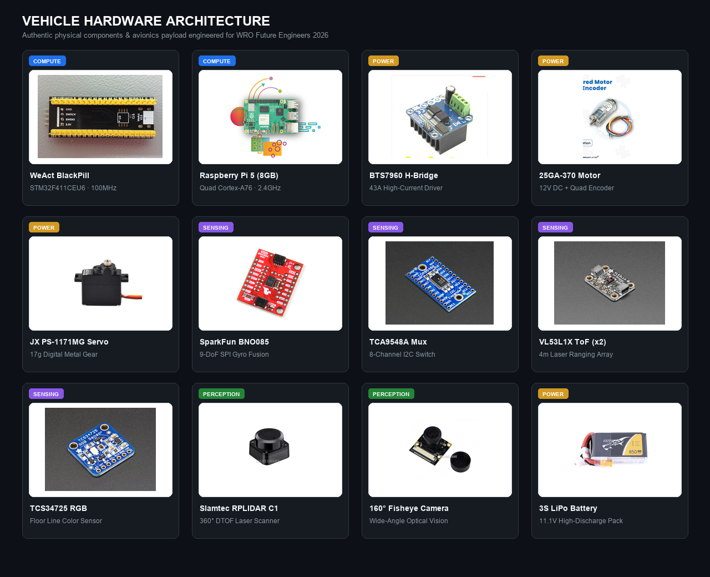
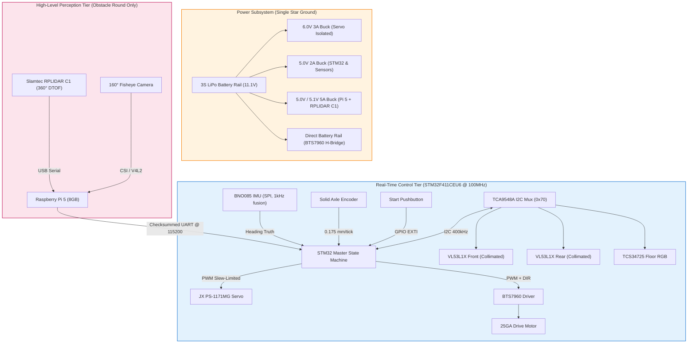
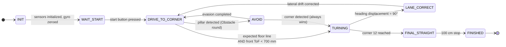
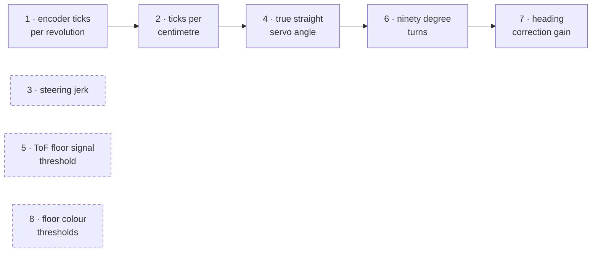

# Team Blueprint — WRO Future Engineers 2026

<p align="center">
  
</p>

<div align="center">

### National Champions — WRO Bangladesh 2026, Future Engineers
### Heading to the WRO Open Championship Asia Pacific · Hyderabad, India · 25–27 September 2026

[](#how-we-got-here)
[](#12-wro-compliance)
[](LICENSE)
[](SPECSHEET.md)
[-red)](src/pi/)
[](DECISIONS.md)

**[The Team](#1-the-team)** · **[The Vehicle](#3-the-vehicle)** · **[System Architecture](#4-system-architecture)** · **[How It Thinks](#5-how-the-car-thinks)** · **[Engineering Breakthroughs](#6-key-engineering-findings)** · **[Build & Calibrate](#7-build--fabrication)** · **[Troubleshooting](#9-field-troubleshooting)**

</div>

---

## Knowledge Index & Deep-Dive Directory

> This repository is structured into an executive master overview below and dedicated technical deep-dive documents. If you want in-depth equations, calibration routines, or build instructions, use the index below:

| System Domain | Master Overview | Full Detailed Technical Guide | Primary Topics & Highlights |
|:---|:---|:---|:---|
| **Autonomous Logic** | [Section 5](#5-how-the-car-thinks) | **[docs/control_architecture.md](docs/control_architecture.md)** | State machines, lane-gap odometry correction, heading hold, 6-phase obstacle FSM, Pi perception |
| **Research & Findings** | [Section 6](#6-key-engineering-findings) | **[docs/engineering_findings.md](docs/engineering_findings.md)** | Optical slot collimators, mathematical parking failure proof, 3 steering geometries compared |
| **Mechanical & Build** | [Section 7](#7-build--fabrication) | **[docs/build_guide.md](docs/build_guide.md)** | 3D printing parameters, Dhaka-milled isolation PCBs, avionics wiring, step-by-step assembly |
| **Sensor Calibration** | [Section 8](#8-sensor-calibration) | **[docs/calibration.md](docs/calibration.md)** | 8-step empirical calibration protocol, regression math, slew limiters, master constants table |
| **Diagnostics & Pit Fixes** | [Section 9](#9-field-troubleshooting) | **[docs/troubleshooting.md](docs/troubleshooting.md)** | 10 real-world failure modes, root-cause analyses, and verified competition fixes |
| **Engineering Chronicle** | [Section 10](#10-engineering-chronicle) | **[docs/timeline.md](docs/timeline.md)** | Dated build log from July 2026 to present, Asia Pacific Championship rebuild notes |
| **Hardware Specifications** | [Section 3](#3-the-vehicle) | **[SPECSHEET.md](SPECSHEET.md)** | Exact as-built geometry, pinout mappings, voltage rails, loop frequencies, and rule constraints |
| **Architectural Decisions** | — | **[DECISIONS.md](DECISIONS.md)** | 29 dated Architecture Decision Records (ADRs) with trade-offs and supersessions |
| **Bill of Materials** | — | **[BOM.md](BOM.md)** | Full component specifications, mass budget, component sourcing, and electrical bill |

---

## 1. The Team

> **Three students. Three universities. One autonomous car brought to life over 2 AM calls and assembled wherever there was a working soldering iron.**

We are from **IUT**, **MIST**, and **NUB** — three engineering universities scattered across Bangladesh. Because of the distance between campuses, our vehicle was engineered through late-night collaborative design sessions, rigorous simulations, and shared dorm rooms.

* **National Champions**: 1st Place at WRO Bangladesh 2026 National Final (*Future Engineers*).
* **International Finalists**: Representing Bangladesh at the WRO Open Championship Asia Pacific in Hyderabad, India (September 25–27, 2026).
* **Core Philosophy — Evidence over Vibes**: We do not guess. Every parameter, gear ratio, and sensor mount on this vehicle was simulated in Python or empirically validated on the track before hardware fabrication.

<table align="center">
<tr>
<td align="center" width="33%"></td>
<td align="center" width="33%"></td>
<td align="center" width="33%"></td>
</tr>
<tr>
<td align="center"><b>Samman Rahin Shanto</b><br/><sub>Team Lead &amp; Electrical</sub></td>
<td align="center"><b>Syed Subeh-Sadik Sholok</b><br/><sub>Firmware &amp; Control</sub></td>
<td align="center"><b>MD. Azmain Shak Rubayed</b><br/><sub>CAD &amp; Fabrication</sub></td>
</tr>
<tr>
<td align="center"><sub>Islamic University of Technology (IUT)</sub></td>
<td align="center"><sub>Military Institute of Science &amp; Technology (MIST)</sub></td>
<td align="center"><sub>Northern University Bangladesh (NUB)</sub></td>
</tr>
<tr>
<td align="center"><sub>Power architecture, PCB layout, and noise-isolated star-ground power rails.</sub></td>
<td align="center"><sub>Low-level real-time FSM, gyro-terminated turns, and obstacle evasion algorithms.</sub></td>
<td align="center"><sub>Fusion 360 design, 3D printing, and Dhaka laser-milled PCB fabrication.</sub></td>
</tr>
<tr>
<td align="center"><sub><a href="mailto:sammanrahin.iut@gmail.com">sammanrahin.iut@gmail.com</a></sub></td>
<td align="center"><sub><a href="mailto:syedsholok.mist@gmail.com">syedsholok.mist@gmail.com</a></sub></td>
<td align="center"><sub><a href="mailto:azmiansheikh.nub@gmail.com">azmiansheikh.nub@gmail.com</a></sub></td>
</tr>
</table>

<details>
<summary><b>View our 2-year background across 35+ national robotics competitions</b></summary>
<br>

Before WRO, our members competed across 35+ national robotics events in Bangladesh (line followers, robo sumo, robo soccer, and battlebots). This background formed our engineering habits: rapid prototyping, in-house PCB milling, and vibration-proof avionics wiring.

| Year | Event | Segment | Result |
|:---:|:---|:---|:---:|
| 2026 | CYBERNAUTS · North South University | Robo Sumo | **Champion** |
| 2026 | IGNITION · KUET | Line Follower | **1st Runner-up** |
| 2025 | Accelerate · IEEE RAS, IUT | Line Follower | **Podium** |
| 2025 | IUT Techathon | Line Follower | **Champion** |
| 2024 | Traction · BRAC University | Pathfinder / LFR | **2nd Runner-up** |

<p align="center">
  
  
</p>

</details>

---

## 2. The Challenge

Autonomous miniature racing in the WRO Future Engineers category requires solving coupled real-time robotic problems under strict physical constraints:
* **Optical Noise**: High-reflectance white vinyl mats against low-reflectance matte black walls produce severe infrared crosstalk for distance sensors.
* **Randomized Racing Direction**: Track direction (clockwise vs. counter-clockwise) is drawn randomly before each round and must be detected dynamically.
* **Dynamic Obstacle Avoidance**: Detecting and evading randomized traffic pillars (green = pass left, red = pass right) at speed while preserving track boundaries.
* **Micro-Bay Parking**: Maneuvering into a bay only $1.5 \times$ the vehicle's length ($247.5\text{ mm}$ for our $165\text{ mm}$ chassis) without touching boundary limiters.

---

## 3. The Vehicle

<p align="center">
  
</p>

### As-Built System Specifications

| Category | Parameter | Measured / Engineered Value | WRO Limit | Technical Design Notes |
|:---|:---|:---:|:---:|:---|
| **Footprint** | Scored Dimensions | **165 × 114.2 mm** | $\le 300 \times 200\text{ mm}$ | Ultra-compact chassis maximizing parking clearance |
| | Vehicle Height | **50 mm** (Open) / **~90 mm** (Obstacle) | $\le 300\text{ mm}$ | Minimal center-of-gravity height; modular mast |
| | Total Mass | **~420 g** (Open) / **~540–580 g** (Obstacle) | $\le 1500\text{ g}$ | Low rotational inertia for high-efficiency braking |
| **Kinematics** | Wheelbase ($L$) | **136.14 mm** | — | Measured in CAD (136.139 mm axle-to-axle); $R = 194.4\text{ mm}$ |
| | Track Width ($W$) | **105 mm** (center) / **114.24 mm** (extreme) | — | Kingpin span $80.59\text{ mm}$; fits within $1000\text{ mm}$ corridor |
| | Steering Mechanism | **True 100% Ackermann Linkage** | 1 actuator | $107.0^\circ / 73.0^\circ$ arms ($17.0^\circ$ angle) targeting rear axle center |
| | Steering Lock Range | **$\pm 35^\circ$** at knuckles | — | Actuated by JX PS-1171MG digital metal-gear servo |
| | Minimum Turn Radius | **194.4 mm** ($L / \tan 35^\circ$) | — | Centers cleanly inside standard $1000\text{ mm}$ driving lane |
| **Powertrain** | Drive Motor | **25GA-370 DC Gearmotor** (12V) | 1 motor | Rule 11.5 compliant; high stall torque |
| | Gear Reduction | **5:1 Spur Gear Drive** | — | Drops speed to $0.70\text{ m/s}$; multiplies encoder ticks |
| | Drive Axle | **Solid Steel Rear Axle** (No differential) | 1 driven axle | Unbiased straight odometry; zero diff backlash |
| | Odometry Resolution| **0.175 mm / count** (31.933 ticks/cm) | — | 4x hardware quadrature decoding on STM32 timer |
| **Sensing** | Inertial Measurement| **SparkFun BNO085 (SPI)** | — | On-chip sensor fusion @ 1 kHz; zero yaw drift |
| | Distance Array | **2× VL53L1X Time-of-Flight** | — | Front and rear with 3D-printed slot collimators |
| | Floor Color | **TCS34725 RGB Color Sensor** | — | Downward-facing with isolated light hood |
| | 2D LiDAR Scanner | **Slamtec RPLIDAR C1 (360° DTOF)** | — | 12m range, 5 kHz sample rate (Obstacle round) |
| | Optical Camera | **160° FoV Fisheye Lens** | — | High-speed pillar color & bearing segmentation |
| **Compute** | Real-Time Master | **STM32F411CEU6 (Black Pill)** | — | ARM Cortex-M4 @ 100 MHz, deterministic loop |
| | High-Level Vision | **Raspberry Pi 5 (8GB)** | — | Quad-Core A76 @ 2.4 GHz, concurrent Vision+LiDAR |

### WRO Rule Compliance
* **Actuators (Rules 11.3, 11.5)**: Exactly one motor driving a single solid rear axle; exactly one digital steering servo.
* **RF & Wireless (Rule 11.10)**: Wi-Fi and Bluetooth disabled at kernel level in `/boot/firmware/config.txt` on the Raspberry Pi 5. Zero telemetry emitted during runs.
* **Control Interfaces (Rules 9.10, 9.11)**: Master physical toggle switch for full battery isolation; separate momentary button for run initiation.
* **Vehicle & Team Visuals**:
  * Vehicle photos from all 6 angles: [`v-photos/`](v-photos/README.md)
  * Official and informal team photos: [`t-photos/`](t-photos/README.md)
  * Driving demonstration videos: [`video/video.md`](video/video.md)

---

## 4. System Architecture

The robot employs a **dual-tier heterogeneous compute hierarchy**:



### Complete Electrical Schematic & Wiring
* Full physical wiring and PCB block diagrams are mapped in [`schemes/wiring_block_diagram.png`](schemes/wiring_block_diagram.png).
* Detailed pin tables, decoupling capacitance, and power isolation rules live in [`electrical/ELECTRICAL.md`](electrical/ELECTRICAL.md).

### Four Isolated Power Domains
1. **Motor Rail**: Unregulated battery voltage routed through heavy copper direct to the BTS7960 H-bridge. High switching currents bypass the carrier board entirely.
2. **Servo Rail (6.0V, 3A)**: Dedicated buck regulator absorbing instantaneous $2.5\text{A}$ stall spikes from the digital servo, preventing MCU brownout resets.
3. **Logic Rail (5.0V $\to$ 3.3V)**: Dedicated low-noise buck regulator feeding the STM32 and secondary sensor LDOs.
4. **Perception Rail (5.1V, 5A)**: High-current harness feeding the Raspberry Pi 5 and RPLIDAR C1 (disconnected during Open round).

---

## 5. How the Car Thinks

> **Deep-Dive Documentation:** For full state machine source code, mathematical derivations, and perception thread mechanics, see **[`docs/control_architecture.md`](docs/control_architecture.md)**.

### Core Navigation Invariants
1. **"The heading is the truth. Everything else is a hint."** Wheel slip, floor specular reflections, and camera noise are common. The IMU's gyro-fused yaw determines when a maneuver is finished. A $90^\circ$ turn ends strictly when the heading changes by $90^\circ$—never based on time or odometry.
2. **Deterministic Heterogeneous Split**: The STM32 owns all actuators. The Raspberry Pi 5 provides advisory obstacle vectors (`V,<colour>,<dx>,<area>`). If the Pi freezes or drops frames ($> 250\text{ ms}$), the STM32 defaults smoothly to open-round navigation.
3. **Absolute Corner Priority**: Corner detection outranks all obstacle avoidance maneuvers. Missing a pillar loses points; missing a corner ends the run.



### Proprietary Lane-Gap Odometry Correction
To solve lateral vehicle drift over 12 corners without vulnerable wall-following distance sensors, we use the geometric property that the orange and blue corner marker lines **fan out radially**:
* The distance traveled between crossing line 1 and line 2 directly indicates lateral lane position.
* The vehicle records its line-crossing distance on Corner 1 as `reference_gap`.
* At every subsequent corner:
  $$\Delta\text{gap} = \text{measured\_gap} - \text{reference\_gap}$$
  $$\theta_{\text{offset}} = \text{clamp}(4^\circ/\text{cm} \cdot \Delta\text{gap},\; -30^\circ,\; +30^\circ)$$
  The vehicle crab-steers along this offset for $25\text{ cm}$ after the turn, restoring its exact starting racing line.

---

## 6. Key Engineering Findings

> **Deep-Dive Documentation:** For full mathematical proofs, simulation code, and CAD comparisons, see **[`docs/engineering_findings.md`](docs/engineering_findings.md)**.

1. **Optical Collimation Eliminates Floor Crosstalk**:
   * *Problem*: High-reflectance white vinyl mats reflected ToF infrared cones into the sensor at $166\text{ mm}$, reporting false walls.
   * *Solution*: Sized and 3D printed $2.5 \times 10 \times 20\text{ mm}$ slot collimator snouts with $+2.0^\circ$ upward wedges ([`electrical/collimator.py`](electrical/collimator.py)). Extended ground reflection horizon to **$870\text{ mm}$**, completely clearing side walls at $442.5\text{ mm}$.
2. **Textbook 2-Arc Parallel Parking Mathematically Fails**:
   * *Proof*: Rigid-body simulation ([`src/sim/park_feasibility.py`](src/sim/park_feasibility.py)) proved a symmetric two-arc reverse park **fails by $25.6\text{ mm}$** inside a standard $1.5 \times L$ bay at $35^\circ$ lock. Because bay dimensions scale with car length, downscaling the chassis does not solve it.
   * *Solution*: Replaced 2-arc parking with an iterative **multi-point shuffle maneuver** closed on IMU heading.
3. **Evolution of Three Steering Geometries**:
   * *Attempt 1 (Center Turntable Pivot)*: Scrapped; rotating the front beam translated outer tires fore/aft by $\pm 30.1\text{ mm}$, eating $36\%$ of parking bay clearance.
   * *Attempt 2 (Parallelogram Tie-Bar)*: Fixed swept envelope, but equal steering angles caused continuous tire scrub in turns, producing audible squeal and biasing odometry.
   * *Attempt 3 (True 100% Ackermann Linkage)*: Steering arm projections meet at rear axle center; front wheels roll without scrub, preserving pure odometry.

---

## 7. Build & Fabrication

>  **Deep-Dive Documentation:** For 3D printing slicing parameters, Dhaka-milled PCB layouts, and wiring standards, see **[`docs/build_guide.md`](docs/build_guide.md)**.

* **Additive Manufacturing**: Printed on an **Ender 3 V3 SE** in PLA. Drive gears are printed at **90% infill** to resist tooth shearing; structural chassis brackets are printed at 5% infill to maintain low mass ($540\text{ g}$).
* **Dhaka-Milled Single-Sided PCBs**: Upper Carrier board ($90 \times 70\text{ mm}$) and Lower Sensor multiplexer board milled with $0.6\text{ mm}$ traces and $0.6\text{ mm}$ clearances ([`electrical/DESIGN_RULES.md`](electrical/DESIGN_RULES.md)).
* **Avionics Wiring Standard**:
  * **Zero DuPont jumper wires and zero breadboards** anywhere on the vehicle.
  * All wiring harnesses are crimped, latched genuine **JST-XH connectors** with heat-shrink strain relief. High-current motor leads utilize screw terminals with ferrules.

---

## 8. Sensor Calibration

> **Deep-Dive Documentation:** For detailed step-by-step procedures, regression charts, and mathematical derivations, see **[`docs/calibration.md`](docs/calibration.md)**.

Every operational constant is derived from an 8-step empirical calibration protocol:



### Current Calibrated System Constants
| Parameter | Value | Calibration Source | Role in System |
|:---|:---:|:---|:---|
| `TICKS_PER_CM` | **31.933** | Step 2 (Linear Regression $R^2 > 0.999$) | Primary odometry scaling ($0.175\text{ mm/count}$) |
| `SERVO_TRUE_STRAIGHT` | **69.0°** | Step 4 (Gyro-bisected V-curve) | Neutral steering command for straight tracking |
| `SERVO_SLEW` | **2.5°/cycle** | Step 3 (Yaw jerk minimization) | Prevents steering snap and wheel scrub |
| `SIGNAL_MIN_MCPS` | **4.0** | Step 5 (Photon rate ceiling) | Discards spurious high-reflectance floor returns |
| `TURN_KP` / `TURN_KV` | **2.5 / 3.5** | Step 6 (Eased turn response) | Proportional corner steering and speed easing |
| `TURN_STOP_DEG` | **0.3°** | Step 6 (Heading termination) | Gyro angle threshold to exit $90^\circ$ corner turns |
| `HEAD_KP` | **2.0** | Step 7 (Oscillation onset threshold) | Straight cruise heading hold gain ($K_i = K_d = 0$) |
| Floor BLUE Cutoff | **%B > 36 & %R < 24** | Step 8 (Normalized RGB ratios) | Lighting-invariant corner line trigger |
| Floor ORANGE Cutoff | **%R > 35 & %B < 27** | Step 8 (Normalized RGB ratios) | Lighting-invariant corner line trigger |

---

## 9. Field Troubleshooting

> **Deep-Dive Documentation:** For detailed failure logs, electrical root causes, and pit remedies, see **[`docs/troubleshooting.md`](docs/troubleshooting.md)**.

| Symptom | Root Cause | Verified Field Remedy |
|:---|:---|:---|
| **Spurious Wall on Open Mat** | White mat reflection clipping ToF beam | Fit collimator snouts + $+2.0^\circ$ wedge; filter `SIGNAL_MIN_MCPS` |
| **Heading Drifts Across Laps** | Low-grade IMU drift / turn overshoot | Use BNO085 (SPI); calibrate `TURN_KP` and `SERVO_TRUE_STRAIGHT` |
| **Double Turn at Single Corner** | Color sensor sweeping line on exit | Enforce post-corner lockout (`POST_CORNER_LOCKOUT_CM = 50 cm`) |
| **Wrong Turn After Avoidance** | Avoidance state overriding corner trigger | Enforce absolute corner turn priority in FSM |
| **Wheel Squeal & Wide Turns** | Equal-angle steering scrub | Upgrade to true 100% Ackermann steering geometry |
| **Distance Calibration Drift** | Coupler slipping or mass mismatch | Tighten drive grub screws; calibrate at full competition mass |
| **Phantom Red Obstacles** | Orange line seen as red under arena lights | Re-tune color bounds in dashboard; raise `min_blob_area` |
| **Camera Device Allocation Error**| Multiple processes opening `/dev/video0` | Enable systemd service conflict masking (`Conflicts=robot.service`) |
| **MCU Reset on Steering Snap** | Servo stall spike pulling down logic rail | Isolate servo on dedicated 6.0V 3A buck regulator |
| **Intermittent Vibration Faults** | DuPont jumper pin friction failure | Replace all wiring with crimped, latched JST-XH connectors |

---

## 10. Engineering Chronicle

> **Deep-Dive Documentation:** For the full narrative log and competition preparation notes, see **[`docs/timeline.md`](docs/timeline.md)** and **[`DECISIONS.md`](DECISIONS.md)**.

* **July 2026**: Mathematical simulations proved textbook 2-arc parallel parking is unviable; adopted multi-point shuffle. Center pivot steering scrapped due to $\pm 30.1\text{ mm}$ longitudinal tire sweep.
* **Late July 2026**: Optical collimator baffles designed, eliminating false ToF floor reflections. Fabricated two-board single-sided PCB stack with star ground.
* **August 2026**: Autonomous FSM validated. Enforced absolute corner priority over obstacle avoidance. **Won WRO Bangladesh National Championship**.
* **September 2026 (Hyderabad Rebuild)**: Upgraded steering to 100% Ackermann linkage (zero scrub); upgraded IMU to BNO085; integrated Raspberry Pi 5 with Slamtec RPLIDAR C1 DTOF scanner.

---

## 11. Quick Start & Toolchains

### 1. Python Simulations
```bash
# Clone repository
git clone https://github.com/ShammanRahin/WRO_TeamBluePrint.git
cd WRO_TeamBluePrint

# Run kinematic swept-polygon parking solver
python src/sim/park_feasibility.py --wheelbase 110 --plot

# Run optical collimator floor reflection sweep
python electrical/collimator.py --plot
```

### 2. STM32 Real-Time Firmware
```bash
# Build and flash using PlatformIO
pio run -e blackpill_f411ce --target upload
```

### 3. Raspberry Pi Perception Stack
```bash
cd src/pi
pip install -r requirements.txt

# Start sensor fusion and obstacle tracking
python3 main.py
```

---

## 12. WRO Compliance

Audit against **WRO Future Engineers General Rules 2026, Chapter 7**:

| Rule Requirement | Compliance Status | Implementation Evidence |
|:---|:---:|:---|
| **Public Repository & MIT License** | **Compliant** | Public GitHub repo, [LICENSE](LICENSE) file included |
| **English README $\ge 5000$ Characters** | **Compliant** | Comprehensive master documentation ($> 15,000$ characters) |
| **Complete Source Code** | **Compliant** | Embedded firmware (`src/open_round/`, `src/obstacle_round/`), perception (`src/pi/`) |
| **Engineering Process Log** | **Compliant** | Detailed records in [`docs/timeline.md`](docs/timeline.md), [`DECISIONS.md`](DECISIONS.md), [`journal/`](journal/) |
| **Electromechanical Schematics** | **Compliant** | Schematics and diagrams in [`schemes/`](schemes/), [`electrical/`](electrical/) |
| **Driving Demonstration Videos** | **Compliant** | Minimum 30s uncut video records documented in [`video/video.md`](video/video.md) |
| **Vehicle Photos (All 6 Sides)** | **Compliant** | Perspectives linked in [`v-photos/`](v-photos/README.md) |
| **Team Photos (Official & Candid)** | **Compliant** | Portraits and team shots in [`t-photos/`](t-photos/README.md) |
| **CAD Sources & Printable Models** | **Compliant** | 3D models and printable STLs in [`models/`](models/) |

---

## 13. Repository Map

```
WRO_TeamBluePrint/
├── README.md                      # Executive master documentation
├── SPECSHEET.md                   # As-built geometry, pinout maps, voltage limits
├── DECISIONS.md                   # 29 dated Architecture Decision Records (ADRs)
├── BOM.md                         # Bill of Materials, part sources, mass budget
├── LICENSE                        # MIT License
│
├── docs/                          # Deep-Dive Technical Documentation
│   ├── control_architecture.md    # Autonomous state machines, lane-gap odometry, perception
│   ├── engineering_findings.md    # Collimator math, parking proof, steering kinematics
│   ├── build_guide.md             # 3D printing parameters, PCB fabrication, assembly sequence
│   ├── calibration.md             # 8-step empirical calibration suite with math & tables
│   ├── troubleshooting.md         # 10 real-world failure modes, causes, and verified fixes
│   └── timeline.md                # Dated engineering chronicle and Hyderabad rebuild log
│
├── src/
│   ├── open_round/OpenRound.cpp   # Real-time STM32 navigation firmware (Open Challenge)
│   ├── obstacle_round/            # Obstacle avoidance firmware (Obstacle Challenge)
│   ├── pi/                        # Raspberry Pi 5 perception, LiDAR, camera fusion, dashboard
│   ├── sim/                       # Python kinematic, parking, and steering simulations
│   └── tools/calibration/         # Calibration test sketches and pit suite
│
├── electrical/                    # Schematics, PCB design rules, collimator solver
├── schemes/                       # High-resolution wiring block diagrams
├── models/                        # CAD models and 3D printable STL files
├── journal/                       # Raw day-by-day engineering build log
├── media/                         # Technical diagrams, team portraits, test figures
├── t-photos/                      # Official team photos (WRO Chapter 7)
├── v-photos/                      # Vehicle photos from 6 perspectives (WRO Chapter 7)
└── video/                         # Driving demonstration video links (WRO Chapter 7)
```

---

## 14. Credits & Licence

### Team Blueprint
* **Samman Rahin Shanto** — Team Lead, Power Architecture & PCB Design *(Islamic University of Technology - IUT)*
* **Syed Subeh-Sadik Sholok** — Embedded Firmware, Kinematics & Control Algorithms *(Military Institute of Science and Technology - MIST)*
* **MD. Azmain Shak Rubayed** — CAD Modeling, 3D Printing & Mechanical Fabrication *(Northern University Bangladesh - NUB)*

### Institutional Support
Developed collaboratively across **Islamic University of Technology (IUT)**, **Military Institute of Science and Technology (MIST)**, and **Northern University Bangladesh (NUB)**.

### License
This project is open source and available under the **[MIT License](LICENSE)**.
