# Team Blueprint — WRO Future Engineers 2026

<p align="center">
  
</p>

<div align="center">

### National Champions — WRO Bangladesh 2026, Future Engineers
### Heading to the WRO Open Championship Asia Pacific · Hyderabad, India · 25–27 September 2026

[](#how-we-got-here)
[](#13-wro-compliance)
[](LICENSE)
[](SPECSHEET.md)
[-red)](src/pi/)
[](DECISIONS.md)

**[The team](#1-the-team)** · **[The vehicle](#3-the-vehicle)** · **[How it thinks](#5-how-the-car-thinks)** · **[What broke](#6-engineering-findings)** · **[Build one](#7-build-one-from-scratch)** · **[Calibrate it](#8-calibration)** · **[Troubleshooting](#11-troubleshooting)**

</div>

---

<div align="center">

<a id="contents"></a>

### Contents

</div>

| | Section | What is in it |
|---|---|---|
| **1** | [The team](#1-the-team) | Who we are, what we have won, why the car is called Blueprint |
| **2** | [The challenge](#2-the-challenge) | What Future Engineers asks for, and the problems that creates |
| **3** | [The vehicle](#3-the-vehicle) | Full specification, photographs, rule compliance |
| **4** | [System architecture](#4-system-architecture) | The two-tier split, power domains, wiring |
| **5** | [How the car thinks](#5-how-the-car-thinks) | Every control decision in plain language — **start here** |
| **6** | [Engineering findings](#6-engineering-findings) | Four things we got wrong, measured, and fixed |
| **7** | [Build one from scratch](#7-build-one-from-scratch) | Parts, printing, boards, assembly order |
| **8** | [Calibration](#8-calibration) | Eight steps, written for someone who has never done them |
| **9** | [Software: build, flash, run](#9-software-build-flash-run) | Toolchains and commands for all three tiers |
| **10** | [Engineering log](#10-engineering-log) | Dated record of what broke and what changed |
| **11** | [Troubleshooting](#11-troubleshooting) | Every failure mode we have hit, and the fix |
| **12** | [Repository map](#12-repository-map) | Where everything lives |
| **13** | [WRO compliance](#13-wro-compliance) | Checked against the 2026 General Rules, chapter 7 |
| **14** | [Reference documents](#14-reference-documents) | Spec sheet, decision records, bill of materials |
| **15** | [Credits and licence](#15-credits-and-licence) | |

> **Short on time?** Read [section 5](#5-how-the-car-thinks). It is the whole car in one pass, no source files required.

---

## 1. The team

### Hi, we're Blueprint

Three students. Three different universities. One very small car that has to drive itself around a track without anyone touching it.

We're from **IUT**, **MIST** and **NUB** — three campuses scattered across Bangladesh, which means most of this robot was designed over group calls at 2 AM and assembled in whatever room had a working soldering iron. In 2026 we won the **WRO Bangladesh National Final** in Future Engineers, and in September we're taking this thing to **Hyderabad** to race against Asia Pacific.

Here's the thing you should know about how we work: **we don't guess.**

Every number in this repository was either calculated, simulated, or measured on a bench before it went into the car. When something didn't work, we didn't quietly delete it — we wrote down why it failed and left it in. Scroll down far enough and you'll find the steering system we built, tested, and then threw away; the parking manoeuvre that our own maths proved was impossible; and the sensor that kept detecting the floor instead of the wall.

That's not us being humble. It's the whole point. A design decision only means something if you can see what it beat.

**Start here if you're in a hurry:**

| Document | What's in it |
|---|---|
|  [`SPECSHEET.md`](SPECSHEET.md) | Every measured number on the car — geometry, pin maps, calibrated limits |
|  [`DECISIONS.md`](DECISIONS.md) | Every choice we made, dated, with the data behind it and what it replaced |
|  [`BOM.md`](BOM.md) | What we bought, what it cost, what we're still waiting on |
|  [`journal/`](journal/) | The messy day-by-day version of the above |

---

### Meet the three of us

<table align="center">
<tr>
<td align="center" width="33%"></td>
<td align="center" width="33%">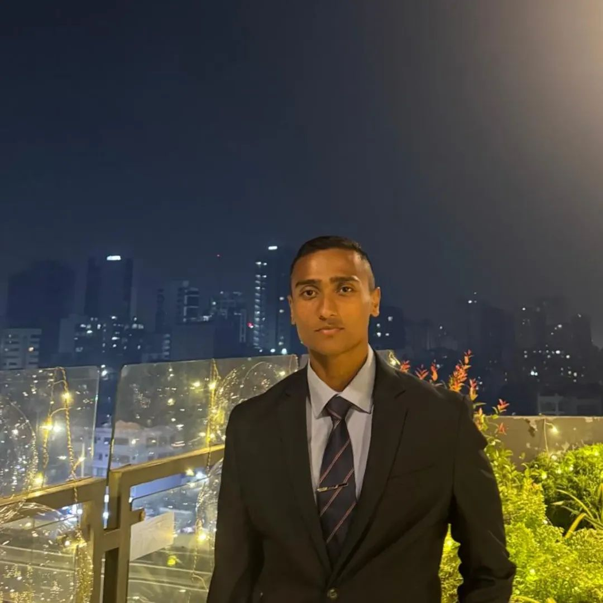</td>
<td align="center" width="33%"></td>
</tr>
<tr>
<td align="center"><b>Samman Rahin Shanto</b><br/><sub>Team Lead</sub></td>
<td align="center"><b>Syed Subeh-Sadik Sholok</b><br/><sub>Firmware &amp; Control</sub></td>
<td align="center"><b>MD. Azmain Shak Rubayed</b><br/><sub>CAD &amp; Fabrication</sub></td>
</tr>
<tr>
<td align="center"><sub>Islamic University of Technology</sub></td>
<td align="center"><sub>Military Institute of Science &amp; Technology</sub></td>
<td align="center"><sub>Northern University Bangladesh</sub></td>
</tr>
<tr>
<td align="center"><sub>Power architecture, PCB layout, and the reason there isn't a single jumper wire on this car.</sub></td>
<td align="center"><sub>Wrote everything the car decides in real time — heading hold, gyro-terminated turns, the failsafe that keeps it alive when the Pi dies.</sub></td>
<td align="center"><sub>If a part on this robot wasn't bought, he drew it and printed it. Chassis, knuckles, tie-bar, camera mast.</sub></td>
</tr>
<tr>
<td align="center"><sub> <a href="mailto:sammanrahin.iut@gmail.com">sammanrahin.iut@gmail.com</a></sub></td>
<td align="center"><sub> <a href="mailto:syedsholok.mist@gmail.com">syedsholok.mist@gmail.com</a></sub></td>
<td align="center"><sub> <a href="mailto:azmiansheikh.nub@gmail.com">azmiansheikh.nub@gmail.com</a></sub></td>
</tr>
</table>

---

### How we got here

#### The one that matters

| Season | Event | Category | Result |
|---|---|---|---|
| **2026** | **WRO Bangladesh — National Final** | Future Engineers |  **National Champion**  selected to represent  |
| **2026** | **WRO Open Championship Asia Pacific** · Hyderabad, 25–27 Sept | Future Engineers |  Racing |

>  [Official announcement of the national round](https://www.facebook.com/share/r/1JujdfQpYH/)

#### The years before that

Blueprint didn't appear out of nowhere for WRO. Between us we've turned up to **35+ national robotics competitions** across Bangladesh — line followers, robo sumo, robo soccer, death race, battlebots. Most weekends of the last two years have been spent in a university sports hall somewhere, waiting for a heat.

That circuit is where the habits came from: iterate fast, design your own PCB instead of waiting for one, and build hardware that can take a hit — because it will.

<table>
<tr>
<td width="50%">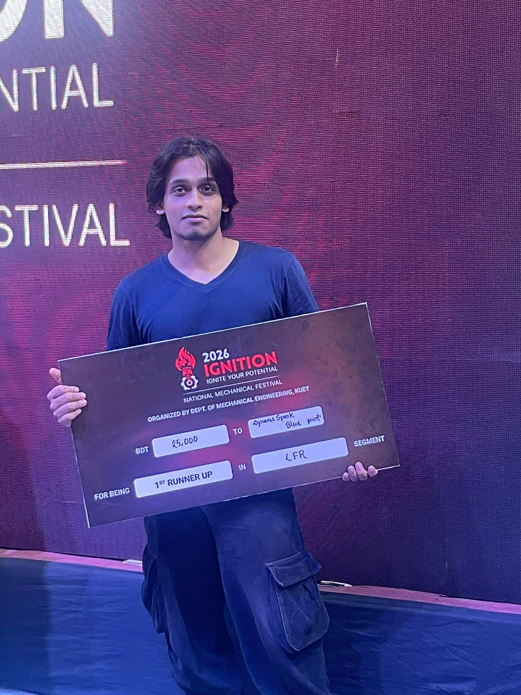</td>
<td width="50%">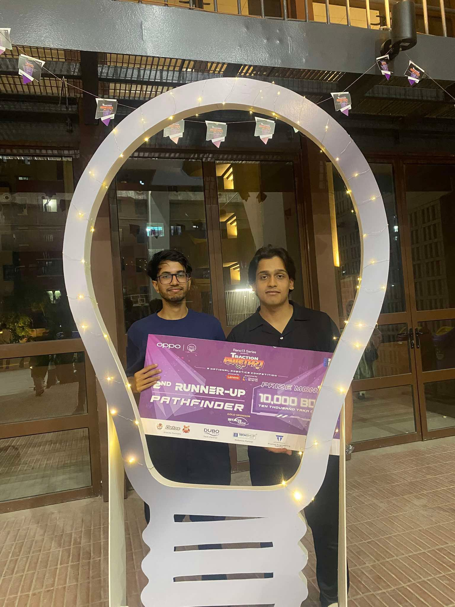</td>
</tr>
<tr>
<td align="center"><sub><b>IGNITION 2026</b> · KUET National Mechanical Festival<br/> 1st Runner-up, Line Follower</sub></td>
<td align="center"><sub><b>Traction 2024</b> · BRAC University<br/> 2nd Runner-up, Pathfinder</sub></td>
</tr>
</table>

| Year | Event | Segment | Result |
|---|---|---|---|
| 2026 | CYBERNAUTS · North South University | Robo Sumo |  Champion |
| 2026 | IGNITION · KUET | Line Follower |  1st Runner-up |
| 2025 | Accelerate · IEEE RAS, IUT | Line Follower |  Podium |
| 2025 | IUT Techathon | Line Follower |  Champion |
| 2024 | Traction · BRAC University | Pathfinder / LFR |  2nd Runner-up |

<p align="center">
  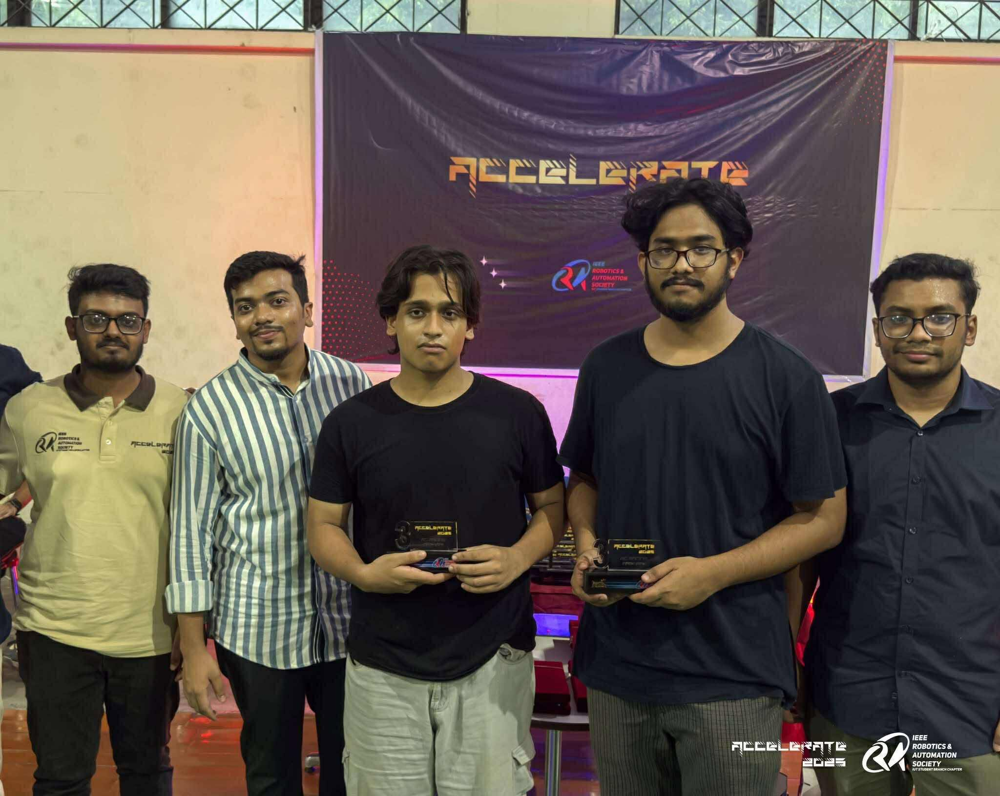
  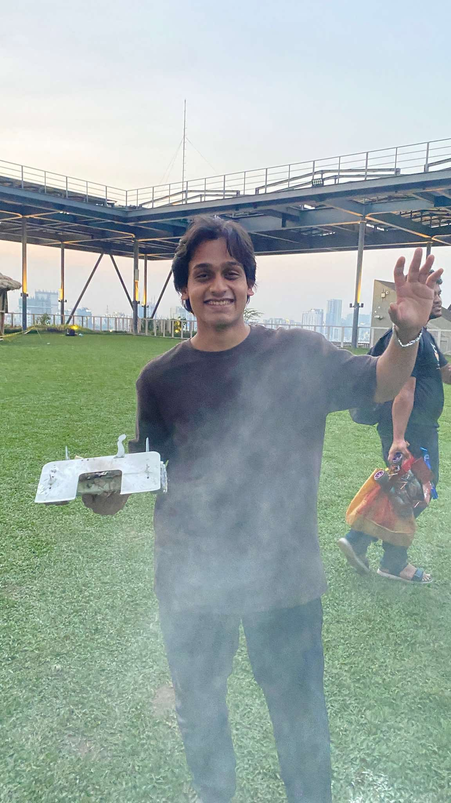
</p>
<p align="center"><sub>Left: Accelerate 2025 at IUT. Right: a robot that technically finished the run. Both count as data.</sub></p>

---

### Why "Blueprint"

> *A dream without a plan is just a wish. An autonomous car without a blueprint is just guesswork.*

We picked the name as a rule for ourselves, not as a slogan. It means three things:

**1. Do the maths before you print the part.**
We simulate the kinematics and the swept volume first. When the maths says a manoeuvre can't work, we believe the maths. That's exactly what happened with parallel parking — the textbook two-arc reverse misses by 25.6 mm at our steering lock, and no amount of tuning was ever going to fix that. So we designed a different manoeuvre.

**2. Write down why, not just what.**
Every pivot goes into [`DECISIONS.md`](DECISIONS.md) with a date, the measurement that forced it, and what it supersedes. If you want to know why there's no steering encoder on this car, the answer is in there, with the reasoning we used at the time — including the part where we were wrong first.

**3. Three universities, one car.**
None of us could have built this alone. The electrical depth, the firmware, and the mechanical design each came from a different campus, and the interesting problems all lived in the seams between them.

---

---

<div align="right"><a href="#contents">back to top</a></div>

## 2. The challenge

### 1. The Challenge
Autonomous miniature racing requires solving complex, coupled real-time problems under strict physical and optical constraints:
- **Optical Noise**: High-reflectance white vinyl mats against low-reflectance matte black walls cause severe infrared crosstalk for standard ToF distance sensors.
- **Dynamic Obstacle Avoidance**: Distinguishing between randomized green (pass left) and red (pass right) traffic pillars at race speeds while maintaining track boundaries.
- **Micro-Bay Parking**: Maneuvering into a bay only $1.5 \times$ the vehicle's length ($L = 110\text{ mm}$), where classical two-arc symmetric reverse parking mathematically fails.

### 2. Primary Engineering Goals
- [x] **Sub-millimeter Odometry Loop**: Quadrature encoder integration with an STM32 hardware timer, delivering $0.175\text{ mm/tick}$.
- [x] **Zero-Drift Heading Control**: High-speed (1 kHz) gyro sampling with IMU-terminated 90° turns immune to wheel scrub and slip.
- [x] **Fail-Safe Heterogeneous Architecture**: STM32 handles deterministic real-time safety; Raspberry Pi 5 handles perception. A high-level software crash never stops the vehicle.
- [x] **Avionics Wiring Standard**: Zero jumper wires (DuPont) and zero breadboards. All connections utilize latched JST-XH connectors and Dhaka-milled isolation PCBs.

---

---

<div align="right"><a href="#contents">back to top</a></div>

## 3. The vehicle

| Category | Parameter | Measured / Engineered Value | Rule Limit / Target | Notes |
|---|---|---|---|---|
| **Envelope** | Scored Footprint | **165 × 115 mm** | ≤ 300 × 200 mm | Ultra-compact design to maximize parking slack |
| | Height | **50 mm** (Open) / **~90 mm** (Obstacle with LiDAR) | ≤ 300 mm | Minimal CG height; sensor mast modular |
| | Total Mass | **~420 g** (Open) / **~540–580 g** (Obstacle) | Unrestricted | Low-inertia vehicle for rapid deceleration |
| **Chassis** | Wheelbase ($L$) | **110 mm** | Measured | Optimized against turning radius |
| | Track Width ($W$) | **105 mm** (center-to-center) / **115 mm** (extreme) | — | 115 mm total outer width |
| | Wheel Diameter | **46 mm** (Front) / **50 mm** (Rear) | — | 1.1° natural forward rake |
| **Kinematics** | Steering Mechanism | **True Ackermann linkage**, 100 % (single servo) | — | Third geometry. Inner wheel turns further than outer, so nothing scrubs |
| | Steering Range | **±35°** at wheel knuckles | — | Actuated via JX PS-1171MG digital metal-gear servo |
| | Minimum Turning Radius | **157 mm** ($L / \tan 35^\circ$) | — | Centers inside standard 1000 mm driving lane |
| **Powertrain** | Primary Motor | **25GA DC Gearmotor** (12V) | Max 1 motor | Rule 11.5 compliant |
| | Reduction | **5:1 Spur Gear Final Drive** | — | High starting torque, eliminates stall cogging |
| | Drive Topology | **Solid rear axle** (No differential) | Max 1 driven axle | Maximizes straight-line odometry consistency |
| | Maximum Speed | **0.70 m/s** | — | Software throttled for predictable braking |
| **Sensors** | 2D LiDAR Scanner | **Slamtec RPLIDAR C1 (360° DTOF)** | — | 12 m range, 5 kHz sampling, high ambient light immunity (Obstacle round) |
| | Optical Camera | **160° FOV Wide-Angle Fisheye** | — | High-speed pillar color & centroid extraction (Obstacle round) |
| | Distance Array | **4× VL53L1X Time-of-Flight (ToF)** | — | Front and rear, on TCA9548A channels 1 and 2, with custom 3D-printed optical collimators |
| | Ground Color Sensing | **TCS34725 RGB Sensor** | — | Downward-facing with isolated illumination hood |
| | Inertial Measurement | **BNO085 (SPI, on-chip sensor fusion)** | — | 1 kHz internal sampling for heading integration |
| | Odometry Resolution | **0.175 mm / count** | — | Quadrature optical/magnetic motor encoder |
| **Compute** | Real-Time Master | **STM32F411CEU6 (Black Pill)** | — | ARM Cortex-M4 @ 100 MHz, Hardware FPU, Real-Time Loop |
| | Perception & Mapping | **Raspberry Pi 5 (8GB)** | — | Quad-Core Cortex-A76 @ 2.4 GHz, concurrent Vision + LiDAR SLAM |

### Rule Compliance Matrix

- **Mechanical (Rules 11.3, 11.5, 11.13)**: Exactly four wheels, single steering actuator, single drive motor coupled via a fixed gear reduction to a single solid axle.
- **RF & Telemetry (Rule 11.10)**: All wireless interfaces (Wi-Fi, Bluetooth) are disabled at kernel boot (`config.txt`) on the Raspberry Pi. Zero external communication during runs.
- **Power & Control Interface (Rules 9.10, 9.11)**: Dedicated master physical toggle switch for complete battery cut-off, plus a separate momentary push-button dedicated solely to initiating autonomous runs.

---


### 1. Vehicle Views (`v-photos/`)
Detailed competition photographs conforming to WRO documentation rules:

| Perspective | File Link | Perspective | File Link |
|---|---|---|---|
| **Front View** | [`v-photos/front.jpg`](v-photos/README.md) | **Back View** | [`v-photos/back.jpg`](v-photos/README.md) |
| **Left Side View** | [`v-photos/left.jpg`](v-photos/README.md) | **Right Side View** | [`v-photos/right.jpg`](v-photos/README.md) |
| **Top View** | [`v-photos/top.jpg`](v-photos/README.md) | **Chassis Underside** | [`v-photos/bottom.jpg`](v-photos/README.md) |

### 2. Team Documentation (`t-photos/`)
- **Official Team Photo**: [`t-photos/official.jpg`](t-photos/README.md)
- **Informal / Behind the Scenes**: [`t-photos/funny.jpg`](t-photos/README.md)

### 3. Engineering Visual Artifacts

<div align="center">

| Optical Collimator Simulation | Swept Parking Envelope Analysis |
|:---:|:---:|
|  |  |
| *Ground IR reflection threshold extended from 166 mm to 870 mm* | *Proof of textbook 2-arc failure & shuffle maneuver validation* |

</div>

---

<div align="right"><a href="#contents">back to top</a></div>

## 4. System architecture

The robot employs a **dual-tier heterogeneous compute hierarchy**:

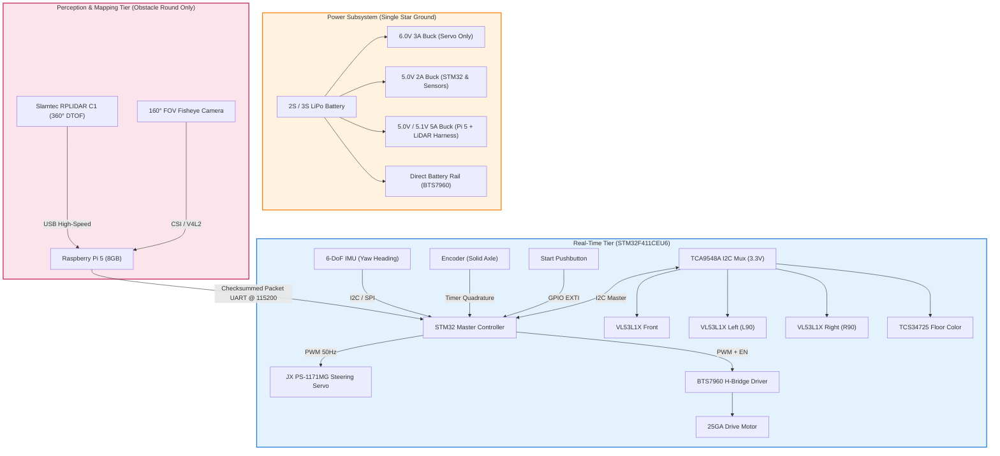

### Complete Electrical Schematic
A full physical wiring block diagram is illustrated below, mapping PCB pinouts, line terminations, and bus distributions:

<p align="center">
  
</p>

---

### Power architecture

<p align="center">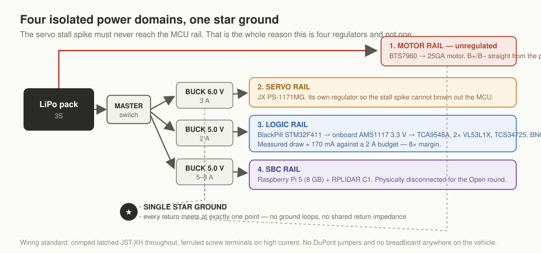</p>

Four domains, one star ground, and the reason is the servo. A JX PS-1171MG pulls
an instantaneous stall spike big enough to drag a shared rail down and reset the
MCU mid-run. Giving it its own regulator makes that spike somebody else's
problem. The motor rail bypasses the carrier board entirely — B+ and B− run from
the pack straight to the BTS7960 — so the highest current on the vehicle never
crosses a milled trace.

Measured logic draw is about 170 mA against a 2 A budget. Eight times margin,
because brownouts do not announce themselves in testing.

Pin map, decoupling, bus architecture and bring-up order are in
[`electrical/ELECTRICAL.md`](electrical/ELECTRICAL.md).


To ensure resilience during high-vibration dynamic runs, the electronics follow strict avionics-style guidelines:

- **Custom Dhaka-Milled PCBs**: Fabricated using a single-sided isolation milling process with conservative 0.5 mm trace/space constraints:
  - **Board A (Upper)**: Houses STM32F411, BTS7960 gate interface, IMU, hardware UART, and primary power distribution.
  - **Board B (Lower)**: Dedicated 3.3V sensor aggregation plane containing the TCA9548A multiplexer and modular sensor headers.
- **Four Isolated Power Domains with Single Star Ground**:
  1. *Motor Rail*: Unregulated battery voltage routed via heavy-gauge copper directly to BTS7960 H-Bridge.
  2. *Servo Rail (6.0V)*: Dedicated 3A buck regulator. Prevents the 2.5A instantaneous stall spikes of the JX PS-1171MG from causing MCU brownout resets.
  3. *Logic Rail (5.0V  3.3V)*: Dedicated buck feeding STM32 and secondary low-dropout (LDO) regulator for sensors.
  4. *SBC & LiDAR Rail (5.0V/5.1V, 5A)*: Dedicated high-current regulator harness for the Raspberry Pi 5 (8GB) and RPLIDAR C1 (physically disconnected during Open round).
- **Wiring & Interconnect Standards**:
  - **Zero jumper wires (DuPont) and zero breadboards** anywhere on the vehicle.
  - All wiring harness connections are crimped and latched using genuine JST-XH connectors with heat-shrink strain reliefs.
  - High-current paths use screw terminals with ferrules.

---

---

<div align="right"><a href="#contents">back to top</a></div>

## 5. How the car thinks

This is the whole control logic in plain language. No code required to follow
it. Where a constant is named it comes from
[`docs/CALIBRATION.md`](#8-calibration), and the firmware it describes is
[`src/open_round/OpenRound.cpp`](src/open_round/OpenRound.cpp) and
[`src/obstacle_round/ObstacleRound.cpp`](src/obstacle_round/ObstacleRound.cpp).

---

### The one idea the whole car is built on

**The heading is the truth. Everything else is a hint.**

A wheel can slip. A tyre can scrub sideways through a turn. A distance sensor
can read the floor and call it a wall. A camera can lose a pillar to a shadow.
Every one of those has happened to us on a run.

What does not lie is the IMU's idea of which way the car is pointing. So the
car is built so that heading decides when a manoeuvre is finished, and
everything else only decides when one should *start*. A turn ends when the
heading has moved 90 degrees, never after a time or a distance. A straight is
held on heading, not by following a wall.

That single decision is why the car finishes three laps instead of drifting
into a wall on lap two.

---

### Two tiers, and why the split exists

```
            +-------------------------------------------+
            |  Raspberry Pi 5            ADVISORY tier   |
            |                                            |
            |  camera thread  ->  colour + bearing       |
            |  lidar thread   ->  360 ranges             |
            |  fusion loop    ->  obstacles with distance|
            +--------------------+-----------------------+
                                 |  UART 115200
                                 |  "V,<colour>,<dx>,<area>"
                                 v
            +-------------------------------------------+
            |  STM32F411CEU6             REAL-TIME tier  |
            |                                            |
            |  IMU heading, encoder odometry,            |
            |  ToF ranges, floor colour,                 |
            |  the state machine, servo, motor           |
            +-------------------------------------------+
```

The STM32 is the only thing that can move the car. It owns the motor, the servo
and every safety decision, and it runs a fixed cycle with no dynamic memory
allocation and no blocking calls.

The Pi only ever *suggests*. It sends a frame saying "I can see a red pillar,
this far off centre, this big". The STM32 reads that as advice and decides for
itself what to do about it.

**Why it is built this way:** if the Pi crashes, overheats, drops frames, or a
Python exception takes down the vision thread, the STM32 notices the frames have
gone stale — `visionFresh()` is false after 250 ms — and quietly carries on
driving the open-round logic. A dead perception stack costs you pillar points.
It does not cost you the run. The high-level stack physically cannot stall or
crash the vehicle.


### The state machine

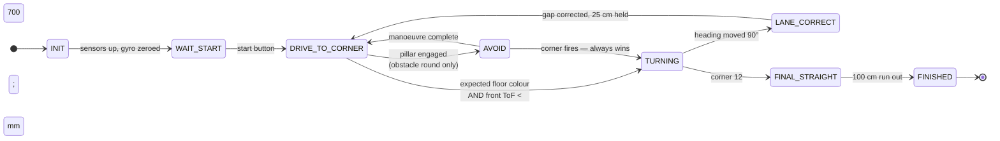

Two rules hold this together. **The corner turn outranks everything** — if a
turn condition fires mid-avoidance, the turn wins, because a missed pillar costs
points and a missed corner costs the run. And **no state exits on a timer**;
every transition is a measured condition.

---

### Startup and arming

1. Power on. The STM32 brings up the I2C mux, the two VL53L1X, the TCS34725 and
   the BNO085 over SPI. Anything that fails to answer is marked absent and the
   car keeps going without it.
2. **Gyro zeroing.** The car sits still and the current yaw is captured as
   `initialYawOffset`. From here on "heading" means degrees relative to however
   the car was pointing when it was armed, wrapped to -180..+180. This is why
   the car must be placed square in the start section and left alone during
   boot.
3. `STATE_WAIT_START`. Nothing moves until the button is pressed. One button,
   one job, as the rules require.

---

### Working out which way round the track goes

The direction is randomised, so the car has to discover it on the first corner
rather than be told.

The mat has an orange line and a blue line at every corner. Which one the car
crosses **first** tells it the direction of travel:

- orange first -> clockwise -> every corner is a right turn
- blue first -> counter-clockwise -> every corner is a left turn

Once locked, it stays locked for the whole run. Corners two through twelve never
re-ask the question. Every subsequent corner only looks for the colour it
already expects, which makes a stray reflection off the other line harmless.

---

### The main loop: `STATE_DRIVE_TO_CORNER`

The car drives straight, holding the heading it left the last corner on:

```
error  =  target_heading - current_heading
servo  =  SERVO_TRUE_STRAIGHT + HEAD_KP * error,   slew limited to SERVO_SLEW
```

Proportional only. No integral, no derivative — the reasoning is in
[CALIBRATION step 7](#7-heading-correction-gain).

While it drives it is watching for three things.

**The corner.** A corner is declared when the expected floor colour is seen
**and** the front ToF says a wall is inside `FRONT_TURN_MM` (700 mm). Both
conditions, because either alone gives false positives — a colour smear on the
mat, or a ToF return off the floor.

**The lockout.** For `POST_CORNER_LOCKOUT_CM` (50 cm) after a corner, colour
detections are ignored. Coming out of a turn the sensor sweeps back across the
same pair of lines it just crossed, and without the lockout the car would
declare a second corner immediately and spin.

**A pillar**, on the obstacle round only. More on that below.

---

### The lane-gap correction: the part that is ours

<p align="center">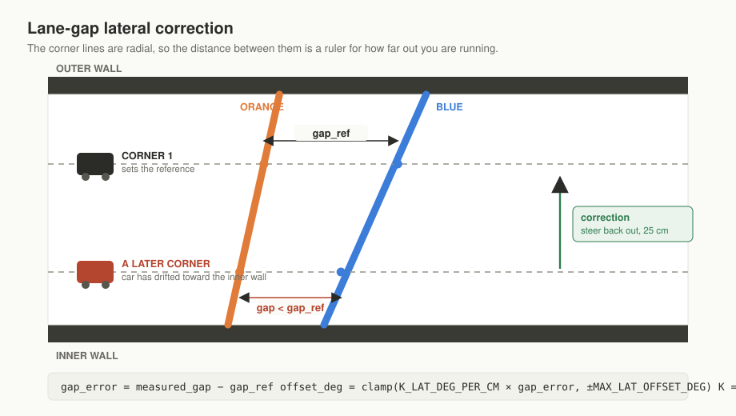</p>

This is the piece of this car we have not seen anyone else do, and it is worth
reading slowly.

#### The problem

Over three laps the car drifts sideways. Turn slightly wide on corner three and
you spend the rest of the lap running closer to the outer wall, which puts the
corner-four entry in the wrong place, and the error compounds. Twelve corners is
plenty of distance to accumulate a wall strike.

The usual fix is to follow a side wall with a distance sensor. We tried it. It
fails on this mat for the same reason step 5 exists: the ToF picks up the white
floor and reports a wall that is not there, and a wall-follower fed a phantom
wall steers into the real one.

#### The insight

The orange and blue lines at each corner are not parallel. **They fan out.** The
further from the inner wall you cross them, the further apart they are.

So the gap between them is a ruler. The car does not need to see a wall at all —
it can measure its own lateral position by how much track it covers between
crossing the first line and crossing the second.

That measurement is pure odometry. It uses the encoder, which is the one sensor
on this car that the white mat cannot fool.

#### How it runs

1. **Corner one sets the reference.** The car records the encoder distance
   between the two line crossings and stores it as the gap it intends to hold
   for the rest of the race. Whatever line it happened to take on corner one
   becomes "correct" by definition — the car is not trying to find the racing
   line, it is trying to stop drifting off whatever line it started on.
2. **Every corner after measures the same gap.** Smaller gap than the reference
   means the car has moved closer to the inner wall. Larger means it has drifted
   out.
3. **The correction is proportional to the difference:**

```
gap_error   =  measured_gap - reference_gap
offset_deg  =  clamp(K_LAT_DEG_PER_CM * gap_error,  -MAX_LAT_OFFSET_DEG, +MAX_LAT_OFFSET_DEG)
```

With `K_LAT_DEG_PER_CM = 4` and the cap at 30 degrees. That offset is added to
the heading target and held for `CORRECTION_DISTANCE_CM` (25 cm) at
`CORRECTION_PWM` (70), then released — the car crabs back onto its original
line and resumes normal heading hold.

4. **A deadband stops it hunting.** Errors under `GAP_DEADBAND_CM` (2 cm) are
   ignored. Errors over `GAP_THRESHOLD_CM` (20 cm) are treated as a bad
   measurement rather than a real drift and discarded, because 20 cm of lateral
   movement in one lap means something else went wrong and over-correcting on a
   bad reading is worse than not correcting at all.

#### Why it is better than wall-following

- It cannot be fooled by floor reflections, because it never looks at the floor
  for distance.
- It needs no extra hardware — the encoder and the colour sensor are already
  there for other reasons.
- It self-references. There is no absolute "correct distance from the wall" to
  measure or calibrate. Corner one defines the target, so the same code works on
  any mat and any start position.
- It corrects **once per corner**, at the moment the information arrives, rather
  than continuously fighting a noisy signal down the straight.

---

### `STATE_TURNING`

Heading-terminated, proportional, eased, no settle. The law and the reasoning
are in [CALIBRATION step 6](#6-ninety-degree-turns).

Two things worth repeating here:

- The corner turn has **absolute priority**. If a turn condition fires while the
  car is halfway through a pillar avoidance, the turn wins and avoidance is
  abandoned. A missed pillar costs points. A missed corner costs the run.
- `TURN_STOP_DEG` is 0.3 degrees, but the car does not sit there trying to hit
  it. The moment the turn exits, heading hold takes over and removes the
  remainder while the car is already moving away.

On corner twelve the car enters `STATE_FINAL_STRAIGHT`, runs
`FINAL_STRAIGHT_CM` (100 cm) to put itself back in the start section, and brakes
to `STATE_FINISHED`.

---

### Pillar avoidance — obstacle round only

#### What the Pi sends

One line per frame, at up to 30 Hz:

```
V,<colour>,<dx>,<area>
```

- `colour` — `R`, `G` or `N` for nothing
- `dx` — how far off centre the pillar is, in pixels, positive to the right,
  spanning `DX_SPAN` = 160 either way
- `area` — blob size in pixels, which stands in for "how close"

The STM32 engages only when the colour is right, `area` exceeds
`AVOID_MIN_AREA_R` / `AVOID_MIN_AREA_G` (1600), and the frame is under 250 ms
old. A stale frame is no frame.

#### Offset-based, not fixed-swerve

The naive approach is "see red, steer right by a fixed amount". It fails,
because how far you need to move depends entirely on where the pillar already
is. A pillar dead centre needs a big move. A pillar already near the edge of the
frame needs almost none, and moving the full amount throws you into the wall.

So the target is computed from `dx`:

- pillar **centred** (`|dx|` near 0) -> move a lot -> aim to pass **near** the
  wall, `AVOID_SIDE_NEAR_MM` = 150
- pillar **already off to the side** -> move little -> aim to pass **far** from
  the wall, `AVOID_SIDE_FAR_MM` = 300

with a hard floor of `SIDE_SAFE_MM` = 100 that the car will never go inside
whatever the arithmetic says. Red passes on the right, green on the left, per
the rules.

#### The six phases

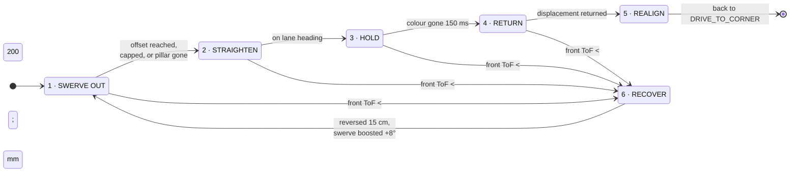


| Phase | What happens |
|---|---|
| 1 | **Swerve out** to the computed offset. Exits when the offset is reached, the safety floor is hit, the cap is hit, or the pillar simply leaves the frame. The encoder distance travelled sideways is remembered. |
| 2 | **Straighten** onto the lane heading while holding the offset |
| 3 | **Hold** until the colour has been gone for `AVOID_RELEASE_MS` (150 ms) — debounced, so one dropped frame does not end the manoeuvre early |
| 4 | **Return** exactly the remembered displacement, so the move out and the move back are symmetric and the car ends up on the line it started on |
| 5 | **Realign** to lane heading, restore the base swerve angle, hand back to `STATE_DRIVE_TO_CORNER` |
| 6 | **Recover** — see below |

#### The recovery phase

If the front ToF drops below `FRONT_STOP_MM` (200 mm) during any of phases 1 to
4, the car is about to clip something. It does not stop and it does not give up:

1. Reverse `AVOID_BACKUP_CM` (15 cm) on the steering angle it was last using, so
   it retraces its own path out rather than reversing into something new
2. Increase the swerve by `AVOID_STEER_BOOST` (8 degrees), capped at
   `AVOID_STEER_MAX` (44)
3. Go back to phase 1 and try again, harder

It must move forward `RECOVER_MIN_FWD_CM` (5 cm) between backups, which stops
the car from oscillating back and forth against an obstacle it cannot clear. The
boosted angle is reset once the pillar is crossed, so one awkward pillar does not
leave the car swerving wildly for the rest of the lap.

---

### The Pi perception stack

Three threads, one shared state object, deliberately simple.
Source: [`src/pi/`](src/pi/).

#### `worldstate.py` — the integration seam

One lock, two slots — the newest camera result and the newest lidar result.
Producers overwrite; nothing is queued. `snapshot()` copies two references out
under the lock and returns.

The critical section is two assignments long. All the heavy work — colour
conversion, contour finding, sector scanning — happens outside it. That is why a
slow camera frame cannot stall the lidar thread or the fusion loop.

Conventions are fixed once, in that file, and enforced everywhere: **distances
in mm, angles in degrees, 0 degrees is robot forward, positive is left, and "no
return" is `float('inf')` and never `None`.** Most integration bugs in a system
like this are unit and sign bugs, and the cure is to decide once and write it
down where nobody can miss it.

#### `sensors/camera.py`

Detection lives in **module-level functions**, not inside the thread class. The
robot calls them with values loaded from `config.json`; the dashboard calls the
same functions with live slider values. There is exactly one code path, so what
you tune in the browser is bit-for-bit what runs on the car. Nothing is
duplicated and the two cannot drift apart.

The camera's job is **colour and bearing only**. Distance is left at infinity.

```
bearing = -((cx - width/2) / (width/2)) * (hfov / 2)
```

#### `sensors/lidar.py`

The `rplidarc1` library is asyncio and uses a TaskGroup. Rather than force the
whole program to be async, that entire world is sealed inside one thread running
its own event loop. Three tasks: the library's scan producer, a consumer that
folds streaming points into a rolling 360-element array indexed by integer
degree, and a publisher that copies that array into shared state at 50 Hz.

Outside that file nothing in the program knows asyncio exists.

#### `main.py` — fusion

At 30 Hz: take a snapshot, and for each camera obstacle look up the lidar range
at the same bearing (`sector_min` over `BEARING_MATCH_DEG` = 8 degrees either
side) to attach a real distance to it.

Camera gives colour and bearing well and distance badly. Lidar gives distance
perfectly and colour not at all. Together they give a coloured obstacle with a
real range, which is what the avoidance logic actually needs.

> **Current state.** The fusion loop prints to the console. It does not yet
> drive the MCU — the `V,...` frame is not being emitted from this stack yet.
> That is the open item on the perception tier.

#### `dashboard.py`

Flask, MJPEG streams of raw / mask / overlay, live sliders, a lidar radar view,
and atomic save back to `config.json` (write to a temp file, then `os.replace`,
so a crash mid-save can never leave a half-written config on the car).

Runs as a systemd unit ([`robodash.service`](src/pi/robodash.service)) with
`Conflicts=robot.service`, because only one process can hold the camera and it
is better to fail loudly at boot than to have two processes fight over
`/dev/video0` in the pit.

---

### What runs where

| | Open round | Obstacle round |
|---|---|---|
| STM32 firmware | `OpenRound.cpp` | `ObstacleRound.cpp` |
| Heading hold | yes | yes |
| Lane-gap correction | yes | yes |
| Pillar avoidance | no | yes |
| Raspberry Pi | not required | camera + lidar + fusion |
| Wireless | disabled | disabled |

Same navigation core in both. The obstacle firmware adds the UART vision link,
the avoidance sub-machine and the front-proximity failsafe, and changes nothing
about how the car drives between pillars.

---

<div align="right"><a href="#contents">back to top</a></div>

## 6. Engineering findings

Through rigorous physical validation, four primary engineering hypotheses were challenged and redesigned:

### 1. Floor IR crosstalk, and the collimator that fixed it

<p align="center">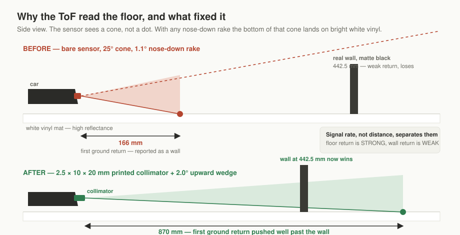</p>

* **Problem**: The WRO mat is high-reflectance white vinyl (Rule 13.2), while perimeter walls are low-reflectance matte black (Rules 13.4, 13.6). Standard VL53L1X ToF sensors possess a 25° field of view without software-defined regions of interest. Chassis rake (1.1° nose-down) caused the sensors to trigger on the floor at 166 mm instead of detecting walls.
* **Solution**: Developed [`electrical/collimator.py`](electrical/collimator.py) to calculate optical snout baffles. 3D-printed narrow 2.5 × 10 × 20 mm slot collimators paired with +2.0° mechanical upward wedges pushed the first ground reflection threshold from 166 mm out to **870 mm**, completely clearing side walls at 442.5 mm.

### 2. Analytical Failure of Textbook Two-Arc Parallel Parking
* **Problem**: Kinematic analysis ([`src/sim/park_feasibility.py`](src/sim/park_feasibility.py)) proved that a standard symmetric reverse two-arc parking trajectory **fails by 25.6 mm** at 35° steering lock within WRO designated bay limits ($1.5 \times L$).
* **Insight**: The problem is scale-invariant—shortening the car shrinks the bay proportionally.
* **Solution**: Implemented an iterative **multi-point shuffle maneuver closed on IMU yaw feedback**, robust to open-loop steering backlash and varying floor friction.

### 3. Three steering geometries, two of them wrong

<p align="center">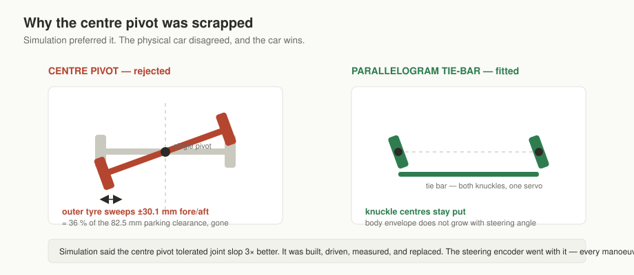</p>

**Attempt one — centre pivot.** Simulation said a single central pivot tolerated
mechanical joint slop three times better than a linkage, so that is what was
built. On the car it was wrong. Rotating the whole front axle swept the outer
tyre ±30.1 mm fore and aft — `(track / 2) · sin δ` — which consumed 36 % of the
82.5 mm parking clearance and raised the risk of a body strike. Scrapped.

**Attempt two — parallelogram tie-bar.** Both knuckles driven to the same angle
by one tie bar. It fixed the swept envelope: knuckle centres stay put, so the
body envelope no longer grows with steering angle. It drove acceptably on the
bench and badly on the mat.

The reason is geometric and we should have caught it in the maths. In any turn
the inner wheel is on a tighter radius than the outer, so it needs a *larger*
steering angle. A parallelogram gives both wheels the same angle. That angular
difference does not disappear — it comes out as scrub. What we actually
observed:

- audible squeal and visible scuffing through corners
- wide corner exits, with the lane-gap correction constantly pulling the car
  back in
- the same commanded steering angle producing a different heading change from
  one run to the next

**Attempt three — true Ackermann, and this is what is on the car.** The steering
arms are angled so that their extensions meet at the centre of the rear axle.
At any steering angle both front wheels are perpendicular to a radius drawn
from one shared turn centre, so every wheel rolls and none scrubs. 100 %
Ackermann, still one servo.

**Why this mattered more than a grip problem.** A scrubbing tyre rotates further
than the car travels, so the encoder over-reads. The lane-gap correction in
[section 5](#the-lane-gap-correction-the-part-that-is-ours) measures lateral
position purely by odometry. Parallelogram steering was quietly corrupting the
one sensor the entire navigation scheme trusts — the slip did not just cost
grip, it fed bad numbers into the lane correction, which then steered on them.

Simulation preferred the losing geometry both times. The car disagreed both
times. When the model and the vehicle disagree, the vehicle is right.


### 4. Feedforward Steering with IMU Closed-Loop
* **Problem**: Original blueprints called for an absolute magnetic rotary encoder (AS5600) on the steering shaft to eliminate servo gear backlash.
* **Insight**: Transitioning to the parallelogram mechanism removed the central steering shaft. Further analysis revealed that closed-loop steering angle is redundant because the high-level navigation loop terminates maneuvers on **measured body yaw rate and heading from the gyro**, not wheel angle. The magnetic encoder was eliminated, saving cost, mass, and I²C bus complexity.

---

---

<div align="right"><a href="#contents">back to top</a></div>

## 7. Build one from scratch

Order the parts, print the parts, build the boards, assemble, flash, calibrate.
If you follow this page and [`docs/CALIBRATION.md`](#8-calibration) you should
end up with a car that behaves the same way ours does.

> Items marked **VERIFY** are not yet confirmed against the current build. The
> car is being rebuilt for the Open Championship and this page tracks the new
> build, not the nationals car.

### 0. What you are building

A four-wheeled vehicle, one steered axle at the front, one driven axle at the
rear, a real-time microcontroller doing all the driving and a single-board
computer doing all the seeing.

| Subsystem | Part |
|---|---|
| Real-time controller | WeAct BlackPill, STM32F411CEU6, Cortex-M4 at 100 MHz |
| Perception computer | Raspberry Pi 5, 8 GB |
| Drive motor | 12 V 25GA-370 gearmotor with hall encoder, 1330 rpm **VERIFY: output or motor rpm, and gearbox ratio** |
| Motor driver | BTS7960 module |
| Steering servo | JX PS-1171MG, 17 g digital metal gear |
| IMU | BNO085 over SPI |
| I2C mux | TCA9548A at 0x70 |
| Distance | 2x VL53L1X on mux channels 1 and 2 **VERIFY: which is front, which is rear** |
| Floor colour | TCS34725 on mux channel 3, downward facing with a light hood |
| Camera | fisheye lens on the Pi **VERIFY: `config.json` says 62 degree HFOV, which is not a fisheye figure** |
| Lidar | Slamtec RPLIDAR C1, 360 degree |
| Battery | LiPo **VERIFY: cell count, capacity, C rating** |

### 1. Printed parts

Printed on an **Ender 3 V3 SE** in **PLA**.

| Part | Infill | Notes |
|---|---|---|
| Chassis plate | 5% | ~130 x 105 mm |
| Body and brackets | 5% | strength is not the constraint, mass is |
| Gears | 90% | tooth root stress; do not print these light |
| Front wheels x2 | 5% | 46 mm |
| Rear wheels x2 | 5% | 50 mm |
| Steering knuckles and tie-bar | 5% | parallelogram linkage, +/-35 deg travel |
| ToF collimator snouts | 5% | see [step 5](#5-tof-floor-signal-threshold) — these are structural, not decorative |
| Sensor mounts | 5% | fixed to the chassis, never to the steering |
| Camera mast | 5% | ~90 mm |

CAD source and STLs go in [`models/`](models/). `*.f3d` and `*.f3z` were
previously excluded by `.gitignore`; that has been removed so the Fusion sources
are tracked.

### 2. Boards

Two single-sided boards, milled in-house by Azmain with a fibre laser and
etching.

- **Carrier**, 90 x 70 mm, bottom copper only, Raspberry Pi 5 stack holes,
  routed with FreeRouting. 0-ohm through-hole resistors used as jumpers wherever
  a crossing could not be avoided.
- **Mux board**, its own single-sided PCB, joined to the carrier by a 10-pin IDC
  box header, carrying the local JST-PH sensor ports.

Wiring standards, non-negotiable, because they are what stops a run dying to
vibration:

- **No DuPont jumpers and no breadboard anywhere on the vehicle**
- Every harness crimped and latched, JST-XH, with heat-shrink strain relief
- High-current paths on screw terminals with ferrules
- Motor B+ and B- go straight from the pack to the BTS7960 and never touch the
  carrier
- One master switch that breaks the logic rails; one separate momentary button
  that does nothing but start a run

Power domains and the star ground are documented in
[`electrical/ELECTRICAL.md`](electrical/ELECTRICAL.md), section 2. The current
budget is section 3. Read both before you power anything.

### 3. Assembly order

1. **Steering first.** Build the Ackermann linkage on the bench and check it
   through its full travel before anything else goes on the chassis. Two things
   to verify, both of which we got wrong on earlier attempts:
   - **Knuckle centres must stay fixed** as the wheels turn. If the whole axle
     rotates you have built a centre pivot, which sweeps the outer tyre ±30 mm
     fore and aft and eats 36 % of the parking clearance.
   - **The inner wheel must turn further than the outer.** Put the linkage at
     full lock and check by eye that the angles differ. If they are equal you
     have built a parallelogram, and it will scrub. The steering arms must be
     angled so their extensions meet at the centre of the rear axle — that is
     the entire Ackermann condition and it is easy to check with two rulers.
2. **Powertrain.** Motor, gear reduction, solid rear axle. No differential —
   a solid axle keeps straight-line odometry consistent, which the whole
   lane-gap correction depends on. Check the encoder coupler grub screw is
   properly tight; a slipping coupler is invisible until step 1 of calibration
   gives you a growing standard deviation.
3. **Electronics.** Carrier on, mux board on, sensors last. Bring the power
   rails up one at a time with the boards unpopulated and check each voltage
   before plugging anything in.
4. **Sensors.** ToF with collimators fitted and at final rake. Colour sensor at
   final ride height with its hood. Mast and camera. Lidar last so it is not in
   the way while you work.
5. **Bring-up order** is in `ELECTRICAL.md` section 10. Do not skip it.

### 4. Flash and calibrate

```bash
# STM32 firmware, PlatformIO
pio run -e blackpill_f411ce --target upload
```

Then work through [`docs/CALIBRATION.md`](#8-calibration) in order. This is not
optional. Every constant in the firmware is specific to one physical car, and a
car built from these files with our numbers in it will not drive straight.

### 5. Raspberry Pi

See [`src/pi/README.md`](src/pi/).

### 6. Cost

**TODO.** Being priced from part links; will be published as an estimate with
local Dhaka sourcing noted separately, since local prices differ substantially
from listed international ones.

---

<div align="right"><a href="#contents">back to top</a></div>

## 8. Calibration

Every number this car drives on was measured, not guessed. This page is the
procedure, start to finish, written so that somebody who has never touched the
robot can pick it up and get the same numbers we did.

Work through the steps in order the first time. Later you can re-run any single
step on its own, but the dependencies below are real — step 2 is meaningless if
step 1 was wrong.

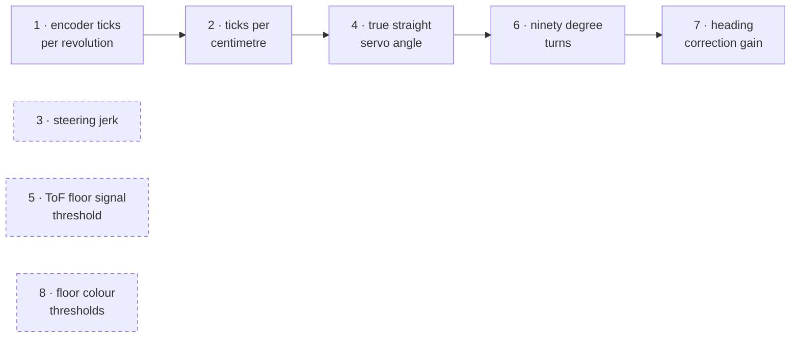

Solid arrows are hard dependencies — step 2 is meaningless if step 1 was wrong.
The three dashed boxes are independent and can be run at any time.

### Before you start

| | |
|---|---|
| Board | WeAct BlackPill, STM32F411CEU6 |
| Framework | Arduino core for STM32 (STM32duino) |
| Upload | DFU over USB, or ST-Link |
| Serial | 115200 baud |
| Libraries | `SparkFun_BNO08x_Arduino_Library`, Pololu `VL53L1X`, `Adafruit_TCS34725`, built-in `Servo`, `SPI`, `Wire` |

Two ways to run these:

- **The eight standalone sketches** in [`src/tools/calibration/`](src/tools/calibration/) —
  `01_encoder_ticks_per_rev.cpp` through `08_floor_colour_thresholds.cpp`.
  One job each, heavily commented, more diagnostic output. Read these to
  understand what a step is doing.
- **[`CalibrationSuite.cpp`](src/tools/calibration/CalibrationSuite.cpp)** — all
  eight behind a serial menu. Flash once, type a number. This is the one to
  have on the board in a pit with no table.

Both share [`hardware_config.h`](src/tools/calibration/hardware_config.h).
Pins live there and nowhere else. Anything marked `VERIFY` in that file has not
been confirmed against the current PCB yet.

**Everything must be at competition weight.** Battery in, lid on, mast fitted.
The rolling radius of a loaded tyre is smaller than an unloaded one, and every
distance number in this document depends on it.

---

### 1. Encoder ticks per wheel revolution


<p align="center">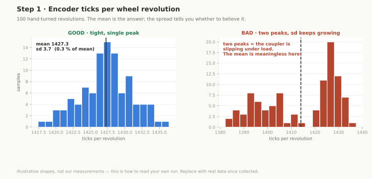</p>
**Gives you:** counts produced by one full turn of the drive wheel.

**Why not read the datasheet:** because the datasheet describes the encoder, not
your car. Gearbox backlash, a coupler that slips a few degrees under load, and
quadrature counting both edges of both channels all move the real figure.

**Rig:** flat hard floor. A pen mark on the tyre sidewall and a matching mark on
the chassis right beside it.

**Procedure:** line the marks up, press the button to zero, turn the wheel
forward by hand exactly one revolution until the marks meet again, press the
button. Repeat until you have 100 samples. Turn slowly and evenly and never
back up to correct an overshoot — a backed-up sample is a bad sample, discard
it.

**Reading it:** the sketch prints a running mean and standard deviation after
every sample. The standard deviation should settle inside about one percent of
the mean. If it keeps growing you are overshooting the mark, or the encoder is
dropping counts — check the coupler grub screw and the encoder wiring before
you collect another eighty samples of noise.

---

### 2. Ticks per centimetre


<p align="center">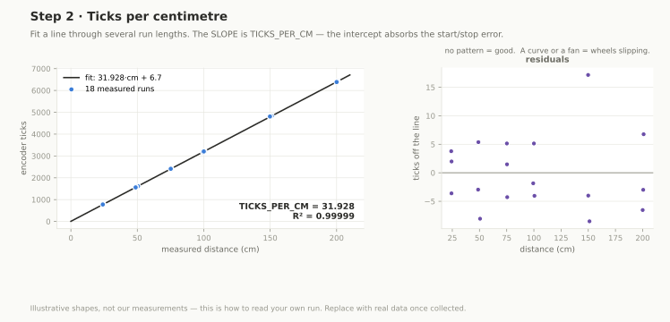</p>
**Gives you:** `TICKS_PER_CM`, currently **31.933**.

**Why it takes two measurements.** A caliper across the wheel gives a first
guess:

```
ticks_per_cm  =  ticks_per_rev / (pi * wheel_diameter_cm)
```

That guess is always slightly high, because the loaded rolling radius is smaller
than the free radius — the tyre squashes under the car's weight and the contact
patch flattens out. How much smaller depends on the tyre compound, the mass and
the floor. There is no way to calculate it. You have to drive it.

**Why a regression and not a division.** Every run has a fixed error at each
end: the car accelerating off the line, and the car coasting the last few
millimetres after the motor cuts. Divide one distance by one tick count and that
fixed error is baked into your answer. Fit a straight line through several
different run lengths and the fixed error falls into the intercept, leaving the
slope clean. The slope is the number you want.

**Rig:** 2 m or more of the surface you will actually compete on. Carpet and
competition mat give different answers. Masking tape at 25, 50, 75, 100, 150
and 200 cm.

**Procedure:** line the rear axle up with the start line, press start, let it
roll, press start to stop it near a target line. Measure where the rear axle
*actually* finished, not where you aimed, and type that into the serial monitor.
Three passes over all six distances is eighteen points.

**Reading it:** R² should be above 0.999. Lower than that and either one
distance reading is wrong or the wheels are slipping. A large intercept means a
consistent sighting bias — you are reading the tape at an angle.

---

### 3. Steering jerk


<p align="center">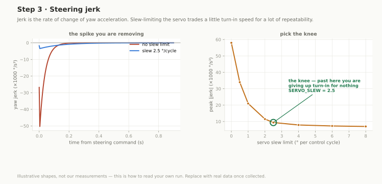</p>
**Gives you:** `SERVO_SLEW`, currently **2.5** degrees per control cycle.

**What jerk is.** Position, velocity, acceleration, jerk — the third derivative.
Taken on the heading axis here:

```
yaw rate   (deg/s)    straight off the gyro
yaw accel  (deg/s2)   rate of change of yaw rate
yaw jerk   (deg/s3)   rate of change of yaw accel
```

**Why it matters.** A jerk spike is the car snapping into a turn. That snap
breaks traction at the rear, scrubs the tyres, and makes the encoder over-read
because the wheels are turning further than the car is travelling. It also puts
a torque spike through the servo horn, which is how plastic gears strip. Limit
how fast the servo is allowed to move and you trade a little turn-in speed for a
large drop in jerk, and the car starts behaving the same way twice.

**Rig:** 2 m of clear floor, the car drives a continuous circle. Battery at
competition charge — jerk scales with speed and speed scales with pack voltage.

**Procedure:** set `SLEW_LIMIT` at the top of the sketch, flash, press start.
The car rolls straight for 800 ms so it is actually moving, then commands 25
degrees of steer and holds it while logging. Run the same steer angle at
`SLEW_LIMIT` of 0 (no limit, worst case), 1.0, 2.5 and 5.0.

**Reading it:** plot peak jerk against slew limit. You want the knee — the point
past which slowing the servo further stops buying you anything. Watch the
settling time printed at the end too. Past about 300 ms your corner entry goes
sloppy and you are giving back more than the jerk reduction is worth.

---

### 4. True straight servo angle


<p align="center">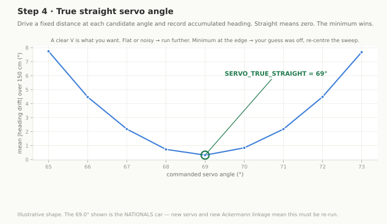</p>
**Gives you:** `SERVO_TRUE_STRAIGHT`.

**Why it is not 90.** The servo's mechanical centre, which spline tooth the horn
landed on, the tie-bar length and both knuckle stops all stack up. Zero steer
lands wherever that stack puts it. On the nationals car it was **69 degrees**.

You cannot eyeball this. Half a degree of steer is invisible across a workbench
and puts the car 9 cm off line over a metre.

> **Two changes invalidate every steering number below.** The current build
> runs a **JX PS-1171MG** where the nationals car had an **MG996R** — different
> servo, different spline, different centre. And the linkage is now **true
> Ackermann**, not the parallelogram those numbers were measured on. The 69.0 in
> `hardware_config.h`, both lock limits, and the whole of
> [step 6](#6-ninety-degree-turns) and [step 7](#7-heading-correction-gain)
> **must be re-run on the new car.**

**How the sketch finds it.** Sweep candidate angles either side of your best
guess. Drive a fixed distance at each one and record how much heading the IMU
accumulated. A car going perfectly straight accumulates zero. Least absolute
drift wins. Several passes per angle, because floor texture and push-off add
noise to any single run.

**Rig:** 2 m straight, clear, on competition surface. Room to catch it.

**Reading it:** the summary should be a V — a clear minimum with bigger errors
either side. Flat or noisy means `RUN_CM` is too short, raise it. A minimum
sitting at the edge of the sweep means `CENTRE_GUESS` was off; move it and go
again.

---

### 5. ToF floor signal threshold


<p align="center">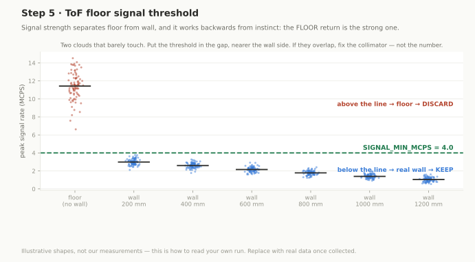</p>
**Gives you:** `SIGNAL_MIN_MCPS` (**4.0**) and `TOF_MAX_VALID_MM` (**1300**).

**The problem.** The WRO mat is white vinyl and highly reflective. The walls are
matte black and barely reflective at all. The VL53L1X sees a cone, not a dot, so
when the car noses down even slightly the bottom of that cone clips the floor.
The floor throws back a bright return from close range; the wall throws back a
weak one from further away. The sensor reports the bright one, and you get a
wall that is not there.

Distance alone cannot separate the two. **Signal strength can** — and it works
the opposite way round to instinct. A real wall return is *weak*. A floor return
is *strong*. So we set a ceiling: anything stronger than the threshold is floor,
and gets thrown away.

**Rig:** the car at its finished ride height and rake. Not a bench — the whole
point of this measurement is the angle the sensor sits at once it is bolted to
the car. Plus a piece of the real matte black wall material and a tape measure.

**Procedure:** log 30 s of clear floor with no wall in range. Then log 30 s each
with the wall at 200, 400, 600, 800, 1000 and 1200 mm. Paste the CSV into a
spreadsheet.

**Reading it:** plot signal rate per condition. Two clouds that barely touch —
floor high, wall low. Put the threshold in the gap, nearer the wall cloud, so
you never discard a real wall. The furthest distance at which the wall still
returns usably is your `TOF_MAX_VALID_MM`.

If the clouds **overlap**, the fix is mechanical, not numerical. Add a
collimator snout or tilt the sensor up. See
[`electrical/collimator.py`](electrical/collimator.py) — that solver is what
took our first ground reflection from 166 mm out to 870 mm.

---

### 6. Ninety degree turns


<p align="center">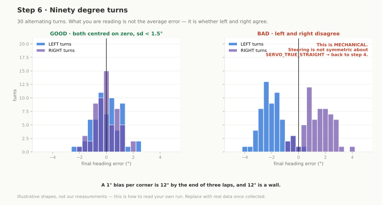</p>
**Gives you:** `TURN_KP`, `TURN_MAX_STEER`, `TURN_MIN_STEER`, `TURN_KV`,
`TURN_STOP_DEG`, `TURN_MIN_PWM`, `TURN_MAX_PWM`.

**How the turn works.** Not for a fixed time, not for a fixed distance. Both of
those lie the moment a wheel slips. The car turns until the IMU says the heading
has moved 90 degrees, and not one degree before.

```
error  =  target_heading - current_heading
steer  =  clamp(TURN_KP * |error|,  TURN_MIN_STEER, TURN_MAX_STEER)
pwm    =  clamp(TURN_KV * |error|,  TURN_MIN_PWM,   TURN_MAX_PWM)
done   when |error| < TURN_STOP_DEG
```

Big error, big steering and more speed. Small error, less of both — so the car
eases into the exit instead of snapping onto it and overshooting.

**There is no settle step, deliberately.** The turn hands straight over to
heading hold, which absorbs the last fraction of a degree while the car is
already driving away down the next straight. A settle delay just burns track
time to arrive at the same heading.

**Rig:** 1.5 m square of open floor.

**Procedure:** press start per sample, thirty samples, alternating left and
right (`ALTERNATE` does this for you).

**Reading it:**

| What you see | What it means |
|---|---|
| mean near zero, sd under ~1.5 deg | done |
| mean consistently one sign | systematic over- or undershoot; lower `TURN_KP` if overshooting |
| large sd, scattered both ways | `TURN_MIN_STEER` or `TURN_MIN_PWM` too low and the car stalls out at the end of the turn |
| left mean and right mean differ | mechanical, not software. Steering is not symmetric about `SERVO_TRUE_STRAIGHT`. Back to step 4 |

This one compounds. A 1 degree bias per corner is 12 degrees by the end of three
laps, and 12 degrees is a wall.

---

### 7. Heading correction gain


<p align="center">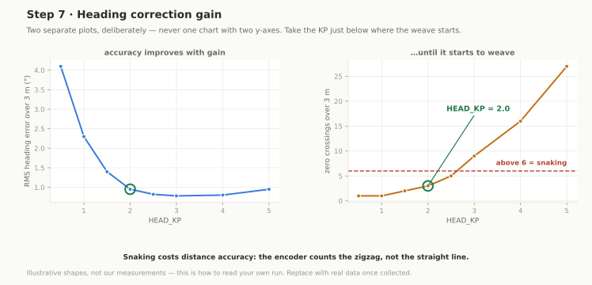</p>
**Gives you:** `HEAD_KP` (**2.0**), and confirmation that `HEAD_KD` and
`HEAD_KI` stay at zero.

**What heading hold does.** Between corners the car has exactly one job: hold
the heading it left the last corner on. It does not follow a wall. It does not
look at the camera.

```
error  =  target_heading - current_heading
servo  =  SERVO_TRUE_STRAIGHT + HEAD_KP * error,  slew limited
```

A P controller and nothing more.

- **KI is zero** because there is no steady disturbance worth integrating away.
  If the car drifts constantly then `SERVO_TRUE_STRAIGHT` is wrong, and an
  integrator would just hide that from you.
- **KD is zero** because the yaw signal is already filtered
  (`YAW_FILT_ALPHA = 0.35`) and differentiating filtered noise buys nothing at
  0.7 m/s.

**How to tune KP.** Raise it until the car visibly snakes — a weave down the
straight with a period of roughly half a second — then back off to about 60
percent of the gain that first produced it.

Too low and the car takes the entire straight to come back on line after a
corner. Too high and it snakes, which costs distance accuracy, because the
encoder counts the zigzag and not the straight line.

**Rig:** the longest straight you can find, 3 m plus.

**Reading it:** table KP against RMS error and zero-crossing count. RMS error
falls as KP rises, then crossings start climbing. Take the KP just below that.
More than about six crossings over 3 m is snaking. Worth doing once more while
nudging the car sideways by hand mid-run — the disturbance recovery tells you
more than a clean run does.

---

### 8. Floor colour thresholds


<p align="center">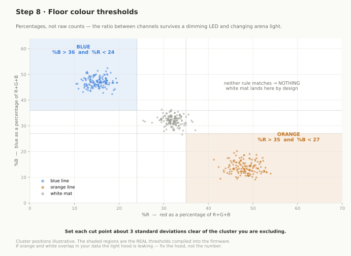</p>
**Gives you:** the cut points that turn a TCS34725 reading into ORANGE, BLUE or
NOTHING. Currently:

```
BLUE    if  %B > 36  and  %R < 24
ORANGE  if  %R > 35  and  %B < 27
```

**Why percentages, not raw counts.** Raw red, green and blue counts move with
room brightness, sensor ride height, and pack voltage — the sensor's own
illumination LED dims as the battery sags. All three of those change on
competition day.

What does not change is the **ratio** between channels. Orange mat is orange
whether it is brightly or dimly lit. So divide each channel by the total and
threshold on the percentage, and the same code works in the pit, under arena
lights, and at the end of a run on a tired pack.

Note the deliberate gap between the two rules — blue demands `%R < 24` while
orange only demands `%B < 27`. White mat sits in the middle, matches neither,
and correctly returns nothing.

**Rig:** the real mat. The sensor at final ride height with its hood fitted.
Ride height changes the answer, so a bench reading is worthless.

**Procedure:** 200 samples over white, then orange, then blue. Then do all three
again with the lighting changed — brighter, dimmer, and with somebody standing
over the car casting a shadow. Competition lighting is not your workshop
lighting.

**Reading it:** set each cut point about three standard deviations clear of the
population you are excluding. If orange and white `%R` overlap at three sigma,
your hood is leaking ambient light — fix the hood, do not fudge the number.

`COLOR_CONFIRM_MS = 6` is the other half of this: a colour must hold for 6 ms
before it counts. That kills single-sample noise and adds no meaningful lag at
0.7 m/s.

---

### Pillar colour, on the Pi

Separate from the floor sensor. Pillar colour is done in the camera pipeline on
the Raspberry Pi, tuned through the web dashboard rather than by reflashing:
you click the pillar in the live view, it takes a set of samples, and it
computes the threshold for you.

Run it with:

```bash
cd src/pi
python3 dashboard.py          # then open http://<pi-address>:5000
```

Save writes back to [`src/pi/config.json`](src/pi/config.json) atomically, and
the robot reads that same file at startup. The detection functions in
[`src/pi/sensors/camera.py`](src/pi/sensors/camera.py) are module-level and
shared by both the dashboard and the robot, so what you tune is exactly what
runs. Nothing is duplicated between the two paths.

> **Open item.** `config.json` and `dashboard.py` as committed both work in
> **HSV**. The click-to-sample tuning we actually use works in **Lab**. The Lab
> version is not in the repository yet. Until it is committed, this section
> describes the HSV path and the two will disagree.

---

### Current values, all in one place

| Constant | Value | From |
|---|---|---|
| `TICKS_PER_CM` | 31.933 | step 2 |
| `SERVO_TRUE_STRAIGHT` | 69.0 | step 4 — **re-measure for the JX servo** |
| `SERVO_MAX_LEFT` | 5.0 | step 4 |
| `SERVO_MAX_RIGHT` | 115.0 | step 4 |
| `SIGNAL_MIN_MCPS` | 4.0 | step 5 |
| `TOF_MAX_VALID_MM` | 1300 | step 5 |
| `TURN_KP` | 2.5 | step 6 |
| `TURN_MAX_STEER` | 55.0 | step 6 |
| `TURN_MIN_STEER` | 8.0 | step 6 |
| `TURN_KV` | 3.5 | step 6 |
| `TURN_MIN_PWM` / `TURN_MAX_PWM` | 100 / 130 | step 6 |
| `TURN_STOP_DEG` | 0.3 | step 6 |
| `HEAD_KP` / `KD` / `KI` | 2.0 / 0 / 0 | step 7 |
| `YAW_FILT_ALPHA` | 0.35 | step 7 |
| `SERVO_SLEW` | 2.5 | step 3 |
| floor BLUE | `%B > 36 && %R < 24` | step 8 |
| floor ORANGE | `%R > 35 && %B < 27` | step 8 |
| `COLOR_CONFIRM_MS` | 6 | step 8 |

---

<div align="right"><a href="#contents">back to top</a></div>

## 9. Software: build, flash, run

### 1. Kinematic & Optical Simulations (Python)
The mechanical and electrical analytical models can be reproduced using standard Python scientific tooling:

```bash
# 1. Clone repository
git clone https://github.com/ShammanRahin/WRO_TeamBluePrint.git
cd WRO_TeamBluePrint

# 2. Install dependencies
pip install numpy matplotlib pymunk

# 3. Optical collimator sizing simulation (Floor IR reflection vs slot geometry)
python electrical/collimator.py --plot

# 4. Geometric turning radius and park ratio sweep across wheelbases
python src/sim/geometry_sweep.py --wheelbase 110 --plot

# 5. Swept-body parallel parking envelope simulation
python src/sim/park_feasibility.py --wheelbase 110 --plot
```

### 2. Embedded Firmware Tier (STM32F411CEU6)
- **Toolchain**: PlatformIO / STM32CubeIDE with `arm-none-eabi-gcc`.
- **Clock Tree**: HSE 25 MHz crystal $\to$ PLL configured for maximum 100 MHz SYSCLK, 50 MHz APB2, 25 MHz APB1.
- **Build & Flash**:
  ```bash
  # Using PlatformIO CLI
  pio run -e blackpill_f411ce --target upload
  ```

### 3. Perception Tier (Raspberry Pi 5)
- **OS**: Raspberry Pi OS (Bookworm 64-bit Lite).
- **Dependencies**: OpenCV 4.x (V4L2 backend), Slamtec RPLIDAR SDK, NumPy.
- **Execution**:
  ```bash
  cd src/pi
  python3 main.py
  ```

---

---

<div align="right"><a href="#contents">back to top</a></div>

## 10. Engineering log

Dated record of what we built, what broke, and what we changed because of it.
Entries are written when the thing happens, not reconstructed afterwards.

The detailed rationale behind each architectural change lives in
[`DECISIONS.md`](DECISIONS.md) as numbered ADRs; this page is the narrative
that connects them.

---

### 2026-07-12 — repository opened

First commit. Steering study begun the same day
([`journal/steering-study-2026-07-12.md`](journal/steering-study-2026-07-12.md)).

### 2026-07 — steering geometry

Kinematic simulations for turning radius, swept envelope and parking
feasibility. See [`src/sim/`](src/sim/) and
[`journal/day-01-geometry-and-steering.md`](journal/day-01-geometry-and-steering.md).

**Finding: the textbook two-arc reverse park is not feasible for us.** At 35
degrees of lock inside a bay 1.5x the vehicle length, the symmetric trajectory
misses by 25.6 mm. The problem is scale-invariant — shortening the car shrinks
the bay proportionally, so a smaller car does not fix it. Replaced with an
iterative multi-point shuffle closed on IMU yaw.

### 2026-07-26 — plan revision

[`journal/day-02-plan-revision-2026-07-26.md`](journal/day-02-plan-revision-2026-07-26.md).

**Centre-pivot steering scrapped.** Simulation had said a single central pivot
tolerated joint slop three times better, so that is what was built. On the car
it was wrong: rotating the whole front axle swept the outer tyre +/-30.1 mm fore
and aft, which is 36% of the 82.5 mm parking clearance, and raised the risk of a
body strike. Replaced with a dual-knuckle parallelogram tie-bar that locks the
knuckle centres.

**Steering encoder deleted.** The original design had an AS5600 on the steering
shaft to cancel servo backlash. Moving to the parallelogram removed the central
shaft it would have mounted to, and the analysis that followed showed closed-loop
steering angle is redundant anyway: every manoeuvre terminates on measured body
yaw, not on wheel angle. One sensor, one I2C address and some mass saved.

### 2026-07-28 — ToF floor crosstalk solved

The VL53L1X has a wide cone and no software region of interest. With 1.1 degrees
of nose-down rake, the bottom of the cone hit the white mat and the sensors
reported a wall at 166 mm that was not there.

Built [`electrical/collimator.py`](electrical/collimator.py) to size an
optical baffle. 2.5 x 10 x 20 mm printed slot collimators plus a +2.0 degree
mechanical wedge pushed the first ground reflection from **166 mm to 870 mm**,
clearing the side walls at 442.5 mm with margin.

Also on this date: electrical revision to a two-board single-sided build,
decisions 23 through 28.

### 2026-08 — firmware

Open-round FSM working. Obstacle logic bolted on top of it unchanged, rather
than written fresh, so that a pillar bug can never break the round that already
works.

**Bug, mid-August:** clean runs with no pillars, but after an avoidance
manoeuvre the next corner was taken in the wrong direction. Fixed by giving the
corner-turn trigger absolute priority over everything including an in-progress
avoidance.

### 2026-08-29 to 09-05 — carrier PCB

Revisions A through C in EasyEDA. Final: 90 x 70 mm single-sided, Pi 5 stack,
mux moved off onto its own board. Full decision trail in `DECISIONS.md`.

### 2026-09-01 to 09-04 — perception stack

[`src/pi/`](src/pi/). Python environment for the RPLIDAR C1 and the Pi
camera, threading skeleton, camera and lidar adapters, fusion loop, standalone
calibration dashboard, systemd unit.

Status: fusion runs and prints. It does not yet emit the `V,...` frame to the
MCU. **Open.**

### Rebuild for the Open Championship

The nationals car and the Hyderabad car are not the same vehicle.

- **Servo changed** from MG996R to **JX PS-1171MG**. Every steering constant
  measured on the old servo — `SERVO_TRUE_STRAIGHT`, both limits — is invalid
  until [step 4](#4-true-straight-servo-angle) is re-run.
- **IMU: MPU6050 abandoned, BNO085 fitted.** The MPU6050's yaw drift was large
  enough to lose a 90 degree turn within three laps. Since the entire control
  philosophy is "heading is the truth", an IMU that drifts is not a component
  you can compensate for in software — it invalidates the premise. Replaced with
  a BNO085 running its own sensor fusion.
- **ToF count reduced** to two, front and rear protection, now that lateral
  position comes from the lane-gap measurement rather than from wall following.
- **Steering changed again, parallelogram to true Ackermann.** The
  parallelogram solved the swept-envelope problem the centre pivot had, but
  drove both front wheels to the same angle. In a turn the inner wheel is on a
  tighter radius and needs more angle, and the difference came out as scrub:
  squeal through corners, wide exits, and a commanded steering angle that gave
  a different heading change each run. Worse, a scrubbing tyre makes the
  encoder over-read, and the lane-gap correction is pure odometry — so the
  steering geometry was corrupting the navigation input. Replaced with a 100 %
  Ackermann linkage whose arm extensions meet at the rear axle centre. Built
  and driving. Chassis dimensions changed with it; the spec sheet numbers are
  being re-measured.

---

### To be filled in

Samman to complete. These are known gaps, listed so they are not forgotten:

- [ ] Nationals result and anything that failed on the day
- [ ] Parts burned or destroyed, with dates
- [ ] When the RPLIDAR C1 and the Pi 5 actually arrived, and what the car ran
      before them
- [ ] Why the vision pipeline is still at "fusion prints to console"
- [ ] Everything from 2026-09-05 onward, including the current rebuild
- [ ] Test results: runs attempted, runs completed, failure modes seen

---

<div align="right"><a href="#contents">back to top</a></div>

## 11. Troubleshooting

Problems we have actually had on this car, and what fixed them. If you build
from these files you will hit most of these.

### The car reports a wall that is not there

**Symptom.** Front or side ToF shows a few hundred mm on open track. The car
turns early or refuses to drive.

**Cause.** The sensor is reading the white mat. The VL53L1X sees a cone, and any
nose-down rake puts the bottom of that cone on the floor. The floor is bright
and close, so it wins.

**Fix.** Signal-rate filtering — discard returns stronger than
`SIGNAL_MIN_MCPS`. See [CALIBRATION step 5](#5-tof-floor-signal-threshold).
If filtering alone is not enough, the fix is mechanical: fit the printed
collimator snouts and the +2 degree wedge. Ours moved the first floor reflection
from 166 mm to 870 mm.

### Heading drifts over a run

**Symptom.** Laps one and two are clean, lap three clips a wall.

**Causes, in the order worth checking:**

1. **The IMU.** We had this with an MPU6050 and no amount of software fixed it.
   If your yaw reading walks while the car sits still, replace the part. We use
   a BNO085.
2. **Turn bias.** A consistent 1 degree of overshoot per corner is 12 degrees by
   the end. Run [step 6](#6-ninety-degree-turns) and look at
   whether the mean error has a sign.
3. **Asymmetric steering.** Left and right turn errors differing means
   `SERVO_TRUE_STRAIGHT` is wrong. Back to [step 4](#4-true-straight-servo-angle).

### The car turns twice at one corner

**Symptom.** Immediately after a turn it declares another corner and spins.

**Cause.** Coming out of the turn the colour sensor sweeps back across the same
pair of lines.

**Fix.** `POST_CORNER_LOCKOUT_CM`, currently 50 cm, during which colour is
ignored. If it still happens, the lockout is too short for your exit geometry.

### After avoiding a pillar, the next corner goes the wrong way

**Symptom.** Clean with no pillars. With pillars, the car turns the wrong way at
the next corner.

**Cause.** The avoidance sub-machine was still running and held the steering
when the corner condition fired.

**Fix.** Corner turns take absolute priority over everything, avoidance
included. A missed pillar costs points; a missed corner costs the run.

### The car squeals in corners and runs wide

**Symptom.** Audible scrub through turns, scuff marks on the mat, wide corner
exits, and the same commanded steering angle giving a different heading change
run to run.

**Cause.** Parallelogram steering. Both front wheels are being driven to the
same angle, but the inner wheel is on a tighter radius and needs more. The
difference comes out as scrub.

**Fix.** True Ackermann — angle the steering arms so their extensions meet at
the centre of the rear axle. Check it with two rulers before you print.

**Watch out for the second-order effect.** A scrubbing tyre turns further than
the car travels, so the encoder over-reads, and the lane-gap correction is pure
odometry. A steering geometry fault shows up as a navigation fault.

### Distance readings drift over the session

**Symptom.** `TICKS_PER_CM` was right this morning and is wrong now.

**Causes.** A slipping encoder coupler — check the grub screw. Or you calibrated
without the battery in, and the loaded rolling radius is smaller than the
unloaded one. Or you calibrated on a different surface.

### The camera sees red where there is no red

**Symptom.** Phantom red pillars, often near the orange floor line or the
magenta parking walls.

**Cause.** Orange, red and magenta are close together in colour space, and under
the arena lights they get closer.

**Fix.** Re-tune on the real mat under the real lights, not in your workshop.
Raise `min_blob_area`. Check the blob is not sitting inside the floor-line
region before accepting it.

### Camera will not open

**Symptom.** `CameraThread` dies at startup.

**Cause.** Two processes want the camera. `dashboard.py` and `main.py` cannot
both hold it.

**Fix.** `robodash.service` declares `Conflicts=robot.service` for exactly this
reason. Stop one before starting the other.

### Servo browns out the MCU

**Symptom.** The STM32 resets when the steering makes a large fast movement.

**Cause.** The servo pulls an instantaneous stall spike that drags the shared
rail down.

**Fix.** A separate regulator for the servo rail. The power domains in
[`electrical/ELECTRICAL.md`](electrical/ELECTRICAL.md) section 2 exist for
this. Also limit `SERVO_SLEW` — [step 3](#3-steering-jerk).

### Intermittent faults that come and go with vibration

**Symptom.** Works on the bench, fails on the track. A sensor drops out over
bumps.

**Cause.** DuPont jumpers. They are not a connector, they are a friction fit
that shakes loose.

**Fix.** Crimped and latched JST-XH with strain relief, everywhere. No
breadboards on the vehicle.

---

<div align="right"><a href="#contents">back to top</a></div>

## 12. Repository map

```
README.md                  everything — this file is the documentation
LICENSE                    MIT

SPECSHEET.md               as-built geometry, pin maps, calibrated limits
DECISIONS.md               architectural decision records, dated, with supersessions
BOM.md                     bill of materials, sourcing, cost, mass budget

src/
  open_round/              STM32 firmware, Open Challenge
  obstacle_round/          STM32 firmware, Obstacle Challenge
  pi/                      Raspberry Pi perception
    worldstate.py            the lock-guarded seam between threads
    sensors/camera.py        Picamera2 capture + detection shared with the dashboard
    sensors/lidar.py         RPLIDAR C1, asyncio sealed inside one thread
    main.py                  fusion loop
    dashboard.py             browser calibration dashboard
  tools/
    calibration/           eight calibration sketches + menu-driven suite
    bench/                 single-subsystem bench sketches
  sim/                     steering and parking simulations

electrical/                power architecture, pin map, collimator solver
schemes/                   wiring and block diagrams
models/                    CAD sources and printable STLs
journal/                   day-by-day build log
media/
  diagrams/                the figures in this README
  team/                    team portraits
  achievements/            competition photographs
  steering/                simulation output
t-photos/                  team photos, per WRO rules
v-photos/                  vehicle photos from six sides, per WRO rules
video/                     links to the driving demonstration videos
other/                     datasheets, calibration data, supporting material
```

### Looking for one specific thing

| You want | Go to |
|---|---|
| Why the car turns the way it does | [section 5](#5-how-the-car-thinks) |
| What `TICKS_PER_CM` is and how it was measured | [section 8](#2-ticks-per-centimetre) |
| Which pin the servo is on | [`hardware_config.h`](src/tools/calibration/hardware_config.h) |
| Why there is no steering encoder | [section 6](#6-engineering-findings), finding 4 |
| The full current budget | [`electrical/ELECTRICAL.md`](electrical/ELECTRICAL.md), section 3 |
| What changed on a given date | [section 10](#10-engineering-log) and [`DECISIONS.md`](DECISIONS.md) |
| How to tune the pillar colours | [section 8](#pillar-colour-on-the-pi) |
| Something is broken | [section 11](#11-troubleshooting) |

---

<div align="right"><a href="#contents">back to top</a></div>

## 13. WRO compliance

Against WRO Future Engineers General Rules 2026, chapter 7.

| Requirement | Status |
|---|---|
| Public repository, MIT licensed, full revision history | done |
| README over 5000 characters in English | done |
| Source code for every programmed component | done - `src/open_round/`, `src/obstacle_round/`, `src/pi/` |
| Engineering process log | done - `docs/TIMELINE.md`, `DECISIONS.md`, `journal/` |
| Electromechanical schematics | done - `schemes/` |
| Driving demonstration video, one per challenge, 30 s minimum | done - `video/video.md` |
| Vehicle photos, all six sides | outstanding - `v-photos/` |
| Team photos, official and informal | outstanding - `t-photos/` |
| CAD and printable files | outstanding - `models/` |
| Supporting material | outstanding - `other/` |

Nothing above is marked done unless the files are in the repository. Four rows
are outstanding and are being shot and committed before the scoring deadline.

---

<div align="right"><a href="#contents">back to top</a></div>

## 14. Reference documents

Everything you need to understand or rebuild this car is in the sections above.
These stay as separate files because they are lookup tables, not prose.

| File | What it holds |
|---|---|
| [`SPECSHEET.md`](SPECSHEET.md) | Every measured number — as-built geometry, turn radius, odometry resolution, pin map, rule-hard limits, loop rates |
| [`DECISIONS.md`](DECISIONS.md) | Architectural decision records, numbered and dated, each with the measurement that forced it and what it supersedes |
| [`BOM.md`](BOM.md) | Bill of materials — on hand, on order, unit costs, lead times, mass budget |
| [`electrical/ELECTRICAL.md`](electrical/ELECTRICAL.md) | Power domains, star ground rules, current budget, full STM32 pin map, bring-up order |
| [`electrical/DESIGN_RULES.md`](electrical/DESIGN_RULES.md) | Fabrication constraints for the single-sided milled boards |
| [`journal/`](journal/) | The raw day-by-day log that section 10 was written from |

---

<div align="right"><a href="#contents">back to top</a></div>

## 15. Credits and licence

### Team Blueprint
* **Samman Rahin Shanto** — Electrical System Design, Electronics & PCB Layout *(Islamic University of Technology - IUT)*
* **Syed Sholok** — Embedded Firmware (STM32), Low-Level Control Architecture & Kinematics *(Military Institute of Science and Technology - MIST)*
* **MD. Azmain Shak Rubayed** — CAD & Fabrication Engineer *(Northern University Bangladesh - NUB)*

### Institutional Support & Compliance
* Developed collaboratively across **Islamic University of Technology (IUT)**, **Military Institute of Science and Technology (MIST)**, and **Northern University Bangladesh (NUB)**.
* This repository is maintained in compliance with **WRO Future Engineers General Rule Chapter 7** and will remain publicly accessible.

---


This project is licensed under the **MIT License** — see the [LICENSE](LICENSE) file for details.

<div align="right"><a href="#contents">back to top</a></div>
