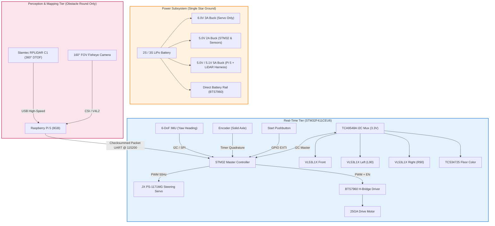

# Team Blueprint — WRO Future Engineers 2026

<p align="center">
  
</p>

<div align="center">

### National Champions — WRO Bangladesh 2026, Future Engineers
### Heading to the WRO Open Championship Asia Pacific · Hyderabad, India · 25–27 September 2026

[](#how-we-got-here)
[](#wro-deliverables-and-compliance-checklist)
[](LICENSE)
[](SPECSHEET.md)
[-red)](src/pi/)
[](DECISIONS.md)

**[Hello](#hi-were-blueprint)** • **[The Three of Us](#meet-the-three-of-us)** • **[How We Got Here](#how-we-got-here)** • **[The Name](#why-blueprint)** • **[The Car](#vehicle-specifications)** • **[How It Thinks](#autonomous-navigation-strategy)** • **[What Broke](#key-engineering-findings)** • **[Build It Yourself](#software-setup-and-reproduction)**

</div>

---

## Hi, we're Blueprint

Three students. Three different universities. One very small car that has to drive itself around a track without anyone touching it.

We're from **IUT**, **MIST** and **NUB** — three campuses scattered across Bangladesh, which means most of this robot was designed over group calls at 2 AM and assembled in whatever room had a working soldering iron. In 2026 we won the **WRO Bangladesh National Final** in Future Engineers, and in September we're taking this thing to **Hyderabad** to race against Asia Pacific.

Here's the thing you should know about how we work: **we don't guess.**

Every number in this repository was either calculated, simulated, or measured on a bench before it went into the car. When something didn't work, we didn't quietly delete it — we wrote down why it failed and left it in. Scroll down far enough and you'll find the steering system we built, tested, and then threw away; the parking manoeuvre that our own maths proved was impossible; and the sensor that kept detecting the floor instead of the wall.

That's not us being humble. It's the whole point. A design decision only means something if you can see what it beat.

**Start here if you're in a hurry:**

| Document | What's in it |
|---|---|
|  [`SPECSHEET.md`](SPECSHEET.md) | Every measured number on the car — geometry, pin maps, calibrated limits |
|  [`DECISIONS.md`](DECISIONS.md) | Every choice we made, dated, with the data behind it and what it replaced |
|  [`BOM.md`](BOM.md) | What we bought, what it cost, what we're still waiting on |
|  [`journal/`](journal/) | The messy day-by-day version of the above |

---

## Meet the three of us

<table align="center">
<tr>
<td align="center" width="33%"></td>
<td align="center" width="33%"></td>
<td align="center" width="33%"></td>
</tr>
<tr>
<td align="center"><b>Samman Rahin Shanto</b><br/><sub>Team Lead</sub></td>
<td align="center"><b>Syed Subeh-Sadik Sholok</b><br/><sub>Firmware &amp; Control</sub></td>
<td align="center"><b>MD. Azmain Shak Rubayed</b><br/><sub>CAD &amp; Fabrication</sub></td>
</tr>
<tr>
<td align="center"><sub>Islamic University of Technology</sub></td>
<td align="center"><sub>Military Institute of Science &amp; Technology</sub></td>
<td align="center"><sub>Northern University Bangladesh</sub></td>
</tr>
<tr>
<td align="center"><sub>Power architecture, PCB layout, and the reason there isn't a single jumper wire on this car.</sub></td>
<td align="center"><sub>Wrote everything the car decides in real time — heading hold, gyro-terminated turns, the failsafe that keeps it alive when the Pi dies.</sub></td>
<td align="center"><sub>If a part on this robot wasn't bought, he drew it and printed it. Chassis, knuckles, tie-bar, camera mast.</sub></td>
</tr>
<tr>
<td align="center"><sub> <a href="mailto:sammanrahin.iut@gmail.com">sammanrahin.iut@gmail.com</a></sub></td>
<td align="center"><sub> <a href="mailto:syedsholok.mist@gmail.com">syedsholok.mist@gmail.com</a></sub></td>
<td align="center"><sub> <a href="mailto:azmiansheikh.nub@gmail.com">azmiansheikh.nub@gmail.com</a></sub></td>
</tr>
</table>

---

## How we got here

### The one that matters

| Season | Event | Category | Result |
|---|---|---|---|
| **2026** | **WRO Bangladesh — National Final** | Future Engineers |  **National Champion**  selected to represent  |
| **2026** | **WRO Open Championship Asia Pacific** · Hyderabad, 25–27 Sept | Future Engineers |  Racing |

>  [Official announcement of the national round](https://www.facebook.com/share/r/1JujdfQpYH/)

### The years before that

Blueprint didn't appear out of nowhere for WRO. Between us we've turned up to **35+ national robotics competitions** across Bangladesh — line followers, robo sumo, robo soccer, death race, battlebots. Most weekends of the last two years have been spent in a university sports hall somewhere, waiting for a heat.

That circuit is where the habits came from: iterate fast, design your own PCB instead of waiting for one, and build hardware that can take a hit — because it will.

<table>
<tr>
<td width="50%"></td>
<td width="50%"></td>
</tr>
<tr>
<td align="center"><sub><b>IGNITION 2026</b> · KUET National Mechanical Festival<br/> 1st Runner-up, Line Follower</sub></td>
<td align="center"><sub><b>Traction 2024</b> · BRAC University<br/> 2nd Runner-up, Pathfinder</sub></td>
</tr>
</table>

| Year | Event | Segment | Result |
|---|---|---|---|
| 2026 | CYBERNAUTS · North South University | Robo Sumo |  Champion |
| 2026 | IGNITION · KUET | Line Follower |  1st Runner-up |
| 2025 | Accelerate · IEEE RAS, IUT | Line Follower |  Podium |
| 2025 | IUT Techathon | Line Follower |  Champion |
| 2024 | Traction · BRAC University | Pathfinder / LFR |  2nd Runner-up |

<p align="center">
  
  
</p>
<p align="center"><sub>Left: Accelerate 2025 at IUT. Right: a robot that technically finished the run. Both count as data.</sub></p>

---

## Why "Blueprint"

> *A dream without a plan is just a wish. An autonomous car without a blueprint is just guesswork.*

We picked the name as a rule for ourselves, not as a slogan. It means three things:

**1. Do the maths before you print the part.**
We simulate the kinematics and the swept volume first. When the maths says a manoeuvre can't work, we believe the maths. That's exactly what happened with parallel parking — the textbook two-arc reverse misses by 25.6 mm at our steering lock, and no amount of tuning was ever going to fix that. So we designed a different manoeuvre.

**2. Write down why, not just what.**
Every pivot goes into [`DECISIONS.md`](DECISIONS.md) with a date, the measurement that forced it, and what it supersedes. If you want to know why there's no steering encoder on this car, the answer is in there, with the reasoning we used at the time — including the part where we were wrong first.

**3. Three universities, one car.**
None of us could have built this alone. The electrical depth, the firmware, and the mechanical design each came from a different campus, and the interesting problems all lived in the seams between them.

---

## Problem Statement & Engineering Objectives

### 1. The Challenge
Autonomous miniature racing requires solving complex, coupled real-time problems under strict physical and optical constraints:
- **Optical Noise**: High-reflectance white vinyl mats against low-reflectance matte black walls cause severe infrared crosstalk for standard ToF distance sensors.
- **Dynamic Obstacle Avoidance**: Distinguishing between randomized green (pass left) and red (pass right) traffic pillars at race speeds while maintaining track boundaries.
- **Micro-Bay Parking**: Maneuvering into a bay only $1.5 \times$ the vehicle's length ($L = 110\text{ mm}$), where classical two-arc symmetric reverse parking mathematically fails.

### 2. Primary Engineering Goals
- [x] **Sub-millimeter Odometry Loop**: Quadrature encoder integration with an STM32 hardware timer, delivering $0.175\text{ mm/tick}$.
- [x] **Zero-Drift Heading Control**: High-speed (1 kHz) gyro sampling with IMU-terminated 90° turns immune to wheel scrub and slip.
- [x] **Fail-Safe Heterogeneous Architecture**: STM32 handles deterministic real-time safety; Raspberry Pi 5 handles perception. A high-level software crash never stops the vehicle.
- [x] **Avionics Wiring Standard**: Zero jumper wires (DuPont) and zero breadboards. All connections utilize latched JST-XH connectors and Dhaka-milled isolation PCBs.

---

## Vehicle Specifications

| Category | Parameter | Measured / Engineered Value | Rule Limit / Target | Notes |
|---|---|---|---|---|
| **Envelope** | Scored Footprint | **165 × 115 mm** | ≤ 300 × 200 mm | Ultra-compact design to maximize parking slack |
| | Height | **50 mm** (Open) / **~90 mm** (Obstacle with LiDAR) | ≤ 300 mm | Minimal CG height; sensor mast modular |
| | Total Mass | **~420 g** (Open) / **~540–580 g** (Obstacle) | Unrestricted | Low-inertia vehicle for rapid deceleration |
| **Chassis** | Wheelbase ($L$) | **110 mm** | Measured | Optimized against turning radius |
| | Track Width ($W$) | **105 mm** (center-to-center) / **115 mm** (extreme) | — | 115 mm total outer width |
| | Wheel Diameter | **46 mm** (Front) / **50 mm** (Rear) | — | 1.1° natural forward rake |
| **Kinematics** | Steering Mechanism | **Parallelogram Tie-Bar** (Single Servo) | — | Replaced center-pivot to eliminate swept envelope growth |
| | Steering Range | **±35°** at wheel knuckles | — | Actuated via JX PS-1171MG digital metal-gear servo |
| | Minimum Turning Radius | **157 mm** ($L / \tan 35^\circ$) | — | Centers inside standard 1000 mm driving lane |
| **Powertrain** | Primary Motor | **25GA DC Gearmotor** (12V) | Max 1 motor | Rule 11.5 compliant |
| | Reduction | **5:1 Spur Gear Final Drive** | — | High starting torque, eliminates stall cogging |
| | Drive Topology | **Solid rear axle** (No differential) | Max 1 driven axle | Maximizes straight-line odometry consistency |
| | Maximum Speed | **0.70 m/s** | — | Software throttled for predictable braking |
| **Sensors** | 2D LiDAR Scanner | **Slamtec RPLIDAR C1 (360° DTOF)** | — | 12 m range, 5 kHz sampling, high ambient light immunity (Obstacle round) |
| | Optical Camera | **160° FOV Wide-Angle Fisheye** | — | High-speed pillar color & centroid extraction (Obstacle round) |
| | Distance Array | **4× VL53L1X Time-of-Flight (ToF)** | — | Front and rear, on TCA9548A channels 1 and 2, with custom 3D-printed optical collimators |
| | Ground Color Sensing | **TCS34725 RGB Sensor** | — | Downward-facing with isolated illumination hood |
| | Inertial Measurement | **BNO085 (SPI, on-chip sensor fusion)** | — | 1 kHz internal sampling for heading integration |
| | Odometry Resolution | **0.175 mm / count** | — | Quadrature optical/magnetic motor encoder |
| **Compute** | Real-Time Master | **STM32F411CEU6 (Black Pill)** | — | ARM Cortex-M4 @ 100 MHz, Hardware FPU, Real-Time Loop |
| | Perception & Mapping | **Raspberry Pi 5 (8GB)** | — | Quad-Core Cortex-A76 @ 2.4 GHz, concurrent Vision + LiDAR SLAM |

### Rule Compliance Matrix

- **Mechanical (Rules 11.3, 11.5, 11.13)**: Exactly four wheels, single steering actuator, single drive motor coupled via a fixed gear reduction to a single solid axle.
- **RF & Telemetry (Rule 11.10)**: All wireless interfaces (Wi-Fi, Bluetooth) are disabled at kernel boot (`config.txt`) on the Raspberry Pi. Zero external communication during runs.
- **Power & Control Interface (Rules 9.10, 9.11)**: Dedicated master physical toggle switch for complete battery cut-off, plus a separate momentary push-button dedicated solely to initiating autonomous runs.

---

## Visual Gallery & Media

### 1. Vehicle Views (`v-photos/`)
Detailed competition photographs conforming to WRO documentation rules:

| Perspective | File Link | Perspective | File Link |
|---|---|---|---|
| **Front View** | [`v-photos/front.jpg`](v-photos/README.md) | **Back View** | [`v-photos/back.jpg`](v-photos/README.md) |
| **Left Side View** | [`v-photos/left.jpg`](v-photos/README.md) | **Right Side View** | [`v-photos/right.jpg`](v-photos/README.md) |
| **Top View** | [`v-photos/top.jpg`](v-photos/README.md) | **Chassis Underside** | [`v-photos/bottom.jpg`](v-photos/README.md) |

### 2. Team Documentation (`t-photos/`)
- **Official Team Photo**: [`t-photos/official.jpg`](t-photos/README.md)
- **Informal / Behind the Scenes**: [`t-photos/funny.jpg`](t-photos/README.md)

### 3. Engineering Visual Artifacts

<div align="center">

| Optical Collimator Simulation | Swept Parking Envelope Analysis |
|:---:|:---:|
|  |  |
| *Ground IR reflection threshold extended from 166 mm to 870 mm* | *Proof of textbook 2-arc failure & shuffle maneuver validation* |

</div>

---

## System Architecture

The robot employs a **dual-tier heterogeneous compute hierarchy**:



### Complete Electrical Schematic
A full physical wiring block diagram is illustrated below, mapping PCB pinouts, line terminations, and bus distributions:

<p align="center">
  
</p>

---

## Autonomous Navigation Strategy

### 1. Open Challenge (Deterministic Real-Time Firmware)
In the Open Challenge, the vehicle runs **exclusively on the STM32F411**, operating on a zero-drift, state-driven control cycle:

1. **Stationary Bias Calibration (Arming)**: Upon boot, stationary gyro offsets are auto-zeroed in flash. Conforms strictly with Rule 9.6 without requiring manual pit calibration.
2. **Centerline Wall Alignment**: Lateral ToF sensors ($L_{90}$ and $R_{90}$) balance distance against perimeter walls to establish the true track heading reference.
3. **Heading-Hold Cruise**: The vehicle drives straight using a proportional-derivative heading controller referenced to the gyro. Encoder odometry measures exact corridor displacement.
4. **Surface Marker Detection**: Downward-facing TCS34725 color sensor identifies the high-contrast orange and blue floor lines.
5. **Deterministic Direction Decoding**:
   - The first corner crossed has dual lines (Orange + Blue).
   - The detection order (`Orange  Blue` vs `Blue  Orange`) resolves the randomized race direction (Rule 9.3) dynamically.
6. **IMU-Terminated Turn Execution**:
   - The steering servo commands full ±35° lock.
   - **Crucial Design Rule**: The turn does *not* complete based on distance or time; it completes when integrated IMU yaw hits exactly 90.0°. Wheel slip and kinematic scrub cannot corrupt this threshold.
   - A temporal lockout mask prevents false line-trigger re-entry until the vehicle clears the intersection.
7. **Lap Counting & Finish**: After completing 12 consecutive 90° turns (3 full laps), the vehicle centers itself into the start sector and engages dynamic motor braking.

### 2. Obstacle Challenge (Vision & LiDAR Sensor Fusion)
- **High-Speed Computer Vision**: The **160° FOV fisheye camera** captures wide forward perspectives. A multithreaded OpenCV pipeline classifies Red (steer right) and Green (steer left) pillars via calibrated Lab/HSV thresholding and contour aspect ratio validation.
- **360° DTOF LiDAR Mapping**: The **Slamtec RPLIDAR C1** performs high-frequency (5 kHz) 360° laser range scanning, mapping obstacle radial positions and corridor wall boundaries up to 12 meters with millimeter accuracy.
- **Safety Isolation Guarantee**: Fused navigation vectors are packaged into fixed-size checksummed UART frames. The STM32 evaluates these inputs as advisory guidance. If the Raspberry Pi 5 or LiDAR pipeline experiences frame drops or latency spikes, the STM32 instantly reverts to deterministic wall-following. **The high-level stack can never stall or crash the vehicle.**

---

## Key Engineering Findings

Through rigorous physical validation, four primary engineering hypotheses were challenged and redesigned:

### 1. Floor IR Crosstalk & Sensor Collimation
* **Problem**: The WRO mat is high-reflectance white vinyl (Rule 13.2), while perimeter walls are low-reflectance matte black (Rules 13.4, 13.6). Standard VL53L1X ToF sensors possess a 25° field of view without software-defined regions of interest. Chassis rake (1.1° nose-down) caused the sensors to trigger on the floor at 166 mm instead of detecting walls.
* **Solution**: Developed [`electrical/collimator.py`](electrical/collimator.py) to calculate optical snout baffles. 3D-printed narrow 2.5 × 10 × 20 mm slot collimators paired with +2.0° mechanical upward wedges pushed the first ground reflection threshold from 166 mm out to **870 mm**, completely clearing side walls at 442.5 mm.

### 2. Analytical Failure of Textbook Two-Arc Parallel Parking
* **Problem**: Kinematic analysis ([`src/sim/park_feasibility.py`](src/sim/park_feasibility.py)) proved that a standard symmetric reverse two-arc parking trajectory **fails by 25.6 mm** at 35° steering lock within WRO designated bay limits ($1.5 \times L$).
* **Insight**: The problem is scale-invariant—shortening the car shrinks the bay proportionally.
* **Solution**: Implemented an iterative **multi-point shuffle maneuver closed on IMU yaw feedback**, robust to open-loop steering backlash and varying floor friction.

### 3. Kinematic Center-Pivot vs. Parallelogram Linkage
* **Problem**: The team originally built a single central pivot front axle because simulations showed 3× higher tolerance to mechanical joint slop.
* **Empirical Flaw**: During physical runs, rotating the entire front axle swept the outer tire forward and backward by $\pm 30.1\text{ mm}$ ($(Track/2) \cdot \sin \delta$). This consumed **36% of the allowable 82.5 mm parking clearance**, increasing body envelope strike risk.
* **Solution**: Scrapped the center-pivot in favor of a dual-knuckle parallelogram tie-bar system, locking knuckle centers and stabilizing the vehicle envelope.

### 4. Feedforward Steering with IMU Closed-Loop
* **Problem**: Original blueprints called for an absolute magnetic rotary encoder (AS5600) on the steering shaft to eliminate servo gear backlash.
* **Insight**: Transitioning to the parallelogram mechanism removed the central steering shaft. Further analysis revealed that closed-loop steering angle is redundant because the high-level navigation loop terminates maneuvers on **measured body yaw rate and heading from the gyro**, not wheel angle. The magnetic encoder was eliminated, saving cost, mass, and I²C bus complexity.

---

## Electrical & PCB Design

To ensure resilience during high-vibration dynamic runs, the electronics follow strict avionics-style guidelines:

- **Custom Dhaka-Milled PCBs**: Fabricated using a single-sided isolation milling process with conservative 0.5 mm trace/space constraints:
  - **Board A (Upper)**: Houses STM32F411, BTS7960 gate interface, IMU, hardware UART, and primary power distribution.
  - **Board B (Lower)**: Dedicated 3.3V sensor aggregation plane containing the TCA9548A multiplexer and modular sensor headers.
- **Four Isolated Power Domains with Single Star Ground**:
  1. *Motor Rail*: Unregulated battery voltage routed via heavy-gauge copper directly to BTS7960 H-Bridge.
  2. *Servo Rail (6.0V)*: Dedicated 3A buck regulator. Prevents the 2.5A instantaneous stall spikes of the JX PS-1171MG from causing MCU brownout resets.
  3. *Logic Rail (5.0V  3.3V)*: Dedicated buck feeding STM32 and secondary low-dropout (LDO) regulator for sensors.
  4. *SBC & LiDAR Rail (5.0V/5.1V, 5A)*: Dedicated high-current regulator harness for the Raspberry Pi 5 (8GB) and RPLIDAR C1 (physically disconnected during Open round).
- **Wiring & Interconnect Standards**:
  - **Zero jumper wires (DuPont) and zero breadboards** anywhere on the vehicle.
  - All wiring harness connections are crimped and latched using genuine JST-XH connectors with heat-shrink strain reliefs.
  - High-current paths use screw terminals with ferrules.

---

## Software Setup and Reproduction

### 1. Kinematic & Optical Simulations (Python)
The mechanical and electrical analytical models can be reproduced using standard Python scientific tooling:

```bash
# 1. Clone repository
git clone https://github.com/ShammanRahin/WRO_TeamBluePrint.git
cd WRO_TeamBluePrint

# 2. Install dependencies
pip install numpy matplotlib pymunk

# 3. Optical collimator sizing simulation (Floor IR reflection vs slot geometry)
python electrical/collimator.py --plot

# 4. Geometric turning radius and park ratio sweep across wheelbases
python src/sim/geometry_sweep.py --wheelbase 110 --plot

# 5. Swept-body parallel parking envelope simulation
python src/sim/park_feasibility.py --wheelbase 110 --plot
```

### 2. Embedded Firmware Tier (STM32F411CEU6)
- **Toolchain**: PlatformIO / STM32CubeIDE with `arm-none-eabi-gcc`.
- **Clock Tree**: HSE 25 MHz crystal $\to$ PLL configured for maximum 100 MHz SYSCLK, 50 MHz APB2, 25 MHz APB1.
- **Build & Flash**:
  ```bash
  # Using PlatformIO CLI
  pio run -e blackpill_f411ce --target upload
  ```

### 3. Perception Tier (Raspberry Pi 5)
- **OS**: Raspberry Pi OS (Bookworm 64-bit Lite).
- **Dependencies**: OpenCV 4.x (V4L2 backend), Slamtec RPLIDAR SDK, NumPy.
- **Execution**:
  ```bash
  cd src/pi
  python3 main.py
  ```

---

## Documentation

| Page | What it covers |
|---|---|
| [docs/LOGIC.md](docs/LOGIC.md) | How the car thinks. The state machine, the lane-gap correction, pillar avoidance, the Pi stack. Written to be read without opening a single source file. |
| [docs/CALIBRATION.md](docs/CALIBRATION.md) | The eight calibration steps. What rig you need, what to run, what number you should get, what to do when it looks wrong. |
| [docs/ASSEMBLY.md](docs/ASSEMBLY.md) | Building one from scratch. Parts, printed components, boards, assembly order, flash, calibrate. |
| [docs/TIMELINE.md](docs/TIMELINE.md) | The engineering log. What broke, when, and what we changed because of it. |
| [docs/TROUBLESHOOTING.md](docs/TROUBLESHOOTING.md) | Every failure mode we have hit on this car and how it was fixed. |
| [src/pi/README.md](src/pi/README.md) | Setting up and running the Raspberry Pi perception stack. |
| [src/tools/calibration/README.md](src/tools/calibration/README.md) | The calibration sketches themselves. |

---

## Repository Structure

```plaintext
README.md                  this file
BOM.md                     bill of materials, sourcing, cost, mass budget
DECISIONS.md               architectural decision records, dated, with supersessions
SPECSHEET.md               as-built geometry, pin maps, calibrated limits
LICENSE                    MIT

docs/
  ASSEMBLY.md              build the car from scratch
  CALIBRATION.md           the eight calibration steps, start to finish
  LOGIC.md                 how the car thinks, in plain language
  TIMELINE.md              engineering log - what broke and what changed
  TROUBLESHOOTING.md       problems we have actually had, and the fixes

src/
  open_round/              STM32 firmware, Open Challenge
  obstacle_round/          STM32 firmware, Obstacle Challenge
  pi/                      Raspberry Pi perception - camera, lidar, fusion, dashboard
  tools/calibration/       eight calibration sketches plus a menu-driven suite
  tools/bench/             single-subsystem bench sketches
  sim/                     steering and parking simulations

electrical/                power architecture, pin map, collimator solver
schemes/                   wiring and block diagrams
models/                    CAD sources and printable STLs
journal/                   day-by-day build log
media/                     team photos, competition photos, simulation figures
t-photos/                  team photos, per WRO rules
v-photos/                  vehicle photos from six sides, per WRO rules
video/                     links to the driving demonstration videos
other/                     datasheets, calibration data, supporting material
```

---

## WRO Deliverables and Compliance Checklist

Against WRO Future Engineers General Rules 2026, chapter 7.

| Requirement | Status |
|---|---|
| Public repository, MIT licensed, full revision history | done |
| README over 5000 characters in English | done |
| Source code for every programmed component | done - `src/open_round/`, `src/obstacle_round/`, `src/pi/` |
| Engineering process log | done - `docs/TIMELINE.md`, `DECISIONS.md`, `journal/` |
| Electromechanical schematics | done - `schemes/` |
| Driving demonstration video, one per challenge, 30 s minimum | done - `video/video.md` |
| Vehicle photos, all six sides | outstanding - `v-photos/` |
| Team photos, official and informal | outstanding - `t-photos/` |
| CAD and printable files | outstanding - `models/` |
| Supporting material | outstanding - `other/` |

Nothing above is marked done unless the files are in the repository. Four rows
are outstanding and are being shot and committed before the scoring deadline.

## Team & Acknowledgments

### Team Blueprint
* **Samman Rahin Shanto** — Electrical System Design, Electronics & PCB Layout *(Islamic University of Technology - IUT)*
* **Syed Sholok** — Embedded Firmware (STM32), Low-Level Control Architecture & Kinematics *(Military Institute of Science and Technology - MIST)*
* **MD. Azmain Shak Rubayed** — CAD & Fabrication Engineer *(Northern University Bangladesh - NUB)*

### Institutional Support & Compliance
* Developed collaboratively across **Islamic University of Technology (IUT)**, **Military Institute of Science and Technology (MIST)**, and **Northern University Bangladesh (NUB)**.
* This repository is maintained in compliance with **WRO Future Engineers General Rule Chapter 7** and will remain publicly accessible.

---

## License

This project is licensed under the **MIT License** — see the [LICENSE](LICENSE) file for details.

