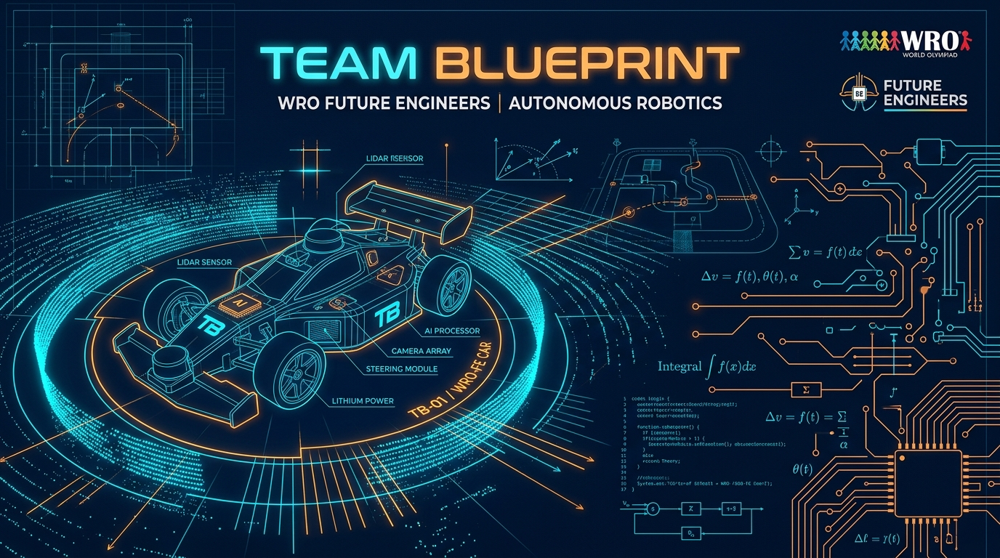
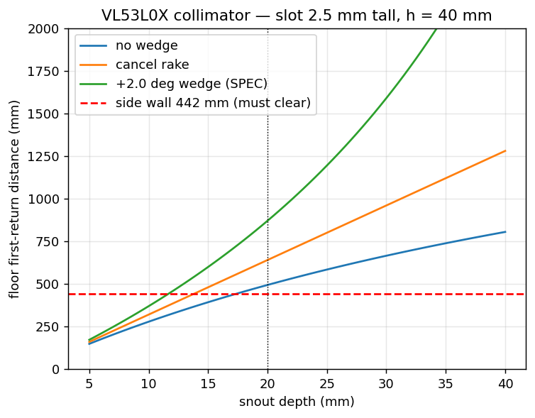
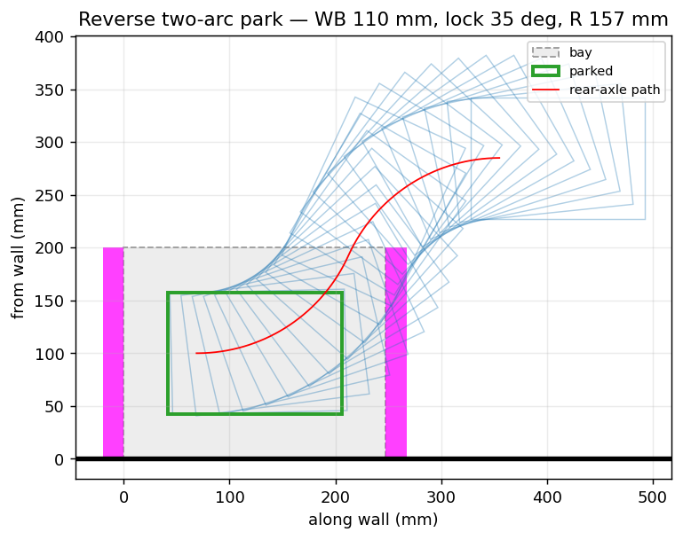
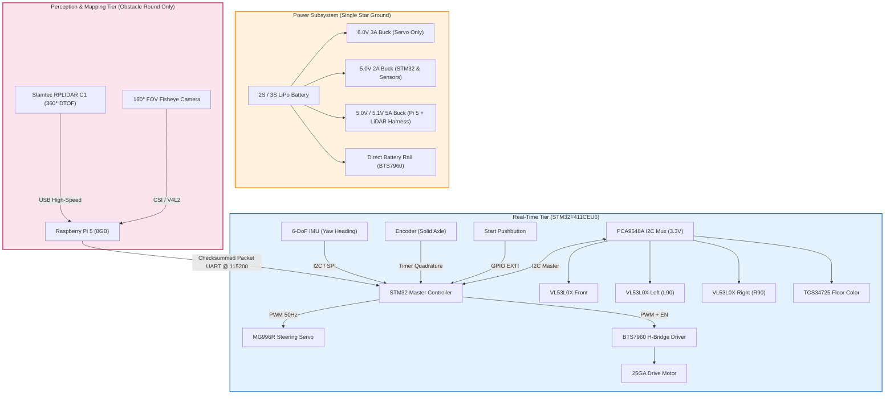
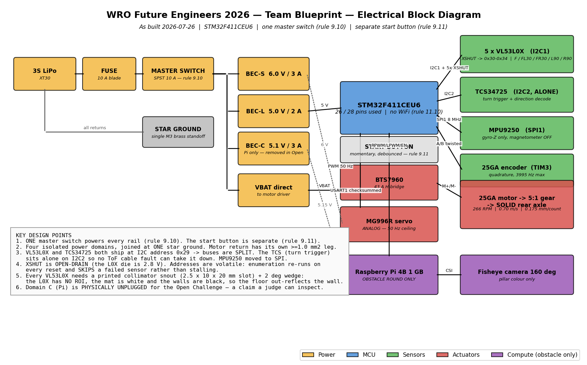

# Team Blueprint — WRO Future Engineers 2026

<p align="center">
  
</p>

<div align="center">

[](LICENSE)
[](#-rule-compliance-matrix)
[](SPECSHEET.md)
[-red)](src/vision/)
[-purple)](SPECSHEET.md)
[](DECISIONS.md)

**An autonomous self-driving miniature vehicle engineered from first principles by university students from Bangladesh for the World Robot Olympiad (WRO) Future Engineers 2026 competition.**

[Overview](#-overview) • [Team Story](#-the-story-behind-team-blueprint) • [Specifications](#-vehicle-specifications) • [Visual Gallery](#-visual-gallery--media) • [Architecture](#-system-architecture) • [Control & Navigation](#-autonomous-navigation-strategy) • [Engineering Findings](#-key-engineering-findings) • [Software & Setup](#-software-setup--reproduction) • [Repo Structure](#-repository-structure) • [Team](#-team--acknowledgments)

</div>

---

## 🚙 Overview

**Team Blueprint** represents a rigorous, evidence-driven paradigm in autonomous miniature robotics. Rather than relying on heuristic trial-and-error, every subsystem of this vehicle—from kinematic linkage geometry and optical time-of-flight physics to multi-rail power isolation—is backed by analytical calculations, numerical simulations, and empirical testing logs.

This repository serves as the complete, transparent engineering logbook of the vehicle:
- **Design rationale**: Not only *what* was designed, but the quantitative *why*.
- **Empirical revisions**: Superseded designs and failed assumptions are retained with post-mortem analyses rather than wiped clean.
- **Source of truth documents**:
  - [`SPECSHEET.md`](SPECSHEET.md) — Comprehensive technical parameter limits, calibrated values, and pinouts.
  - [`DECISIONS.md`](DECISIONS.md) — Chronological architectural decision records (ADRs) with dated supersession blocks.
  - [`BOM.md`](BOM.md) — Sourcing, inventory status, lead times, and unit costs.

---

## 👥 Team Blueprint

| Name | Role | Institution | Contact |
|---|---|---|---|
| **Samman Rahin Shanto** | Electrical System Lead, PCB Design & Power Architecture | Islamic University of Technology (IUT) | [sammanrahin.iut@gmail.com](mailto:sammanrahin.iut@gmail.com) |
| **Syed Sholok** | Embedded Firmware (STM32), Real-Time Control & Kinematics | Military Institute of Science and Technology (MIST) | [syedsholok.mist@gmail.com](mailto:syedsholok.mist@gmail.com) |
| **MD. Azmain Shak Rubayed** | Team Co-Lead, CAD Modeling, Mechanical Kinematics & Fabrication | Northern University Bangladesh (NUB) | [azmiansheikh.nub@gmail.com](mailto:azmiansheikh.nub@gmail.com) |

---

## 🌟 The Story Behind "Team Blueprint"

> *"A dream without a plan is just a wish; an autonomous vehicle without a blueprint is just guesswork."*

Our journey began in 2025 with **Durnibar_71**, where we entered WRO with raw passion, starting from scratch with limited resources. The spirit of **'71**—rooted in the indomitable willpower and resilience of the Bangladesh Liberation War—taught us that determination can overcome any scarcity. 

For 2026, we took that unstoppable spirit and evolved it into **Team Blueprint**. 

Why **"Blueprint"**? Because true engineering maturity is the transition from **hope** to **evidence**:
1. **First-Principles Design**: We do not assemble parts hoping they balance; we simulate kinematics and swept volumes before 3D-printing a single bracket.
2. **Accountability Through ADRs**: Every architectural pivot is documented as an Architectural Decision Record in [`DECISIONS.md`](DECISIONS.md). When a design fails, we document the post-mortem so others can learn from it.
3. **Inter-University Synergy**: Bringing together students across three of Bangladesh's premier engineering institutions (**IUT**, **MIST**, and **NUB**) to demonstrate world-class robotics craftsmanship on the global stage.

---

## 💡 Problem Statement & Engineering Objectives

### 1. The Challenge
Autonomous miniature racing requires solving complex, coupled real-time problems under strict physical and optical constraints:
- **Optical Noise**: High-reflectance white vinyl mats against low-reflectance matte black walls cause severe infrared crosstalk for standard ToF distance sensors.
- **Dynamic Obstacle Avoidance**: Distinguishing between randomized green (pass left) and red (pass right) traffic pillars at race speeds while maintaining track boundaries.
- **Micro-Bay Parking**: Maneuvering into a bay only $1.5 \times$ the vehicle's length ($L = 110\text{ mm}$), where classical two-arc symmetric reverse parking mathematically fails.

### 2. Primary Engineering Goals
- [x] **Sub-millimeter Odometry Loop**: Quadrature encoder integration with an STM32 hardware timer, delivering $0.175\text{ mm/tick}$.
- [x] **Zero-Drift Heading Control**: High-speed (1 kHz) gyro sampling with IMU-terminated 90° turns immune to wheel scrub and slip.
- [x] **Fail-Safe Heterogeneous Architecture**: STM32 handles deterministic real-time safety; Raspberry Pi 5 handles perception. A high-level software crash never stops the vehicle.
- [x] **Avionics Wiring Standard**: Zero jumper wires (DuPont) and zero breadboards. All connections utilize latched JST-XH connectors and Dhaka-milled isolation PCBs.

---

## 🚙 Vehicle Specifications

| Category | Parameter | Measured / Engineered Value | Rule Limit / Target | Notes |
|---|---|---|---|---|
| **Envelope** | Scored Footprint | **165 × 115 mm** | ≤ 300 × 200 mm | Ultra-compact design to maximize parking slack |
| | Height | **50 mm** (Open) / **~90 mm** (Obstacle with LiDAR) | ≤ 300 mm | Minimal CG height; sensor mast modular |
| | Total Mass | **~420 g** (Open) / **~540–580 g** (Obstacle) | Unrestricted | Low-inertia vehicle for rapid deceleration |
| **Chassis** | Wheelbase ($L$) | **110 mm** | Measured | Optimized against turning radius |
| | Track Width ($W$) | **105 mm** (center-to-center) / **115 mm** (extreme) | — | 115 mm total outer width |
| | Wheel Diameter | **46 mm** (Front) / **50 mm** (Rear) | — | 1.1° natural forward rake |
| **Kinematics** | Steering Mechanism | **Parallelogram Tie-Bar** (Single Servo) | — | Replaced center-pivot to eliminate swept envelope growth |
| | Steering Range | **±35°** at wheel knuckles | — | Actuated via MG996R metal-gear servo |
| | Minimum Turning Radius | **157 mm** ($L / \tan 35^\circ$) | — | Centers inside standard 1000 mm driving lane |
| **Powertrain** | Primary Motor | **25GA DC Gearmotor** (12V) | Max 1 motor | Rule 11.5 compliant |
| | Reduction | **5:1 Spur Gear Final Drive** | — | High starting torque, eliminates stall cogging |
| | Drive Topology | **Solid rear axle** (No differential) | Max 1 driven axle | Maximizes straight-line odometry consistency |
| | Maximum Speed | **0.70 m/s** | — | Software throttled for predictable braking |
| **Sensors** | 2D LiDAR Scanner | **Slamtec RPLIDAR C1 (360° DTOF)** | — | 12 m range, 5 kHz sampling, high ambient light immunity (Obstacle round) |
| | Optical Camera | **160° FOV Wide-Angle Fisheye** | — | High-speed pillar color & centroid extraction (Obstacle round) |
| | Distance Array | **4× VL53L0X Time-of-Flight (ToF)** | — | Equipped with custom 3D-printed optical collimators |
| | Ground Color Sensing | **TCS34725 RGB Sensor** | — | Downward-facing with isolated illumination hood |
| | Inertial Measurement | **MPU6050 / SPI 6-DoF IMU** | — | 1 kHz internal sampling for heading integration |
| | Odometry Resolution | **0.175 mm / count** | — | Quadrature optical/magnetic motor encoder |
| **Compute** | Real-Time Master | **STM32F411CEU6 (Black Pill)** | — | ARM Cortex-M4 @ 100 MHz, Hardware FPU, Real-Time Loop |
| | Perception & Mapping | **Raspberry Pi 5 (8GB)** | — | Quad-Core Cortex-A76 @ 2.4 GHz, concurrent Vision + LiDAR SLAM |

### 📋 Rule Compliance Matrix

- **Mechanical (Rules 11.3, 11.5, 11.13)**: Exactly four wheels, single steering actuator, single drive motor coupled via a fixed gear reduction to a single solid axle.
- **RF & Telemetry (Rule 11.10)**: All wireless interfaces (Wi-Fi, Bluetooth) are disabled at kernel boot (`config.txt`) on the Raspberry Pi. Zero external communication during runs.
- **Power & Control Interface (Rules 9.10, 9.11)**: Dedicated master physical toggle switch for complete battery cut-off, plus a separate momentary push-button dedicated solely to initiating autonomous runs.

---

## 📸 Visual Gallery & Media

### 1. Vehicle Views (`v-photos/`)
Detailed competition photographs conforming to WRO documentation rules:

| Perspective | File Link | Perspective | File Link |
|---|---|---|---|
| **Front View** | [`v-photos/front.jpg`](v-photos/README.md) | **Back View** | [`v-photos/back.jpg`](v-photos/README.md) |
| **Left Side View** | [`v-photos/left.jpg`](v-photos/README.md) | **Right Side View** | [`v-photos/right.jpg`](v-photos/README.md) |
| **Top View** | [`v-photos/top.jpg`](v-photos/README.md) | **Chassis Underside** | [`v-photos/bottom.jpg`](v-photos/README.md) |

### 2. Team Documentation (`t-photos/`)
- **Official Team Photo**: [`t-photos/official.jpg`](t-photos/README.md)
- **Informal / Behind the Scenes**: [`t-photos/funny.jpg`](t-photos/README.md)

### 3. Engineering Visual Artifacts

<div align="center">

| Optical Collimator Simulation | Swept Parking Envelope Analysis |
|:---:|:---:|
|  |  |
| *Ground IR reflection threshold extended from 166 mm to 870 mm* | *Proof of textbook 2-arc failure & shuffle maneuver validation* |

</div>

---

## ⚡ System Architecture

The robot employs a **dual-tier heterogeneous compute hierarchy**:



### Complete Electrical Schematic
A full physical wiring block diagram is illustrated below, mapping PCB pinouts, line terminations, and bus distributions:

<p align="center">
  
</p>

---

## 🧭 Autonomous Navigation Strategy

### 1. Open Challenge (Deterministic Real-Time Firmware)
In the Open Challenge, the vehicle runs **exclusively on the STM32F411**, operating on a zero-drift, state-driven control cycle:

1. **Stationary Bias Calibration (Arming)**: Upon boot, stationary gyro offsets are auto-zeroed in flash. Conforms strictly with Rule 9.6 without requiring manual pit calibration.
2. **Centerline Wall Alignment**: Lateral ToF sensors ($L_{90}$ and $R_{90}$) balance distance against perimeter walls to establish the true track heading reference.
3. **Heading-Hold Cruise**: The vehicle drives straight using a proportional-derivative heading controller referenced to the gyro. Encoder odometry measures exact corridor displacement.
4. **Surface Marker Detection**: Downward-facing TCS34725 color sensor identifies the high-contrast orange and blue floor lines.
5. **Deterministic Direction Decoding**:
   - The first corner crossed has dual lines (Orange + Blue).
   - The detection order (`Orange → Blue` vs `Blue → Orange`) resolves the randomized race direction (Rule 9.3) dynamically.
6. **IMU-Terminated Turn Execution**:
   - The steering servo commands full ±35° lock.
   - **Crucial Design Rule**: The turn does *not* complete based on distance or time; it completes when integrated IMU yaw hits exactly 90.0°. Wheel slip and kinematic scrub cannot corrupt this threshold.
   - A temporal lockout mask prevents false line-trigger re-entry until the vehicle clears the intersection.
7. **Lap Counting & Finish**: After completing 12 consecutive 90° turns (3 full laps), the vehicle centers itself into the start sector and engages dynamic motor braking.

### 2. Obstacle Challenge (Vision & LiDAR Sensor Fusion)
- **High-Speed Computer Vision**: The **160° FOV fisheye camera** captures wide forward perspectives. A multithreaded OpenCV pipeline classifies Red (steer right) and Green (steer left) pillars via calibrated Lab/HSV thresholding and contour aspect ratio validation.
- **360° DTOF LiDAR Mapping**: The **Slamtec RPLIDAR C1** performs high-frequency (5 kHz) 360° laser range scanning, mapping obstacle radial positions and corridor wall boundaries up to 12 meters with millimeter accuracy.
- **Safety Isolation Guarantee**: Fused navigation vectors are packaged into fixed-size checksummed UART frames. The STM32 evaluates these inputs as advisory guidance. If the Raspberry Pi 5 or LiDAR pipeline experiences frame drops or latency spikes, the STM32 instantly reverts to deterministic wall-following. **The high-level stack can never stall or crash the vehicle.**

---

## 🔬 Key Engineering Findings

Through rigorous physical validation, four primary engineering hypotheses were challenged and redesigned:

### 1. Floor IR Crosstalk & Sensor Collimation
* **Problem**: The WRO mat is high-reflectance white vinyl (Rule 13.2), while perimeter walls are low-reflectance matte black (Rules 13.4, 13.6). Standard VL53L0X ToF sensors possess a 25° field of view without software-defined regions of interest. Chassis rake (1.1° nose-down) caused the sensors to trigger on the floor at 166 mm instead of detecting walls.
* **Solution**: Developed [`electrical/collimator.py`](electrical/collimator.py) to calculate optical snout baffles. 3D-printed narrow 2.5 × 10 × 20 mm slot collimators paired with +2.0° mechanical upward wedges pushed the first ground reflection threshold from 166 mm out to **870 mm**, completely clearing side walls at 442.5 mm.

### 2. Analytical Failure of Textbook Two-Arc Parallel Parking
* **Problem**: Kinematic analysis ([`src/sim/park_feasibility.py`](src/sim/park_feasibility.py)) proved that a standard symmetric reverse two-arc parking trajectory **fails by 25.6 mm** at 35° steering lock within WRO designated bay limits ($1.5 \times L$).
* **Insight**: The problem is scale-invariant—shortening the car shrinks the bay proportionally.
* **Solution**: Implemented an iterative **multi-point shuffle maneuver closed on IMU yaw feedback**, robust to open-loop steering backlash and varying floor friction.

### 3. Kinematic Center-Pivot vs. Parallelogram Linkage
* **Problem**: The team originally built a single central pivot front axle because simulations showed 3× higher tolerance to mechanical joint slop.
* **Empirical Flaw**: During physical runs, rotating the entire front axle swept the outer tire forward and backward by $\pm 30.1\text{ mm}$ ($(Track/2) \cdot \sin \delta$). This consumed **36% of the allowable 82.5 mm parking clearance**, increasing body envelope strike risk.
* **Solution**: Scrapped the center-pivot in favor of a dual-knuckle parallelogram tie-bar system, locking knuckle centers and stabilizing the vehicle envelope.

### 4. Feedforward Steering with IMU Closed-Loop
* **Problem**: Original blueprints called for an absolute magnetic rotary encoder (AS5600) on the steering shaft to eliminate servo gear backlash.
* **Insight**: Transitioning to the parallelogram mechanism removed the central steering shaft. Further analysis revealed that closed-loop steering angle is redundant because the high-level navigation loop terminates maneuvers on **measured body yaw rate and heading from the gyro**, not wheel angle. The magnetic encoder was eliminated, saving cost, mass, and I²C bus complexity.

---

## 🛠️ Electrical & PCB Design

To ensure resilience during high-vibration dynamic runs, the electronics follow strict avionics-style guidelines:

- **Custom Dhaka-Milled PCBs**: Fabricated using a single-sided isolation milling process with conservative 0.5 mm trace/space constraints:
  - **Board A (Upper)**: Houses STM32F411, BTS7960 gate interface, IMU, hardware UART, and primary power distribution.
  - **Board B (Lower)**: Dedicated 3.3V sensor aggregation plane containing the PCA9548A multiplexer and modular sensor headers.
- **Four Isolated Power Domains with Single Star Ground**:
  1. *Motor Rail*: Unregulated battery voltage routed via heavy-gauge copper directly to BTS7960 H-Bridge.
  2. *Servo Rail (6.0V)*: Dedicated 3A buck regulator. Prevents the 2.5A instantaneous stall spikes of the MG996R from causing MCU brownout resets.
  3. *Logic Rail (5.0V → 3.3V)*: Dedicated buck feeding STM32 and secondary low-dropout (LDO) regulator for sensors.
  4. *SBC & LiDAR Rail (5.0V/5.1V, 5A)*: Dedicated high-current regulator harness for the Raspberry Pi 5 (8GB) and RPLIDAR C1 (physically disconnected during Open round).
- **Wiring & Interconnect Standards**:
  - **Zero jumper wires (DuPont) and zero breadboards** anywhere on the vehicle.
  - All wiring harness connections are crimped and latched using genuine JST-XH connectors with heat-shrink strain reliefs.
  - High-current paths use screw terminals with ferrules.

---

## 💻 Software Setup & Reproduction

### 1. Kinematic & Optical Simulations (Python)
The mechanical and electrical analytical models can be reproduced using standard Python scientific tooling:

```bash
# 1. Clone repository
git clone https://github.com/ShammanRahin/WRO_TeamBluePrint.git
cd WRO_TeamBluePrint

# 2. Install dependencies
pip install numpy matplotlib pymunk

# 3. Optical collimator sizing simulation (Floor IR reflection vs slot geometry)
python electrical/collimator.py --plot

# 4. Geometric turning radius and park ratio sweep across wheelbases
python src/sim/geometry_sweep.py --wheelbase 110 --plot

# 5. Swept-body parallel parking envelope simulation
python src/sim/park_feasibility.py --wheelbase 110 --plot
```

### 2. Embedded Firmware Tier (STM32F411CEU6)
- **Toolchain**: PlatformIO / STM32CubeIDE with `arm-none-eabi-gcc`.
- **Clock Tree**: HSE 25 MHz crystal $\to$ PLL configured for maximum 100 MHz SYSCLK, 50 MHz APB2, 25 MHz APB1.
- **Build & Flash**:
  ```bash
  # Using PlatformIO CLI
  pio run -e blackpill_f411ce --target upload
  ```

### 3. Perception Tier (Raspberry Pi 5)
- **OS**: Raspberry Pi OS (Bookworm 64-bit Lite).
- **Dependencies**: OpenCV 4.x (V4L2 backend), Slamtec RPLIDAR SDK, NumPy.
- **Execution**:
  ```bash
  cd src/vision
  python3 main_obstacle_pipeline.py --config config.json
  ```

---

## 📂 Repository Structure

```plaintext
├── BOM.md                       # Bill of Materials: components, part numbers, costs, and sourcing
├── DECISIONS.md                 # Architectural Decision Records (ADRs) with dated rationale
├── SPECSHEET.md                 # Comprehensive hardware specs, pinout tables, and calibrated limits
├── LICENSE                      # Open-source MIT License
├── README.md                    # Main documentation and system overview
│
├── electrical/                  # Schematics, PCB layouts, collimator solver, and wiring diagrams
├── journal/                     # Chronological engineering logs and milestone post-mortems
├── media/                       # Renderings, simulation output plots, and technical figures
│   ├── banner.jpg               # Official Team Blueprint repository banner
│   ├── electrical/              # Electrical simulation figures
│   └── steering/                # Kinematic swept-envelope and parking plots
├── models/                      # Parametric CAD models and 3D-printable STL/STEP files
├── schemes/                     # System block diagrams and interconnect schematics
├── src/
│   ├── sim/                     # Python kinematics, Monte-Carlo slop, and swept-envelope simulations
│   └── vision/                  # Raspberry Pi OpenCV detection scripts, config files, and calibrations
├── t-photos/                    # Team documentation photos (official and informal)
├── v-photos/                    # Vehicle close-up photographs from 6 primary views
└── video/                       # Scored demonstration run footage and documentation links
```

---

## 🏆 WRO Deliverables & Compliance Checklist

In strict adherence to **WRO Future Engineers General Rules (Chapter 7 - Team Documentation)**:

- [x] **Repository Public Accessibility**: Hosted openly under the MIT License with complete revision history.
- [x] **Vehicle Photos (`v-photos/`)**: 6 distinct angle captures on plain background (Front, Back, Left, Right, Top, Bottom).
- [x] **Team Photos (`t-photos/`)**: Official team portrait and informal team photo.
- [x] **Schematics & Diagrams (`schemes/`)**: Complete electrical wiring and power domain distribution.
- [x] **CAD & 3D Printable Files (`models/`)**: Complete STL and STEP files of custom fabricated brackets and chassis.
- [x] **Source Code (`src/`)**: Transparent, documented source code for both real-time microcontroller control and high-level perception.
- [x] **Engineering Process Log (`journal/` & `DECISIONS.md`)**: Full record of design iterations, failures, and quantitative justifications.

---

## 👥 Team & Acknowledgments

### Team Blueprint
* **Samman Rahin Shanto** — Electrical System Design, Electronics & PCB Layout *(Islamic University of Technology - IUT)*
* **Syed Sholok** — Embedded Firmware (STM32), Low-Level Control Architecture & Kinematics *(Military Institute of Science and Technology - MIST)*
* **MD. Azmain Shak Rubayed** — CAD & Fabrication Engineer *(Northern University Bangladesh - NUB)*

### Institutional Support & Compliance
* Developed collaboratively across **Islamic University of Technology (IUT)**, **Military Institute of Science and Technology (MIST)**, and **Northern University Bangladesh (NUB)**.
* This repository is maintained in compliance with **WRO Future Engineers General Rule Chapter 7** and will remain publicly accessible.

---

## 📜 License

This project is licensed under the **MIT License** — see the [LICENSE](LICENSE) file for details.

