# Team Blueprint — WRO Future Engineers 2026

<p align="center">
  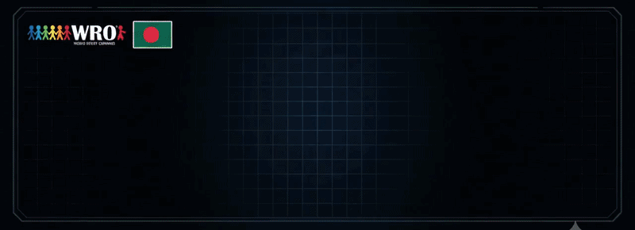
</p>

<div align="center">

### National Champions — WRO Bangladesh 2026, Future Engineers
### Heading to the WRO Open Championship Asia Pacific · Hyderabad, India · 25–27 September 2026

[](#10-engineering-chronicle)
[](#12-wro-compliance)
[](LICENSE)
[](SPECSHEET.md)
[-red)](src/pi/)
[](DECISIONS.md)

**[The Team](#1-the-team)** · **[The Vehicle](#3-the-vehicle)** · **[System Architecture](#4-system-architecture)** · **[How It Thinks](#5-how-the-car-thinks)** · **[Engineering Breakthroughs](#6-key-engineering-findings)** · **[Build & Calibrate](#7-build--fabrication)** · **[Troubleshooting](#9-field-troubleshooting)**

</div>

---

## Knowledge Index & Deep-Dive Directory

> This repository is structured into an executive master overview below and dedicated technical deep-dive documents. If you want in-depth equations, calibration routines, or build instructions, use the index below:

| System Domain | Master Overview | Full Detailed Technical Guide | Primary Topics & Highlights |
|:---|:---|:---|:---|
| **Autonomous Logic** | [Section 5](#5-how-the-car-thinks) | **[docs/control_architecture.md](docs/control_architecture.md)** | State machines, lane-gap odometry correction, heading hold, 6-phase obstacle FSM, Pi perception |
| **Research & Findings** | [Section 6](#6-key-engineering-findings) | **[docs/engineering_findings.md](docs/engineering_findings.md)** | Optical slot collimators, mathematical parking failure proof, 3 steering geometries compared |
| **Mechanical & Build** | [Section 7](#7-build--fabrication) | **[docs/build_guide.md](docs/build_guide.md)** | 3D printing parameters, Dhaka-milled isolation PCBs, avionics wiring, step-by-step assembly |
| **Sensor Calibration** | [Section 8](#8-sensor-calibration) | **[docs/calibration.md](docs/calibration.md)** | 8-step empirical calibration protocol, regression math, slew limiters, master constants table |
| **Diagnostics & Pit Fixes** | [Section 9](#9-field-troubleshooting) | **[docs/troubleshooting.md](docs/troubleshooting.md)** | 10 real-world failure modes, root-cause analyses, and verified competition fixes |
| **Engineering Chronicle** | [Section 10](#10-engineering-chronicle) | **[docs/timeline.md](docs/timeline.md)** | Dated build log from July 2026 to present, Asia Pacific Championship rebuild notes |
| **Electrical Design** | [Section 4](#4-system-architecture) | **[electrical/ELECTRICAL.md](electrical/ELECTRICAL.md)** | Power domains, star ground, bus architecture, harness standard |
| **Hardware Specifications** | [Section 3](#3-the-vehicle) | **[SPECSHEET.md](SPECSHEET.md)** | As-built geometry, rule constraints, and the dated design record behind them |
| **Architectural Decisions** | — | **[DECISIONS.md](DECISIONS.md)** | 29 dated Architecture Decision Records (ADRs) with trade-offs and supersessions |
| **Bill of Materials** | — | **[BOM.md](BOM.md)** | Component list, status, and mass budget |

---

## 1. The Team

> **Three students. Three universities. One autonomous car brought to life over 2 AM calls and assembled wherever there was a working soldering iron.**

We are from **IUT**, **MIST**, and **NUB** — three engineering universities scattered across Bangladesh. Because of the distance between campuses, our vehicle was engineered through late-night collaborative design sessions, simulations, and weekend build sessions wherever the three of us could meet.

* **National Champions**: 1st Place at WRO Bangladesh 2026 National Final (*Future Engineers*).
* **International Finalists**: Representing Bangladesh at the WRO Open Championship Asia Pacific in Hyderabad, India (September 25–27, 2026).
* **Core Philosophy — Evidence over Vibes**: We try not to guess. Key design choices (steering geometry, gear ratio, sensor mounting, parking strategy) were simulated in Python or measured on the mat, and the dated record of each decision — including the ones the build later overturned — is kept in [`DECISIONS.md`](DECISIONS.md).

<table align="center">
<tr>
<td align="center" width="33%"></td>
<td align="center" width="33%"></td>
<td align="center" width="33%"></td>
</tr>
<tr>
<td align="center"><b>Samman Rahin Shanto</b><br/><sub>Team Lead &amp; Electrical</sub></td>
<td align="center"><b>Syed Subeh-Sadik Sholok</b><br/><sub>Firmware &amp; Control</sub></td>
<td align="center"><b>MD. Azmain Sheikh Rubayed</b><br/><sub>CAD &amp; Fabrication</sub></td>
</tr>
<tr>
<td align="center"><sub>Islamic University of Technology (IUT)</sub></td>
<td align="center"><sub>Military Institute of Science &amp; Technology (MIST)</sub></td>
<td align="center"><sub>Northern University Bangladesh (NUB)</sub></td>
</tr>
<tr>
<td align="center"><sub>Power architecture, PCB layout, and noise-isolated star-ground power rails.</sub></td>
<td align="center"><sub>Low-level real-time FSM, gyro-terminated turns, and obstacle evasion algorithms.</sub></td>
<td align="center"><sub>Fusion 360 design, 3D printing, and Dhaka-milled PCB fabrication.</sub></td>
</tr>
<tr>
<td align="center"><sub><a href="mailto:sammanrahin.iut@gmail.com">sammanrahin.iut@gmail.com</a></sub></td>
<td align="center"><sub><a href="mailto:syedsholok.mist@gmail.com">syedsholok.mist@gmail.com</a></sub></td>
<td align="center"><sub><a href="mailto:azmiansheikh.nub@gmail.com">azmiansheikh.nub@gmail.com</a></sub></td>
</tr>
</table>

<details>
<summary><b>View our 2-year background across 35+ national robotics competitions</b></summary>
<br>

Before WRO, our members competed across 35+ national robotics events in Bangladesh (line followers, robo sumo, robo soccer, and battlebots). This background formed our engineering habits: rapid prototyping, in-house PCB milling, and vibration-proof avionics wiring.

| Year | Event | Segment | Result |
|:---:|:---|:---|:---:|
| 2026 | CYBERNAUTS · North South University | Robo Sumo | **Champion** |
| 2026 | IGNITION · KUET | Line Follower | **1st Runner-up** |
| 2025 | Accelerate · IEEE RAS, IUT | Line Follower | **Podium** |
| 2025 | IUT Techathon | Line Follower | **Champion** |
| 2024 | Traction · BRAC University | Pathfinder / LFR | **2nd Runner-up** |

<p align="center">
  
  
</p>

</details>

---

## 2. The Challenge

Autonomous miniature racing in the WRO Future Engineers category requires solving coupled real-time robotic problems under strict physical constraints:
* **Optical Noise**: High-reflectance white vinyl mats against low-reflectance matte black walls produce severe infrared crosstalk for distance sensors.
* **Randomized Racing Direction**: Track direction (clockwise vs. counter-clockwise) is drawn randomly before each round and must be detected dynamically.
* **Dynamic Obstacle Avoidance**: Detecting and evading randomized traffic pillars (green = pass left, red = pass right) at speed while preserving track boundaries.
* **Micro-Bay Parking**: Maneuvering into a bay only $1.5 \times$ the vehicle's length ($275.25\text{ mm}$ for our $183.5\text{ mm}$ chassis baseplate / $411.4\text{ mm}$ total envelope) without touching boundary limiters.

---

## 3. The Vehicle

### 3D CAD Digital Twin & Interactive Assembly

> **Interactive 3D on GitHub**: GitHub natively supports interactive WebGL 3D rendering. **Click the rotating assembly below** or open [`models/ASMB.stl`](models/ASMB.stl) to rotate, zoom, and inspect the physical robot assembly directly in your browser. Complete engineering assemblies are provided in [`models/ASMB.3mf`](models/ASMB.3mf) (native multi-material) and [`models/ASMB.step`](models/ASMB.step) (parametric CAD).

<p align="center">
  <a href="models/ASMB.stl" title="Click to open interactive 3D WebGL viewer on GitHub">
    
  </a>
</p>

<p align="center">
  <a href="models/ASMB.stl"></a>
  <a href="models/ASMB.3mf"></a>
  <a href="models/ASMB.step"></a>
  <a href="models/"></a>
</p>

### Vehicle Photographs (6 Required Perspectives)

> Captured in full competition configuration with 3D-printed red chassis, obstacle round camera mast, and dual-tier compute platform. High-resolution source images are located in [`v-photos/`](v-photos/README.md).

<table align="center">
  <tr>
    <th align="center">Front View</th>
    <th align="center">Top View</th>
    <th align="center">Back View</th>
  </tr>
  <tr>
    <td align="center" width="33%"><a href="v-photos/front.jpg">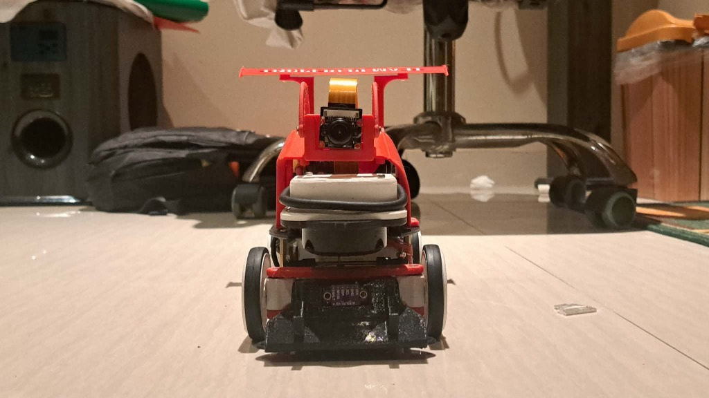</a><br/><sub><b>Front</b>: Fisheye camera mount &amp; bumper</sub></td>
    <td align="center" width="33%"><a href="v-photos/top.jpg">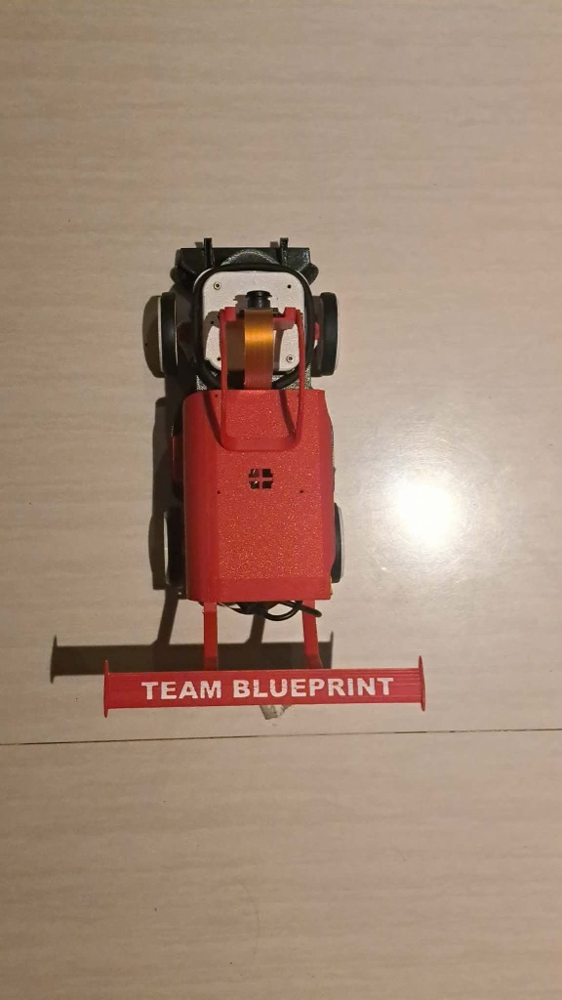</a><br/><sub><b>Top</b>: Chassis layout &amp; rear wing</sub></td>
    <td align="center" width="33%"><a href="v-photos/back.jpg">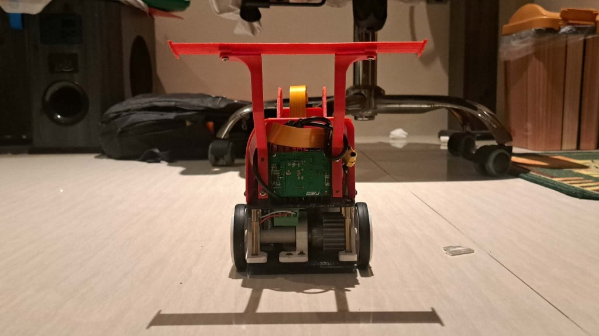</a><br/><sub><b>Back</b>: Power regulator PCB &amp; drive axle</sub></td>
  </tr>
  <tr>
    <th align="center">Left Side View</th>
    <th align="center">Right Side View</th>
    <th align="center">Bottom View</th>
  </tr>
  <tr>
    <td align="center" width="33%"><a href="v-photos/left.jpg">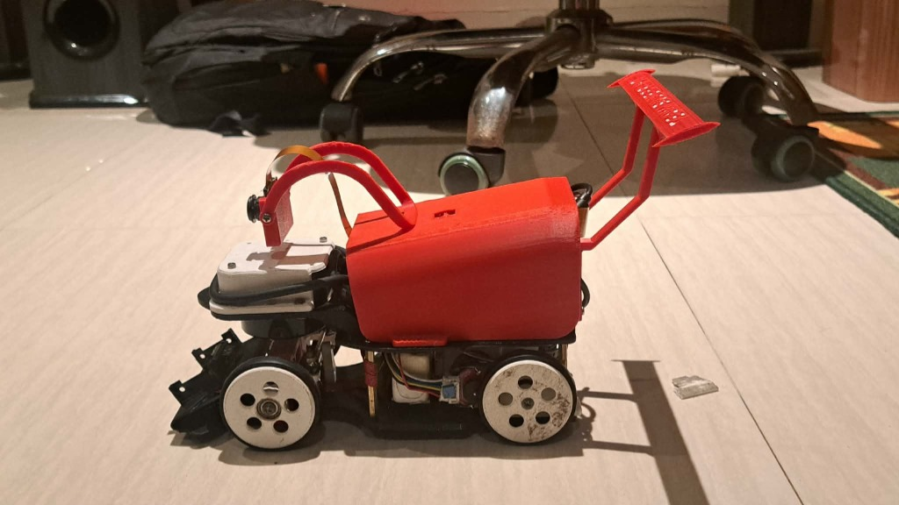</a><br/><sub><b>Left</b>: Profile &amp; Ackermann steering</sub></td>
    <td align="center" width="33%"><a href="v-photos/right.jpg">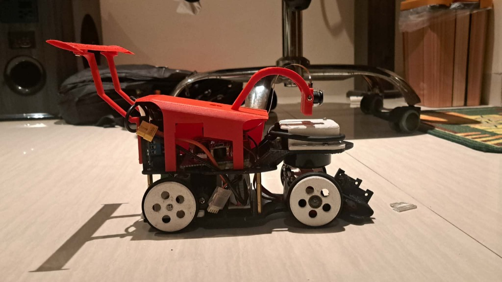</a><br/><sub><b>Right</b>: Wiring harness &amp; wheel hubs</sub></td>
    <td align="center" width="33%"><a href="v-photos/bottom.jpg">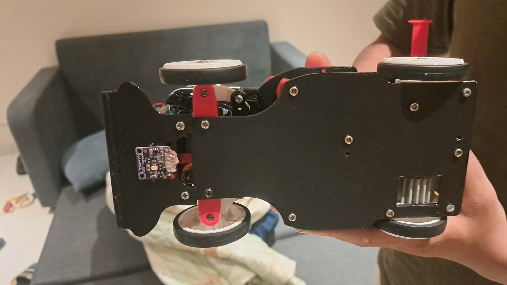</a><br/><sub><b>Bottom</b>: TCS34725 floor sensor &amp; underbody</sub></td>
  </tr>
</table>

### Bill of Materials & Hardware Components

> Below is the complete as-built hardware bill of materials for Team Blueprint, including actual component photographs, functional subsystem assignments, international supplier links, and local Bangladesh supplier links with current market prices. See [`BOM.md`](BOM.md) for full power/mass budgets.

| Photo | Component & Specification | Subsystem / Role | International Link & Price | Local Link (BD) & Price |
|:---:|:---|:---|:---:|:---:|
| 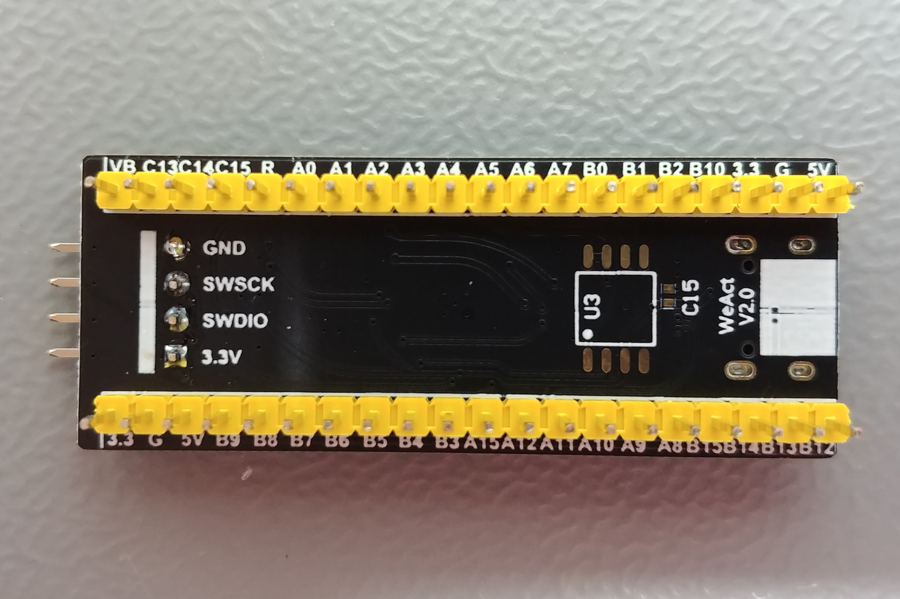 | **STM32F411CEU6 "Black Pill"**<br/>ARM Cortex-M4 @ 100 MHz, 512 KB Flash, 128 KB SRAM | Main Real-time Microcontroller (Firmware & Low-Level Control) | [WeAct Studio / AliExpress](https://www.aliexpress.com/item/1005001456186625.html)<br/>**~$3.80** | [RoboticsBD](https://www.roboticsbd.com/development-boards/stm32f411ceu6-black-pill-development-board)<br/>**~৳520** |
| 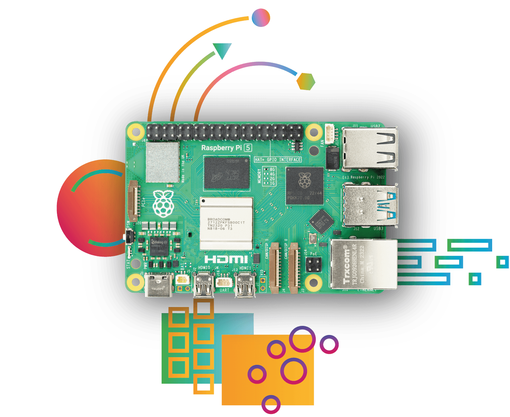 | **Raspberry Pi 5 (8 GB)**<br/>Broadcom BCM2712 Quad-core ARM Cortex-A76 @ 2.4 GHz | High-Level AI, Vision Processing & LiDAR SLAM Compute | [Raspberry Pi Foundation](https://www.raspberrypi.com/products/raspberry-pi-5/) / [DigiKey](https://www.digikey.com/en/products/detail/raspberry-pi/SC1112/21657805)<br/>**~$80.00** | [RoboticsBD](https://www.roboticsbd.com/single-board-computers/raspberry-pi-5-8gb)<br/>**~৳12,500** |
| 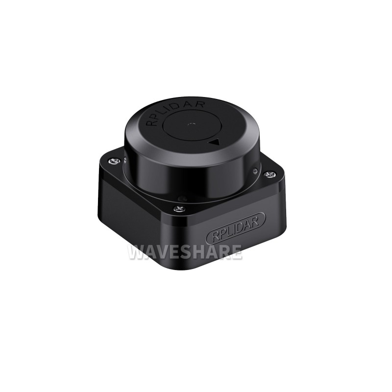 | **Slamtec RPLIDAR C1**<br/>360° DTOF Laser Scanner, 12 m range, 5 kHz sample rate | 2D LiDAR Localization & Obstacle Boundary Mapping | [Slamtec](https://www.slamtec.com/en/Lidar/C1) / [RobotShop](https://www.robotshop.com/products/slamtec-rplidar-c1-360-degree-laser-range-scanner)<br/>**~$89.00** | [RoboticsBD](https://www.roboticsbd.com/sensors/slamtec-rplidar-c1)<br/>**~৳13,500** |
| 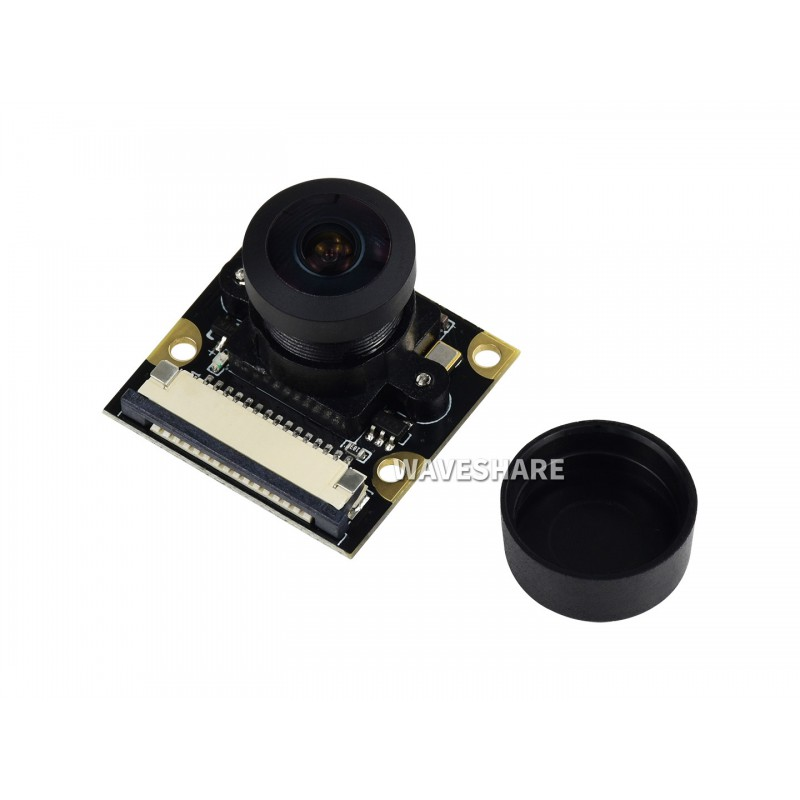 | **160° Ultra-Wide Fisheye Camera**<br/>OV5647 5 MP, low-distortion panoramic optics | Color Computer Vision (Red / Green Pillar Tracking) | [Waveshare](https://www.waveshare.com/rpi-camera-g.htm) / [AliExpress](https://www.aliexpress.com/item/32819894065.html)<br/>**~$11.50** | [RoboticsBD](https://www.roboticsbd.com/camera-modules/raspberry-pi-fisheye-camera-160-fov)<br/>**~৳1,650** |
| 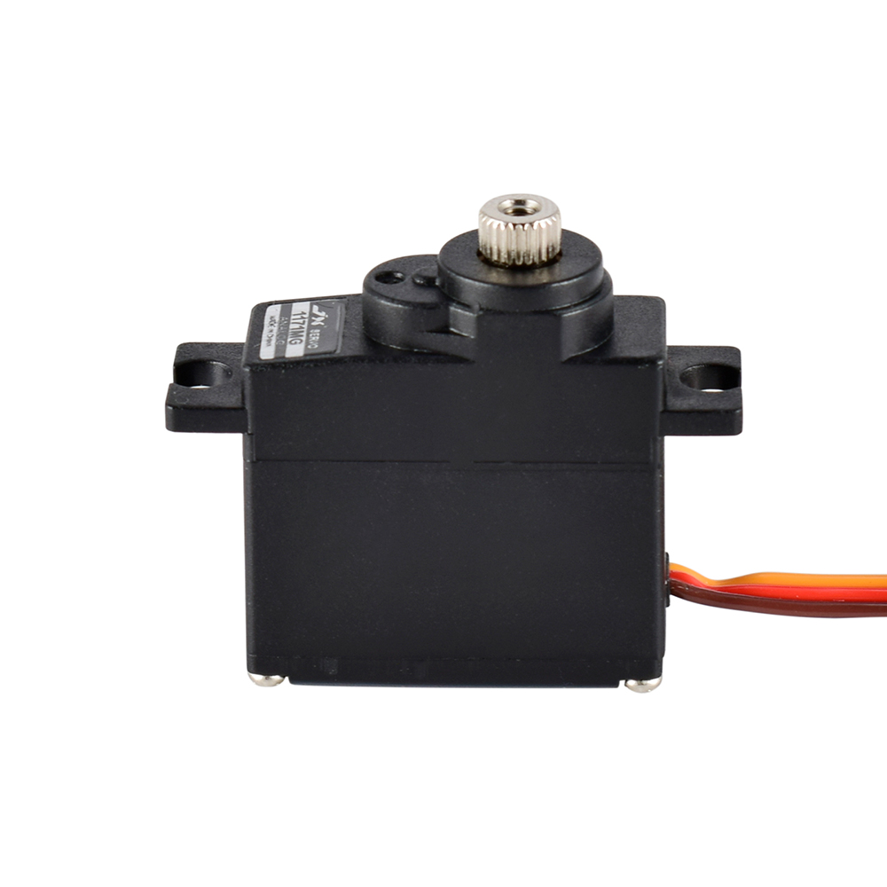 | **JX PS-1171MG Digital Servo**<br/>17 g, metal-gear, 3.5 kg·cm torque @ 6 V, 0.11 s/60° | Ackermann Kinematic Steering ($\pm 35^\circ$ travel) | [Banggood](https://www.banggood.com/JX-PDI-1171MG-17g-3_5kg-Metal-Gear-Digital-Core-Servo-p-1075163.html) / [AliExpress](https://www.aliexpress.com/item/32798939228.html)<br/>**~$7.20** | [RoboticsBD](https://www.roboticsbd.com/motors-servos/jx-servo-ps-1171mg-metal-gear-digital-servo)<br/>**~৳950** |
| 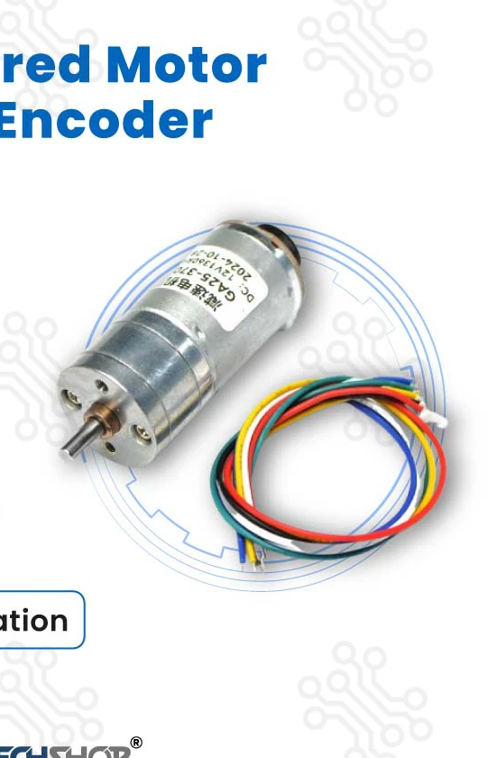 | **25GA-370 12V DC Gearmotor**<br/>1331 RPM motor, integrated magnetic Hall encoder | Primary Traction Powertrain (5:1 external reduction) | [Pololu / AliExpress](https://www.aliexpress.com/item/32854341951.html)<br/>**~$10.50** | [RoboticsBD](https://www.roboticsbd.com/motors-servos/25ga-370-12v-dc-gearmotor-with-encoder)<br/>**~৳1,250** |
| 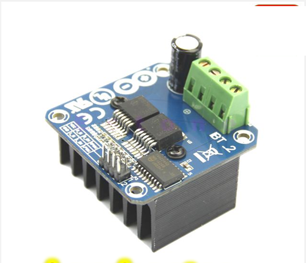 | **BTS7960 43A High-Power Driver**<br/>Dual Infineon half-bridge, PWM forward/reverse/brake | Motor Power Drive & Regenerative Braking | [Amazon](https://www.amazon.com/dp/B07TFB22H5) / [AliExpress](https://www.aliexpress.com/item/1005001621844976.html)<br/>**~$4.80** | [TechshopBD](https://techshopbd.com/detail/1820/BTS7960-43A-Motor-Driver)<br/>**~৳620** |
| 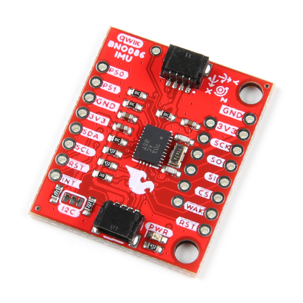 | **BNO085 9-DOF IMU Module**<br/>ARM Cortex-M0+ sensor hub, SH-2 Kalman fusion, SPI | Absolute Heading, Drift-Free Yaw & Race Odometry | [Adafruit](https://www.adafruit.com/product/4754) / [SparkFun](https://www.sparkfun.com/products/16974)<br/>**~$19.95** | [RoboticsBD](https://www.roboticsbd.com/sensors/bno085-9-dof-imu-sensor-module)<br/>**~৳2,850** |
| 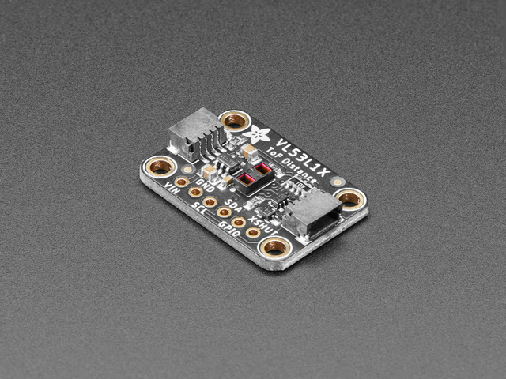 | **STMicroelectronics VL53L1X / VL53L0X**<br/>940 nm FlightSense VCSEL ToF, collimated snout | Wall Distance Ranging & Parking Bay Detection | [Pololu](https://www.pololu.com/product/3415) / [Adafruit](https://www.adafruit.com/product/3967)<br/>**~$4.50 ea.** | [RoboticsBD](https://www.roboticsbd.com/sensors/vl53l1x-time-of-flight-distance-sensor)<br/>**~৳520 ea.** |
| 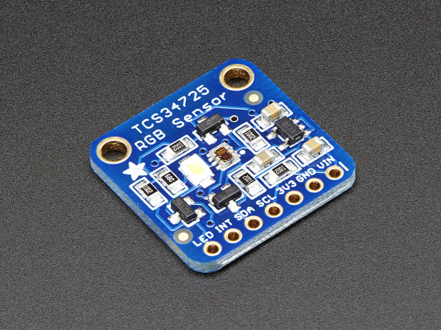 | **TCS34725 RGB Color Sensor**<br/>Integrated IR blocking filter, I²C interface @ 0x29 | Floor Line Detection & Orange Lap Counter | [Adafruit](https://www.adafruit.com/product/1334) / [AliExpress](https://www.aliexpress.com/item/32832813583.html)<br/>**~$4.20** | [RoboticsBD](https://www.roboticsbd.com/sensors/tcs34725-rgb-color-sensor-module)<br/>**~৳480** |
| 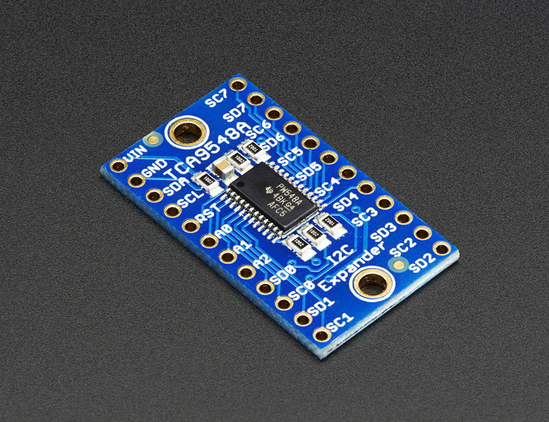 | **TCA9548A / PCA9548A I²C Multiplexer**<br/>8-channel bidirectional translation, address 0x70 | Multi-Sensor Bus Arbitrator (Prevents Address Collisions) | [Adafruit](https://www.adafruit.com/product/2701) / [AliExpress](https://www.aliexpress.com/item/32831201726.html)<br/>**~$2.20** | [TechshopBD](https://techshopbd.com/detail/2984/TCA9548A-I2C-Multiplexer)<br/>**~৳280** |
| 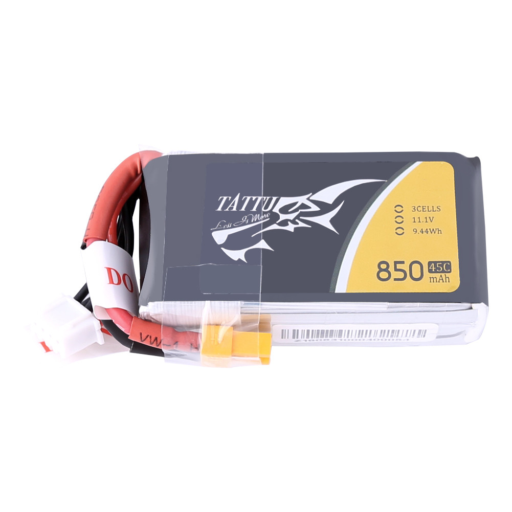 | **3S 11.1V 75C LiPo Battery**<br/>High-discharge lithium-polymer pack with XT30/XT60 | Main Vehicle Traction & Regulated Electronics Power | [HobbyKing](https://hobbyking.com/) / [AliExpress](https://www.aliexpress.com/)<br/>**~$14.00** | [RoboticsBD](https://www.roboticsbd.com/batteries-chargers/3s-lipo-battery-pack)<br/>**~৳1,850** |

### As-Built System Specifications

> **Two firmware generations are in this repository.** The Open Challenge program ([`src/open_round/OpenRound.cpp`](src/open_round/OpenRound.cpp), last changed 2026-09-17) runs on the re-pinned carrier board with a single front VL53L0X. The Obstacle Challenge program ([`src/obstacle_round/ObstacleRound.cpp`](src/obstacle_round/ObstacleRound.cpp)) and the calibration sketches still use the earlier pin map and three VL53L1X sensors. Where the two differ, both values are given below. See [Pin maps](#pin-maps) for details.

| Category | Parameter | Measured / Engineered Value | WRO Limit | Technical Design Notes |
|:---|:---|:---:|:---:|:---|
| **Footprint** | Scored Dimensions | **274.29 × 114.09 mm** (Full) / **183.5 × 101.7 mm** (Base) | $\le 300 \times 200\text{ mm}$ | Fully rule-compliant with 25.7 mm length & 85.9 mm width safety margins |
| | Vehicle Height | **169.19 mm** (To spoiler) / **104.6 mm** (Mid-deck) | $\le 300\text{ mm}$ | Well below the 300 mm rule ceiling; modular perception mast |
| | Total Mass | **~420 g** (Open) / **~540–580 g** (Obstacle, estimated) | $\le 1500\text{ g}$ | See mass budget in [`BOM.md`](BOM.md) |
| **Kinematics** | Wheelbase ($L$) | **136.07 mm** | — | Measured in CAD (136.07 mm axle-to-axle); $R = 194.3\text{ mm}$ |
| | Track Width ($W$) | **102.09 mm** (Front centre) / **114.09 mm** (Extreme) | — | Rear track: 84.84 mm centre / 113.59 mm extreme |
| | Steering Mechanism | **Ackermann linkage** | 1 actuator | $107.0^\circ / 73.0^\circ$ arms ($17.0^\circ$) aimed at the rear axle centre |
| | Steering Lock Range | **$\pm 35^\circ$** at knuckles | — | Actuated by JX PS-1171MG digital metal-gear servo |
| | Minimum Turn Radius | **194.3 mm** ($L / \tan 35^\circ$) | — | Well inside the $1000\text{ mm}$ track corridor |
| | Ground Clearance | **6.02 mm** | — | Measured from ground contact plane to lowest chassis baseplate point |
| **Powertrain** | Drive Motor | **25GA-370 DC Gearmotor** (12V) | 1 motor | One drive motor, rule-compliant |
| | Gear Reduction | **5:1 Spur Gear Drive** | — | Theoretical top speed $0.70\text{ m/s}$ |
| | Drive Axle | **Solid Steel Rear Axle** (No differential) | 1 driven axle | Unbiased straight odometry; no diff backlash |
| | Odometry Scale | **14.853 ticks/cm** (Open fw) / **31.933 ticks/cm** (Obstacle fw) | — | 0.67 mm / 0.31 mm per count; hardware quadrature on an STM32 timer |
| **Sensing** | Inertial Measurement| **BNO085 (SPI)** | — | Game-rotation-vector yaw at ~100 Hz |
| | Distance | **1× VL53L0X front** (Open fw) / **3× VL53L1X L, R, F** (Obstacle fw) | — | Behind a TCA9548A mux; 3D-printed slot collimators |
| | Floor Color | **TCS34725 RGB Color Sensor** | — | Downward-facing with light hood |
| | 2D LiDAR Scanner | **Slamtec RPLIDAR C1 (360° DTOF)** | — | Obstacle round only, USB to the Pi |
| | Optical Camera | **160° FoV Fisheye Lens** | — | Pillar colour and bearing (Obstacle round) |
| **Compute** | Real-Time Master | **STM32F411CEU6 (Black Pill)** | — | ARM Cortex-M4 @ 100 MHz, cooperative non-blocking loop |
| | High-Level Vision | **Raspberry Pi 5 (8GB)** | — | Camera + LiDAR threads (Obstacle round only) |

### WRO Rule Compliance
* **Actuators**: Exactly one motor driving a single solid rear axle; exactly one steering servo.
* **RF & Wireless (Rule 11.10)**: Wi-Fi and Bluetooth disabled via `dtoverlay=disable-wifi` / `dtoverlay=disable-bt` in `/boot/firmware/config.txt` on the Raspberry Pi 5. The Pi is physically unplugged for the Open round.
* **Control Interfaces (Rules 9.10, 9.11)**: One master switch for power; a separate momentary start button.
  > ⚠️ **Open item:** the current Open round firmware does **not** read a start button yet — it starts after a fixed 5 s countdown (`START_DELAY_MS`, `BTN_START_PIN = PB15` is marked "not wired yet"). Rule 9.11 requires a start button, so this must be wired and enabled before competition. The Obstacle round firmware already waits for the button on PA5.
* **Vehicle & Team Visuals**:
  * Vehicle photos from all 6 angles: [Section 3](#vehicle-photographs-6-required-perspectives) and [`v-photos/`](v-photos/README.md)
  * Official and informal team photos: [`t-photos/`](t-photos/README.md) *(still to be added)*
  * Driving demonstration videos: [`video/video.md`](video/video.md)

---

## 4. System Architecture

The robot uses a **two-tier compute hierarchy**:

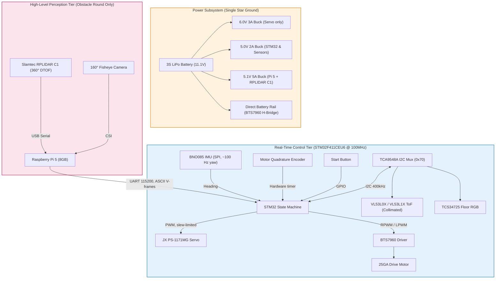
```mermaid
graph TD
    subgraph Power ["Power Subsystem (Single Star Ground)"]
        BAT["3S LiPo Battery (11.1V)"] --> REG6["6.0V 3A Buck (Servo only)"]
        BAT --> REG5["5.0V 2A Buck (STM32 & Sensors)"]
        BAT --> REG55["5.1V 5A Buck (Pi 5 + RPLIDAR C1)"]
        BAT --> DRV_PWR["Direct Battery Rail (BTS7960 H-Bridge)"]
    end

    subgraph LowLevel ["Real-Time Control Tier (STM32F411CEU6 @ 100MHz)"]
        STM["STM32 State Machine"]
        IMU["BNO085 IMU (SPI, ~100 Hz yaw)"] -->|Heading| STM
        ENC["Motor Quadrature Encoder"] -->|Hardware timer| STM
        BTN["Start Button"] -->|GPIO| STM
        MUX["TCA9548A I2C Mux (0x70)"] <-->|I2C 400kHz| STM
        MUX --> TOF["VL53L0X / VL53L1X ToF (Collimated)"]
        MUX --> COL["TCS34725 Floor RGB"]

        STM -->|PWM, slew-limited| SERVO["JX PS-1171MG Servo"]
        STM -->|RPWM / LPWM| BTS["BTS7960 Driver"] --> MOTOR["25GA Drive Motor"]
    end

    subgraph HighLevel ["High-Level Perception Tier (Obstacle Round Only)"]
        PI["Raspberry Pi 5 (8GB)"]
        LIDAR["Slamtec RPLIDAR C1 (360° DTOF)"] -->|USB Serial| PI
        CAM["160° Fisheye Camera"] -->|CSI| PI
        PI -->|"UART 115200, ASCII V-frames"| STM
    end

    style Power fill:#fff3e0,stroke:#f57c00,stroke-width:1.5px
    style LowLevel fill:#e3f2fd,stroke:#1976d2,stroke-width:1.5px
    style HighLevel fill:#fce4ec,stroke:#c2185b,stroke-width:1.5px
```

### Electrical Schematic & Wiring
* Block diagram: [`schemes/wiring_block_diagram.png`](schemes/wiring_block_diagram.png).
  > ⚠️ This diagram is dated **2026-07-26** and predates the I²C multiplexer, the BNO085, the Raspberry Pi 5 and the JX servo. It needs regenerating (`electrical/make_block_diagram.py`) from the pin maps below.
* Power isolation rules, decoupling and harness standards: [`electrical/ELECTRICAL.md`](electrical/ELECTRICAL.md).

### Pin maps

| Function | Current carrier — `OpenRound.cpp` | Earlier map — `ObstacleRound.cpp`, calibration sketches |
|:---|:---|:---|
| Motor (BTS7960) | PA2 RPWM (fwd), PA3 LPWM (rev); EN tied high on board | PB9 RPWM, PB8 LPWM, PB1 EN |
| Servo | PA8 | PA8 |
| Encoder | TIM5 on PA0 / PA1 (32-bit, sign negated in firmware) | TIM3 on PA6 / PA7 |
| IMU (BNO085, SPI) | PA5 SCK, PA6 MISO, PA7 MOSI, PA4 CS, PB0 INT, PB1 RST | PB3 SCK, PB4 MISO, PB5 MOSI, PB0 CS, PB13 INT, PB14 RST |
| I²C to mux | PB6 SCL, PB7 SDA, PB8 mux reset | PB6 SCL, PB7 SDA |
| ToF | VL53L0X front on mux ch 3 | VL53L1X left / right / front on mux ch 1 / 3 / 4 |
| Floor colour | TCS34725 on mux ch 4 | TCS34725, channel auto-detected |
| Start button | PB15 (reserved, **not read yet**) | PA5, active-low |
| Status LEDs | PB12 run, PB13 orange seen, PB14 blue seen | — |

> The obstacle firmware must be ported to the current pin map before it can run on the re-pinned carrier.

### Four Isolated Power Domains
1. **Motor Rail**: Unregulated battery voltage routed directly to the BTS7960 H-bridge. High switching currents bypass the carrier board entirely.
2. **Servo Rail (6.0V, 3A)**: Dedicated buck regulator absorbing servo current spikes, preventing MCU brownout resets.
3. **Logic Rail (5.0V → 3.3V)**: Dedicated buck regulator feeding the STM32 and the sensor board's local 3.3 V regulator.
4. **Perception Rail (5.1V, 5A)**: Separate harness feeding the Raspberry Pi 5 and RPLIDAR C1 (unplugged during the Open round).

---

## 5. How the Car Thinks

> **Deep-Dive Documentation:** For state machine details, control laws and perception thread mechanics, see **[`docs/control_architecture.md`](docs/control_architecture.md)**.

### Core Navigation Invariants
1. **"The heading is the truth. Everything else is a hint."** Wheel slip, floor reflections, and camera noise are common. The IMU yaw decides when a manoeuvre is finished: a $90^\circ$ turn ends when the heading has changed by $90^\circ$ (within `TURN_STOP_DEG` = $0.3^\circ$). Encoder distance is used only as a safety cap in case the IMU never gets there.
2. **Heterogeneous Split**: The STM32 owns all actuators. The Raspberry Pi 5 only sends advisory pillar frames (`V,<colour>,<dx>,<area>`). If no frame arrives for $250\text{ ms}$, the STM32 treats vision as absent and keeps driving on its own navigation.
3. **Corners Come First**: An avoidance manoeuvre is not started once a corner line has armed the turn and the front wall is within `FRONT_TURN_MM`. Missing a pillar loses points; missing a corner ends the run.

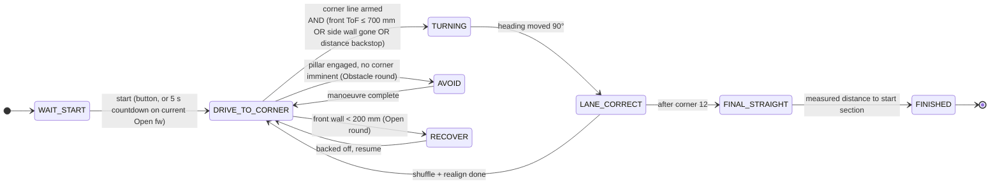
```mermaid
stateDiagram-v2
    direction LR
    [*] --> WAIT_START
    WAIT_START --> DRIVE_TO_CORNER : start (button, or 5 s countdown on current Open fw)
    DRIVE_TO_CORNER --> TURNING : corner line armed<br/>AND (front ToF ≤ 700 mm OR side wall gone OR distance backstop)
    DRIVE_TO_CORNER --> AVOID : pillar engaged, no corner imminent (Obstacle round)
    AVOID --> DRIVE_TO_CORNER : manoeuvre complete
    TURNING --> LANE_CORRECT : heading moved 90°
    LANE_CORRECT --> DRIVE_TO_CORNER : shuffle + realign done
    LANE_CORRECT --> FINAL_STRAIGHT : after corner 12
    FINAL_STRAIGHT --> FINISHED : measured distance to start section
    DRIVE_TO_CORNER --> RECOVER : front wall < 200 mm (Open round)
    RECOVER --> DRIVE_TO_CORNER : backed off, resume
    FINISHED --> [*]
```

### Lane-Gap Odometry Correction
To correct lateral drift over 12 corners without relying on wall-following, we use the geometric property that the orange and blue corner lines **fan out radially**:
* The distance travelled between crossing the first line and its partner line indicates the car's lateral position in the lane.
* The gap measured at Corner 1 becomes the reference (`gapRefCm`; the default before it is learned is `GAP_THRESHOLD_CM` = 20 cm).
* At every later corner:
  $$\Delta\text{gap} = \text{measured gap} - \text{reference gap}$$
  $$\theta_{\text{offset}} = \min(4^\circ/\text{cm} \cdot |\Delta\text{gap}|,\  30^\circ)$$
  If $|\Delta\text{gap}|$ is under the 2 cm deadband nothing is done. Otherwise the servo is held $\theta_{\text{offset}}$ off straight for $25\text{ cm}$ after the turn, then the car eases back onto the lane heading.

---

## 6. Key Engineering Findings

> **Deep-Dive Documentation:** For the derivations, simulation code, and CAD comparisons, see **[`docs/engineering_findings.md`](docs/engineering_findings.md)**.

1. **Optical Collimation Against Floor Returns**:
   * *Problem*: The white mat reflected the ToF infrared cone back into the sensor at about $166\text{ mm}$, reporting false walls.
   * *Solution*: 3D-printed $2.5 \times 10 \times 20\text{ mm}$ slot collimator snouts with $+2.0^\circ$ upward wedges ([`electrical/collimator.py`](electrical/collimator.py)). With the as-built $136.14\text{ mm}$ wheelbase (rake $0.84^\circ$) the solver puts the first floor return at **$\approx 947\text{ mm}$** ($870\text{ mm}$ with the earlier $110\text{ mm}$ figure), well beyond the side walls at $442.5\text{ mm}$.
2. **Textbook 2-Arc Parallel Parking Fails**:
   * *Proof*: The rigid-body simulation ([`src/sim/park_feasibility.py`](src/sim/park_feasibility.py)) shows a symmetric two-arc reverse park **collides by $25.6\text{ mm}$** inside a $1.5 \times$ car-length bay at $35^\circ$ lock (run at the July wheelbase of $110\text{ mm}$). Because bay length scales with car length, shrinking the chassis does not help, and the longer CAD wheelbase only makes the turn radius larger.
   * *Solution*: A **multi-point shuffle manoeuvre** closed on IMU heading (planned; not yet in the firmware — the obstacle program currently has no parking phase).
3. **Evolution of Three Steering Geometries**:
   * *Attempt 1 (Centre Turntable Pivot)*: Scrapped; rotating the front beam moved each front tyre fore/aft by $\pm 30.1\text{ mm}$, eating 36% of parking-bay slack.
   * *Attempt 2 (Parallelogram Tie-Bar)*: Fixed the swept envelope, but equal steering angles caused tyre scrub in turns.
   * *Attempt 3 (Ackermann Linkage)*: Steering-arm projections meet at the rear axle centre, so the front wheels roll with minimal scrub.

---

## 7. Build & Fabrication

> **Deep-Dive Documentation:** For printing parameters, PCB layouts, and wiring standards, see **[`docs/build_guide.md`](docs/build_guide.md)**.

* **Additive Manufacturing**: Printed on an **Ender 3 V3 SE** in PLA. Drive gears are printed at **90% infill** to resist tooth shearing; non-structural shells and brackets use low infill to save mass.
* **Locally Milled Single-Sided PCBs**: Upper carrier board ($90 \times 70\text{ mm}$) and lower sensor/multiplexer board, $0.6\text{ mm}$ traces and $0.6\text{ mm}$ clearances ([`electrical/DESIGN_RULES.md`](electrical/DESIGN_RULES.md)).
* **Wiring Standard**:
  * **No DuPont jumper wires and no breadboards** on the vehicle.
  * Harnesses use crimped, latching **JST-XH connectors** with heat-shrink strain relief. High-current motor leads use screw terminals with ferrules.

---

## 8. Sensor Calibration

> **Deep-Dive Documentation:** For step-by-step procedures and the reasoning behind each constant, see **[`docs/calibration.md`](docs/calibration.md)**.

Operational constants come from an 8-step calibration protocol ([`src/tools/calibration/`](src/tools/calibration/)):

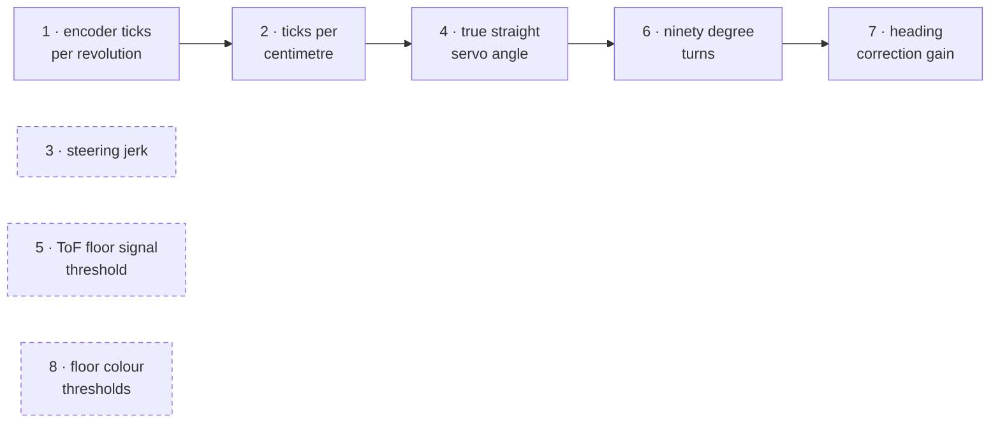
```mermaid
flowchart LR
    S1["1 · encoder ticks<br/>per revolution"] --> S2["2 · ticks per<br/>centimetre"]
    S2 --> S4["4 · true straight<br/>servo angle"]
    S4 --> S6["6 · ninety degree<br/>turns"]
    S6 --> S7["7 · heading<br/>correction gain"]
    S3["3 · steering jerk"]:::indep
    S5["5 · ToF floor signal<br/>threshold"]:::indep
    S8["8 · floor colour<br/>thresholds"]:::indep
    classDef indep stroke-dasharray: 5 4
```

### Current System Constants (as committed in the firmware)
| Parameter | Open round (`OpenRound.cpp`) | Obstacle round (`ObstacleRound.cpp`) | Calibration Step |
|:---|:---:|:---:|:---|
| `TICKS_PER_CM` | **14.853** | **31.933** | Step 2 |
| `SERVO_TRUE_STRAIGHT` | **71.0°** | **69.0°** | Step 4 |
| `SERVO_MAX_LEFT` / `RIGHT` | 1.0° / 150.0° | 5.0° / 115.0° | Step 4 |
| `SERVO_SLEW` | 2.5°/cycle | 2.5°/cycle | Step 3 |
| `SIGNAL_MIN_MCPS` | — (VL53L0X path has no signal filter) | 4.0 | Step 5 |
| `TURN_KP` / `TURN_KV` | 2.5 / 3.5 | 2.5 / 3.5 | Step 6 |
| `TURN_STOP_DEG` | 0.3° | 0.3° | Step 6 |
| `HEAD_KP` (`KI` = `KD` = 0) | 2.0 | 2.0 | Step 7 |
| Floor ORANGE | %R > 52 & %B < 18 | %R > 35 & %B < 27 | Step 8 |
| Floor BLUE | %B > 23 & %R < 40 | %B > 36 & %R < 24 | Step 8 |

> The open-round values were re-measured on the re-pinned car in September 2026; the obstacle values are from the earlier build and should be re-checked once that program is ported.

---

## 9. Field Troubleshooting

> **Deep-Dive Documentation:** For failure logs, root causes, and fixes, see **[`docs/troubleshooting.md`](docs/troubleshooting.md)**.

| Symptom | Root Cause | Field Remedy |
|:---|:---|:---|
| **Spurious Wall on Open Mat** | White mat reflection clipping ToF beam | Fit collimator snouts + $+2.0^\circ$ wedge; tune `SIGNAL_MIN_MCPS` (Step 5) |
| **Heading Drifts Across Laps** | Low-grade IMU drift / turn overshoot | Use BNO085 (SPI); calibrate `TURN_KP` and `SERVO_TRUE_STRAIGHT` |
| **Double Turn at Single Corner** | Color sensor sweeping line on exit | Post-corner lockout (`POST_CORNER_LOCKOUT_CM = 50 cm`) |
| **Wrong Turn After Avoidance** | Avoidance started too close to a corner | Don't start avoidance once a corner is armed and the wall is close |
| **Wheel Squeal & Wide Turns** | Equal-angle steering scrub | Ackermann steering geometry |
| **Distance Calibration Drift** | Coupler slipping or mass mismatch | Tighten drive grub screws; calibrate at full competition mass |
| **Phantom Red Obstacles** | Orange line seen as red under arena lights | Re-tune HSV bounds in the dashboard; raise `min_blob_area` |
| **Camera "Device Busy"** | `main.py` and `dashboard.py` both opening the camera | Run one at a time; `robodash.service` declares `Conflicts=robot.service` |
| **MCU Reset on Steering Snap** | Servo current spike pulling down logic rail | Isolate servo on dedicated 6.0V 3A buck regulator |
| **Intermittent Vibration Faults** | DuPont jumper pin friction failure | Crimped, latched JST-XH connectors |
| **Car Nosing Into a Wall** | Front wall inside 200 mm | Open fw backs off automatically (`STATE_RECOVER`), up to 3 tries |

---

## 10. Engineering Chronicle

> **Deep-Dive Documentation:** For the full narrative log and competition preparation notes, see **[`docs/timeline.md`](docs/timeline.md)**, **[`DECISIONS.md`](DECISIONS.md)** and **[`journal/`](journal/)**.

* **July 2026**: Simulations showed textbook 2-arc parallel parking cannot clear the bay; multi-point shuffle adopted as the plan. Centre-pivot steering scrapped because of its $\pm 30.1\text{ mm}$ fore/aft tyre sweep. Collimator snouts designed for the ToF floor problem; two-board single-sided PCB stack with star ground.
* **August 2026**: Non-blocking FSM validated, offset-based pillar avoidance added. **Won the WRO Bangladesh National Championship** (20 August 2026).
* **September 2026 (Asia Pacific rebuild)**: Ackermann steering, BNO085 IMU, JX PS-1171MG servo, Raspberry Pi 5 with RPLIDAR C1. Carrier board re-pinned; open-round firmware moved to the new pin map with a single front VL53L0X, re-calibrated constants and a wall-recovery state (15–17 Sept).

---

## 11. Quick Start & Toolchains

### 1. Python Simulations
```bash
git clone https://github.com/ShammanRahin/WRO_TeamBluePrint.git
cd WRO_TeamBluePrint
pip install numpy matplotlib

# Two-arc parking feasibility (the solver only accepts wheelbases that fit a 165 mm body)
python src/sim/park_feasibility.py --wheelbase 110 --plot

# ToF collimator floor-return solver, at the as-built wheelbase
python electrical/collimator.py --wheelbase 136.14 --plot
```

### 2. STM32 Firmware
There is no PlatformIO project in this repository; the firmware is built with the **Arduino IDE + STM32duino core**:

1. Install the *STM32 MCU based boards* core (STMicroelectronics) and the libraries **SparkFun BNO08x Arduino Library**, **Adafruit TCS34725**, and Pololu **VL53L0X** (open round) or **VL53L1X** (obstacle round).
2. Copy the program into a sketch folder of the same name, e.g. `OpenRound/OpenRound.ino` (the Arduino IDE only opens `.ino` sketches).
3. Board: *Generic STM32F4 series*, Part number: *BlackPill F411CE*, USB support: *CDC (generic Serial)*, Upload method: *STM32CubeProgrammer (DFU)*.
4. Put the Black Pill in DFU mode (hold BOOT0, tap NRST, release BOOT0) and upload.

### 3. Raspberry Pi Perception Stack
```bash
cd src/pi
python3 -m venv --system-site-packages ~/robo-env   # picamera2 comes from apt
source ~/robo-env/bin/activate
pip install -r requirements.txt

python3 main.py        # camera + LiDAR fusion (prints to console for now)
```
See [`src/pi/README.md`](src/pi/README.md) for the dashboard and service setup.

---

## 12. WRO Compliance

Self-audit against the **WRO Future Engineers 2026 General Rules** documentation requirements:

| Rule Requirement | Status | Evidence |
|:---|:---:|:---|
| **Public Repository & License** | **Done** | Public GitHub repo, [LICENSE](LICENSE) (MIT) |
| **English README ≥ 5000 Characters** | **Done** | This file |
| **Complete Source Code** | **Done** | Firmware (`src/open_round/`, `src/obstacle_round/`), perception (`src/pi/`), tools (`src/tools/`) |
| **Engineering Process Log** | **Done** | [`docs/timeline.md`](docs/timeline.md), [`DECISIONS.md`](DECISIONS.md), [`journal/`](journal/) |
| **Electromechanical Schematics** | **Needs update** | [`schemes/`](schemes/) diagram is dated 2026-07-26 — see [Section 4](#4-system-architecture) |
| **Driving Demonstration Videos** | **Done** | YouTube links in [`video/video.md`](video/video.md) |
| **Vehicle Photos (All 6 Sides)** | **Done** | Included in [Section 3](#vehicle-photographs-6-required-perspectives) and [`v-photos/`](v-photos/README.md) |
| **Team Photos (Official & Funny)** | **Missing** | [`t-photos/`](t-photos/README.md) contains only the instructions |
| **CAD Sources & Printable Models** | **Done** | Interactive 3D assembly ([`ASMB.stl`](models/ASMB.stl)), CAD master ([`ASMB.step`](models/ASMB.step)) & STLs in [`models/`](models/README.md) |

---

## 13. Repository Map

```
WRO_TeamBluePrint/
├── README.md                      # Executive master documentation
├── SPECSHEET.md                   # As-built geometry, rule constraints, dated design record
├── DECISIONS.md                   # 29 dated decision records with supersessions
├── BOM.md                         # Bill of Materials and mass budget
├── LICENSE                        # MIT License
│
├── docs/                          # Deep-dive technical documentation
│   ├── control_architecture.md    # State machines, lane-gap correction, perception
│   ├── engineering_findings.md    # Collimator maths, parking proof, steering kinematics
│   ├── build_guide.md             # Printing, PCB fabrication, assembly sequence
│   ├── calibration.md             # 8-step calibration suite
│   ├── troubleshooting.md         # Failure modes, causes, and fixes
│   └── timeline.md                # Dated engineering chronicle
│
├── src/
│   ├── open_round/OpenRound.cpp   # STM32 firmware, Open Challenge
│   ├── obstacle_round/            # STM32 firmware, Obstacle Challenge (+ experimental/)
│   ├── pi/                        # Raspberry Pi 5 perception, LiDAR, camera fusion, dashboard
│   ├── sim/                       # Python steering, parking and layout simulations
│   └── tools/                     # calibration/ sketches + suite, bench/ bring-up sketches
│
├── electrical/                    # Electrical design, PCB design rules, collimator solver
├── schemes/                       # Wiring block diagram
├── models/                        # CAD models and STL files (to be added)
├── journal/                       # Day-by-day engineering log
├── media/                         # Diagrams, team portraits, test figures
├── other/                         # Misc. (WRO template folder)
├── t-photos/                      # Team photos (WRO requirement)
├── v-photos/                      # Vehicle photos from 6 sides (WRO requirement)
└── video/                         # Driving demonstration video links
```

---

## 14. Credits & Licence

### Team Blueprint
* **Samman Rahin Shanto** — Team Lead, Power Architecture & PCB Design *(Islamic University of Technology - IUT)*
* **Syed Subeh-Sadik Sholok** — Embedded Firmware, Kinematics & Control Algorithms *(Military Institute of Science and Technology - MIST)*
* **MD. Azmain Sheikh Rubayed** — CAD Modeling, 3D Printing & Mechanical Fabrication *(Northern University Bangladesh - NUB)*

### Institutional Support
Developed collaboratively across **Islamic University of Technology (IUT)**, **Military Institute of Science and Technology (MIST)**, and **Northern University Bangladesh (NUB)**.

### License
This project is open source and available under the **[MIT License](LICENSE)**.
