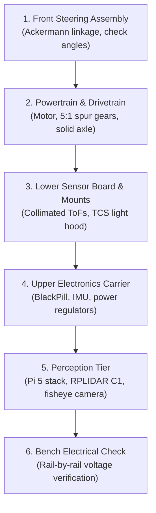

# Build Guide & Mechanical Fabrication

> Complete step-by-step instructions for manufacturing, assembling, and wiring the **Team Blueprint** autonomous vehicle from scratch.
> For a high-level system overview, return to the **[Master README](../README.md)**.

---

## 1. System Bill of Materials Overview

| Subsystem | Component | Specification / Part Number | Notes |
|:---|:---|:---|:---|
| **Real-Time Controller** | WeAct BlackPill | STM32F411CEU6, ARM Cortex-M4 @ 100 MHz | Hardware FPU, 512KB Flash |
| **High-Level Compute** | Raspberry Pi 5 | 8 GB RAM, Quad-Core Cortex-A76 @ 2.4 GHz | Active cooler fitted (Obstacle round) |
| **Drive Motor** | 25GA-370 DC Gearmotor | 12V, 1331 RPM motor shaft, Hall quadrature encoder | 5:1 spur reduction to rear axle |
| **Motor Driver** | BTS7960 H-Bridge | Dual-channel high-power MOSFET driver, 43A rating | Direct battery rail |
| **Steering Servo** | JX PS-1171MG | 17g digital metal-gear servo | Dedicated 6.0V 3A buck rail |
| **Inertial Measurement** | SparkFun BNO085 | 6-DoF IMU with on-chip sensor fusion (SPI mode) | 1 kHz sampling, zero drift |
| **I2C Multiplexer** | TCA9548A / PCA9548A | 8-channel bidirectional I2C switch (Address `0x70`) | Isolates sensors at address `0x29` |
| **Distance Sensors** | 2× VL53L1X Time-of-Flight | 4m max range, customized 3D slot collimators | Front and rear proximity |
| **Floor Color Sensor** | Adafruit TCS34725 | RGB sensor with IR filter and white illumination LED | Downward facing with light hood |
| **Perception Sensor** | Slamtec RPLIDAR C1 | 360° DTOF 2D LiDAR scanner, 12m range, 5 kHz | USB serial interface to Pi 5 |
| **Optical Camera** | 160° FoV Fisheye | Wide-angle lens module connected via CSI/USB | High-speed pillar segmentation |
| **Battery** | 3S LiPo Battery | 11.1V nominal, 75C discharge rating | XT30 connector |

---

## 2. 3D Printing Specifications

All structural components are designed in **Autodesk Fusion 360** and sliced for an **Ender 3 V3 SE** in **PLA**.

| Component | Infill Density | Wall Count | Notes & Constraints |
|:---|:---:|:---:|:---|
| **Chassis Base Plate** | 5% | 3 | $130 \times 105\text{ mm}$, engineered for torsional stiffness |
| **Body Shell & Brackets** | 5% | 2 | Lightweight shell to maintain low center of gravity |
| **Drive Gears** | **90%** | 4 | **Must be printed dense** to resist tooth shearing under motor stalls |
| **Front Wheels (46 mm)** | 5% | 3 | Fitted with silicone/rubber O-rings for traction |
| **Rear Wheels (50 mm)** | 5% | 3 | Keyed to solid steel drive shaft |
| **Ackermann Knuckles & Tie-Bar** | 15% | 4 | $\pm 35^\circ$ travel without mechanical interference |
| **ToF Optical Collimator Snouts** | 10% | 3 | $2.5 \times 10 \times 20\text{ mm}$ aperture + $2.0^\circ$ wedge |
| **TCS34725 Light Hood** | 15% | 3 | Prevents ambient arena lighting from washing out floor lines |
| **Camera & LiDAR Mast** | 10% | 3 | Elevated $\approx 90\text{ mm}$ for unobstructed $360^\circ$ LiDAR beam |

> CAD source models and printable `.stl` files are located in the [`models/`](../models/) directory.

---

## 3. Printed Circuit Boards (PCBs)

Due to local rapid prototyping constraints, the electronics are split across two single-sided Dhaka-milled PCBs (see [`electrical/DESIGN_RULES.md`](../electrical/DESIGN_RULES.md)):

* **Upper Carrier Board ($90 \times 70\text{ mm}$)**:
  * Mounts the STM32 BlackPill, BTS7960 logic interface, BNO085 IMU, pushbuttons, and primary power distribution.
  * Designed with conservative $0.6\text{ mm}$ trace widths and $0.6\text{ mm}$ clearances.
  * Raspberry Pi 5 mounting footprint positioned directly above for compact vertical stacking.
* **Lower Sensor Breakout Board**:
  * Carries the TCA9548A multiplexer and local latching headers for ToF and color sensors.
  * Connected to the Upper Carrier Board via a shielded $40\text{ mm}$ 6-pin JST-XH interconnect.

### Wiring & Avionics Standards
* **Zero DuPont Jumpers**: Jumper wires are strictly prohibited on competition hardware.
* **Latching JST-XH Connectors**: All sensor, servo, and serial connections utilize genuine JST-XH crimped pins with heat-shrink strain relief.
* **High-Current Power Rails**: Motor B+ and B- run directly from the battery harness to the BTS7960 via screw terminals with wire ferrules—high currents never cross milled PCB traces.
* **Isolated Grounds & Power Domains**: See [`electrical/ELECTRICAL.md`](../electrical/ELECTRICAL.md) for star ground topology and current budgets.

---

## 4. Step-by-Step Assembly Sequence



### Step 1: Front Steering Linkage
1. Assemble the steering knuckles onto the chassis base plate using stainless steel pivot shoulder screws and miniature ball bearings.
2. Connect the Ackermann tie-bar to both knuckle horns.
3. **Verification**: Confirm that the knuckle pivot centers remain completely fixed during steering. Verify that the inner wheel turns sharper than the outer wheel at full lock ($\cot\delta_o - \cot\delta_i = W/L$).
4. Center the JX PS-1171MG digital servo and connect the linkage pushrod.

### Step 2: Drivetrain & Rear Axle
1. Press-fit ball bearings into the rear axle chassis brackets.
2. Slide the precision steel drive shaft through the bearings, installing the 5:1 spur gear.
3. Lock both rear wheels to the axle shaft using transverse grub screws.
4. Mount the 25GA gearmotor, verifying backlash-free spur mesh with the axle gear.
5. Secure the motor encoder cable, routing it away from high-current motor leads.

### Step 3: Sensors & Optical Baffles
1. Install the 3D-printed $+2.0^\circ$ mounting wedges and slot collimators on the front and rear VL53L1X ToF sensors.
2. Mount the downward-facing TCS34725 color sensor with its ambient light hood positioned $8\text{ mm}$ above the ground.
3. Secure the lower sensor PCB and connect all sensor harnesses.

### Step 4: Carrier Board & Power Distribution
1. Mount the Upper Carrier Board using nylon M3 standoffs.
2. Connect the 6.0V buck regulator to the servo rail and the 5.0V buck regulator to the MCU/sensor rail.
3. Wire the master toggle switch (WRO Rule 9.10) to the battery input harness.
4. Wire the momentary start button (WRO Rule 9.11) to STM32 pin `PA5`.

### Step 5: High-Level Perception Stack
1. Mount the Raspberry Pi 5 onto the upper carrier board standoffs.
2. Install the rigid sensor mast ($90\text{ mm}$ height) and bolt the RPLIDAR C1 scanner to the top platform.
3. Mount the 160° fisheye camera, ensuring its optical axis is horizontal and aligned with the vehicle centerline.
4. Connect the dedicated 5.0V/5.1V 5A buck regulator harness to the Pi 5 USB-C / GPIO power inputs.

### Step 6: Electrical Bring-Up Order
*Follow the mandatory bring-up sequence in [`electrical/ELECTRICAL.md`](../electrical/ELECTRICAL.md) Section 10 before plugging in sensitive ICs:*
1. Power on with boards unpopulated; measure 6.0V on servo rail, 5.0V on logic rail, and battery voltage on BTS7960 rail.
2. Plug in the STM32 BlackPill; confirm 3.3V LDO output.
3. Connect sensors one by one, checking I2C bus communication with an I2C scanner sketch.
4. Connect the Raspberry Pi 5 and confirm stable 5.1V under load with zero undervoltage warnings.

---

## 5. Firmware Flashing & Software Setup

### STM32 Real-Time Firmware
```bash
# Build and flash using PlatformIO CLI
pio run -e blackpill_f411ce --target upload
```

### Raspberry Pi Perception Setup
```bash
cd src/pi
pip install -r requirements.txt

# Start the perception and fusion pipeline
python3 main.py
```

After flashing and initial power-up, proceed immediately to the **[Calibration Guide](calibration.md)**.
