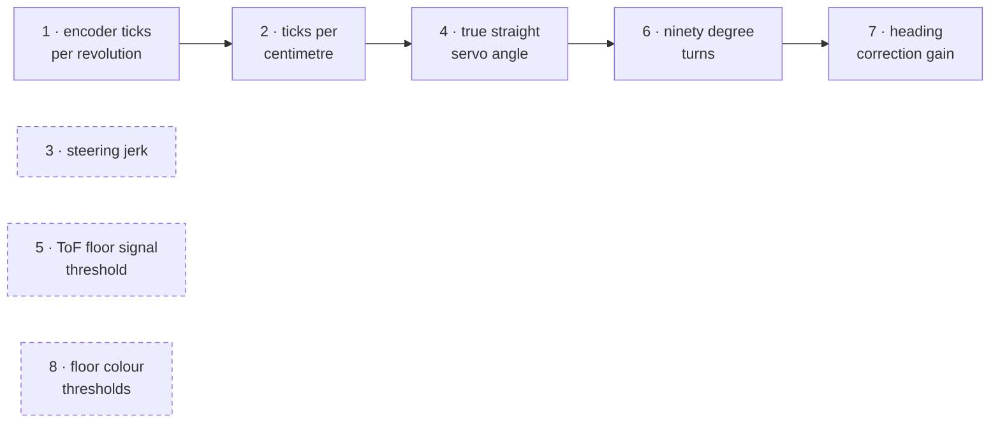

# Sensor & Actuator Calibration Guide

> An empirical, 8-step calibration protocol ensuring every mathematical constant in the vehicle firmware reflects physical reality.
> For a high-level system overview, return to the **[Master README](../README.md)**.

---

## 1. Calibration Architecture & Dependencies

Every constant in this vehicle was experimentally measured rather than estimated. The calibration steps must be performed in strict dependency order on the first setup, as downstream calculations depend directly on prior measurements.



* **Solid arrows**: Strict sequential dependencies (e.g., Step 2 requires the output of Step 1).
* **Dashed boxes**: Independent steps that can be re-run at any time.

### Prerequisite Checklist
* **Competition Weight**: All calibration must be conducted with the vehicle in full competition trim: 3S battery installed, body shell mounted, and camera mast secured. Tyre squash under real vehicle load significantly changes the effective rolling radius.
* **Firmware Sketches**:
  * Standalone diagnostic sketches: [`src/tools/calibration/01_encoder_ticks_per_rev.cpp`](../src/tools/calibration/01_encoder_ticks_per_rev.cpp) through [`08_floor_colour_thresholds.cpp`](../src/tools/calibration/08_floor_colour_thresholds.cpp).
  * Pit menu runner: [`src/tools/calibration/CalibrationSuite.cpp`](../src/tools/calibration/CalibrationSuite.cpp) (flash once, select test via Serial monitor).
  * Hardware pin configurations: [`src/tools/calibration/hardware_config.h`](../src/tools/calibration/hardware_config.h).

---

## 2. Step 1: Encoder Ticks per Wheel Revolution

<p align="center">
  
</p>

* **Objective**: Determine raw quadrature encoder counts produced by exactly one full $360^\circ$ rotation of the drive axle.
* **Why Not Trust Datasheets**: Backlash in the 5:1 spur gears, coupler play, and microcontroller 4x quadrature edge decoding shift the real count away from nominal motor specs.
* **Apparatus**: Flat floor, fine index mark on the rear tyre sidewall aligned with an index mark on the chassis.
* **Procedure**:
  1. Align marks, zero the counter via button press.
  2. Slowly rotate the rear wheel forward by hand exactly one revolution until index marks meet.
  3. Record sample. Collect 100 consecutive rotations.
* **Interpretation**:
  * The running standard deviation must converge to $< 1\%$ of the mean.
  * A growing standard deviation indicates grub screw slippage or electrical noise on the encoder lines.

---

## 3. Step 2: Ticks per Centimetre (`TICKS_PER_CM`)

<p align="center">
  
</p>

* **Objective**: Measure the real linear travel per encoder tick under competition load.
* **Current Value**: **`31.933 ticks/cm`** ($0.175\text{ mm/count}$).
* **Why Use Linear Regression**: Dividing distance by tick count on a single run bakes in acceleration ramp and stopping coast errors. By measuring across six distances ($25, 50, 75, 100, 150, 200\text{ cm}$), the startup/stopping errors isolate into the regression intercept, leaving the slope clean:
  $$\text{ticks} = m \cdot \text{distance} + c \implies \text{TICKS\_PER\_CM} = m$$
* **Apparatus**: Minimum 2 meters of authentic competition mat with high-precision tape measure.
* **Validation Criteria**: Coefficient of determination $R^2 > 0.999$. Lower values indicate tire slip or imprecise sighting.

---

## 4. Step 3: Steering Jerk & Slew Limit (`SERVO_SLEW`)

<p align="center">
  
</p>

* **Objective**: Eliminate instantaneous steering snap to protect gears and prevent traction loss.
* **Current Value**: **`2.5 deg/cycle`**.
* **Physics of Jerk**:
  $$\text{jerk} = \frac{d^3\theta}{dt^3} = \frac{d}{dt}(\text{yaw acceleration})$$
  High yaw jerk breaks rear tire static friction on slick vinyl mats, inducing wheel scrub and corrupting encoder odometry.
* **Procedure**: Run the vehicle at competition speed into a $25^\circ$ step turn with slew limits ranging from $0$ (unlimited) to $5.0^\circ/\text{cycle}$.
* **Selection**: Select the "knee" on the jerk vs. slew curve where jerk drops substantially without making the corner entry sluggish ($< 300\text{ ms}$ settling time).

---

## 5. Step 4: True Straight Servo Angle (`SERVO_TRUE_STRAIGHT`)

<p align="center">
  
</p>

* **Objective**: Find the exact digital servo command that drives the vehicle in a mathematically straight line.
* **Current Value**: **`69.0 deg`** (for JX PS-1171MG linkage).
* **Procedure**:
  1. Sweep servo commands in $0.5^\circ$ increments around nominal center.
  2. Drive $3\text{ meters}$ at each angle, recording accumulated heading drift via the BNO085 gyro.
  3. Plot drift vs. commanded angle; identify the minimum of the V-curve where heading drift equals $0.00^\circ/\text{m}$.

---

## 6. Step 5: ToF Floor Signal Threshold (`SIGNAL_MIN_MCPS`)

<p align="center">
  
</p>

* **Objective**: Distinguish between authentic black wall returns and spurious floor returns using photon count rate.
* **Current Values**: **`SIGNAL_MIN_MCPS = 4.0`**, **`TOF_MAX_VALID_MM = 1300`**.
* **Principle**: On matte black walls, reflected infrared returns are weak ($< 3.0\text{ MCPS}$). Spurious reflections off the bright white vinyl mat produce high photon rates ($> 5.0\text{ MCPS}$).
* **Procedure**: Measure signal return rate across distances from $200\text{ mm}$ to $1200\text{ mm}$ against black walls, versus open white mat. Set the discard ceiling in the clear gap between distributions.

---

## 7. Step 6: 90-Degree Eased Turns

<p align="center">
  
</p>

* **Objective**: Tune the proportional eased cornering controller.
* **Current Values**: `TURN_KP = 2.5`, `TURN_KV = 3.5`, `TURN_STOP_DEG = 0.3°`, `TURN_MIN_PWM = 100`, `TURN_MAX_PWM = 130`.
* **Control Law**:
  $$\text{error} = \theta_{\text{target}} - \theta_{\text{current}}$$
  $$\text{steer} = \text{clamp}(K_{p,\text{turn}} \cdot |\text{error}|,\; \text{TURN\_MIN\_STEER},\; \text{TURN\_MAX\_STEER})$$
  $$\text{pwm} = \text{clamp}(K_{v,\text{turn}} \cdot |\text{error}|,\; \text{TURN\_MIN\_PWM},\; \text{TURN\_MAX\_PWM})$$
* **Validation**: Run 30 consecutive alternating turns (15 left, 15 right). Final heading error standard deviation must stay under $1.5^\circ$. If left and right errors diverge systematically, re-run Step 4.

---

## 8. Step 7: Straight-Line Heading Hold Gain (`HEAD_KP`)

<p align="center">
  
</p>

* **Objective**: Tune the cruise heading hold P-gain.
* **Current Values**: **`HEAD_KP = 2.0`**, **`HEAD_KI = 0.0`**, **`HEAD_KD = 0.0`**, **`YAW_FILT_ALPHA = 0.35`**.
* **Tuning Method**:
  1. Increment $K_p$ on a $4\text{-meter}$ straight until the vehicle visibly oscillates (snaking period $\approx 0.5\text{ s}$).
  2. Reduce $K_p$ to $60\%$ of the oscillation onset gain.
  3. $K_i$ is kept at 0 (eliminates integral windup and prevents masking mechanical steering misalignment).
  4. $K_d$ is kept at 0 (gyro yaw rate is pre-filtered by hardware fusion).

---

## 9. Step 8: Floor Colour Ratio Thresholds

<p align="center">
  
</p>

* **Objective**: Classify track lines into ORANGE, BLUE, or WHITE MAT independent of battery voltage or ambient light.
* **Current Calibration**:
  * **BLUE LINE**: $\%B > 36\% \quad \text{AND} \quad \%R < 24\%$
  * **ORANGE LINE**: $\%R > 35\% \quad \text{AND} \quad \%B < 27\%$
  * **WHITE MAT**: Sitting centrally between thresholds $\to$ Returns `COLOR_NONE`.
* **Why Use Channel Percentages**: Raw ADC counts shift as the LED power drops with battery discharge or when shadows pass over the robot. Normalized ratios ($\%R = R / (R+G+B)$) remain completely invariant under varying light intensities.
* **Debounce Filter**: Line detection must hold for `COLOR_CONFIRM_MS = 6 ms` before triggering corner events.

---

## 10. Pillar Color Calibration (Raspberry Pi Dashboard)

Pillar color detection runs independently on the Raspberry Pi 5:
1. Start the calibration dashboard on the Pi:
   ```bash
   cd src/pi
   python3 dashboard.py
   ```
2. Open a browser at `http://<pi-ip>:5000`.
3. Click on live video samples of red and green pillars under actual arena lighting.
4. Save configuration: updates are atomically committed to [`src/pi/config.json`](../src/pi/config.json).

---

## 11. Master Calibration Constants Reference

| Firmware Constant | Calibrated Value | Calibration Step | Hardware / File |
|:---|:---:|:---:|:---|
| `TICKS_PER_CM` | **31.933** | Step 2 | Motor Encoder |
| `SERVO_TRUE_STRAIGHT` | **69.0°** | Step 4 | JX PS-1171MG |
| `SERVO_MAX_LEFT` / `RIGHT` | **5.0° / 115.0°** | Step 4 | Mechanical Lock Limits |
| `SERVO_SLEW` | **2.5°/cycle** | Step 3 | Slew Rate Limiter |
| `SIGNAL_MIN_MCPS` | **4.0** | Step 5 | VL53L1X Firmware Filter |
| `TOF_MAX_VALID_MM` | **1300 mm** | Step 5 | Wall Distance Ceiling |
| `TURN_KP` / `TURN_KV` | **2.5 / 3.5** | Step 6 | Eased Turn Law |
| `TURN_STOP_DEG` | **0.3°** | Step 6 | Gyro Turn Exit Window |
| `TURN_MIN_PWM` / `MAX_PWM` | **100 / 130** | Step 6 | Motor Cornering Speeds |
| `HEAD_KP` / `KI` / `KD` | **2.0 / 0.0 / 0.0** | Step 7 | Straight Cruise Heading Hold |
| `YAW_FILT_ALPHA` | **0.35** | Step 7 | Gyro Low-Pass Filter |
| Floor BLUE Cutoff | **%B > 36 & %R < 24** | Step 8 | TCS34725 Discriminator |
| Floor ORANGE Cutoff | **%R > 35 & %B < 27** | Step 8 | TCS34725 Discriminator |
| `COLOR_CONFIRM_MS` | **6 ms** | Step 8 | Color Edge Debounce |
