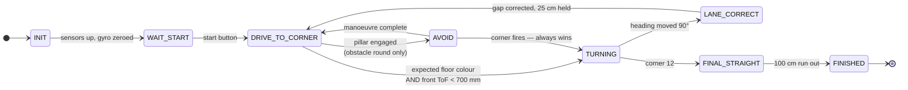
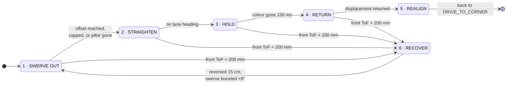

# Control Architecture & Intelligence — How the Car Thinks

> This document details the autonomous decision architecture, real-time state machine, odometry-based lane correction, and dual-tier perception stack of **Team Blueprint**.
> For a high-level system overview, return to the **[Master README](../README.md)**.

---

## 1. Core Navigation Philosophy

> **"The heading is the truth. Everything else is a hint."**

In autonomous miniature vehicle racing, raw sensor feedback is inherently prone to environmental noise:
* Wheels slip under acceleration and corner entry.
* Tyres scrub sideways through turns on low-friction mats.
* Time-of-Flight (ToF) distance sensors pick up specular reflections off high-reflectance white vinyl mats.
* Optical cameras can drop color tracks due to sudden ambient illumination changes or shadows.

To achieve robust 3-lap repeatability across 12 corners, **heading decides when a manoeuvre is finished, while other sensors only decide when one should start**:
* A $90^\circ$ turn terminates strictly when the IMU registers $90^\circ$ of yaw displacement—never based on elapsed time or encoder distance.
* Straightaways are maintained via closed-loop gyroscope heading hold, rather than by continuously following wall distances.
* Drift accumulation is actively bounded by re-referencing yaw at each detected corner.

---

## 2. Dual-Tier Heterogeneous Compute Hierarchy

```
            +-------------------------------------------+
            |  Raspberry Pi 5            ADVISORY tier   |
            |                                            |
            |  camera thread  ->  colour + bearing       |
            |  lidar thread   ->  360° ranges            |
            |  fusion loop    ->  obstacles with distance|
            +--------------------+-----------------------+
                                 |  UART 115200 baud
                                 |  "V,<colour>,<dx>,<area>"
                                 v
            +-------------------------------------------+
            |  STM32F411CEU6             REAL-TIME tier  |
            |                                            |
            |  IMU heading, encoder odometry,            |
            |  ToF ranges, floor colour,                 |
            |  the state machine, servo, motor           |
            +-------------------------------------------+
```

The system separates deterministic vehicle control from computationally heavy perception:

1. **STM32 Real-Time Master ([`src/open_round/OpenRound.cpp`](../src/open_round/OpenRound.cpp) / [`src/obstacle_round/ObstacleRound.cpp`](../src/obstacle_round/ObstacleRound.cpp))**:
   * Directly drives the motor (via BTS7960 H-Bridge PWM) and steering servo (JX PS-1171MG).
   * Executes a zero-allocation, non-blocking cooperative state machine.
   * Reads the high-rate IMU (BNO085 over SPI @ 1 kHz), motor quadrature encoder ($0.175\text{ mm/count}$), ToF distance sensors, and TCS34725 floor color sensor.
2. **Raspberry Pi 5 Advisory Tier ([`src/pi/`](../src/pi/))**:
   * Runs asynchronous camera blob tracking and 2D LiDAR clustering.
   * Emits advisory serial packets (`V,<colour>,<dx>,<area>`).
3. **Fail-Safe Decoupling**:
   * If the Pi freezes, overheats, or drops frames, the STM32 detects stale perception data (`visionFresh() == false` after 250 ms) and automatically falls back to safe open-round navigation.
   * The perception stack physically cannot stall or crash the vehicle.

---

## 3. The Autonomous State Machine



### Invariant Rules
1. **Absolute Corner Priority**: If a corner trigger fires while the vehicle is halfway through an obstacle avoidance maneuver, the turn takes immediate priority and avoidance is abandoned. Missing a pillar forfeits points; missing a corner ends the run.
2. **Deterministic State Exits**: No state exits based on an open-ended timer. Every transition is governed by physical sensor measurements (encoder distance, IMU yaw, or optical color transitions).

---

## 4. Startup, Calibration & Direction Decoding

1. **Sensor Initialization**: At power-on, the STM32 brings up the TCA9548A I2C multiplexer, VL53L1X ToF sensors, TCS34725 floor sensor, and BNO085 IMU over SPI. Non-responding sensors are logged, allowing safe degraded-mode operation.
2. **Gyro Zeroing**: The vehicle records the initial stationary yaw as `initialYawOffset`. All subsequent headings are relative to this startup vector, normalized to $[-180^\circ, +180^\circ]$. The car must remain stationary during boot.
3. **Wait for Start (`STATE_WAIT_START`)**: All actuators remain unpowered until the dedicated start pushbutton is pressed (WRO Rule 9.11).
4. **Autonomous Direction Decoding**:
   The driving direction (clockwise vs. counter-clockwise) is drawn randomly per round (WRO Rule 9.3). The mat features an orange line and a blue line at each corner. The order in which they are crossed on corner 1 determines the entire round:
   * **Orange first** $\to$ Clockwise $\to$ All subsequent corners are $90^\circ$ right turns.
   * **Blue first** $\to$ Counter-Clockwise $\to$ All subsequent corners are $90^\circ$ left turns.
   Once locked, the state machine only checks for its expected corner color, preventing stray reflections from corrupting the run.

---

## 5. Main Cruise Loop: `STATE_DRIVE_TO_CORNER`

Between corners, the vehicle maintains the heading established at corner exit using a proportional heading controller:

$$\text{error} = \text{target\_heading} - \text{current\_heading}$$
$$\text{servo} = \text{SERVO\_TRUE\_STRAIGHT} + K_{p,\text{head}} \cdot \text{error}$$

* Slew-rate limited to `SERVO_SLEW` ($2.5^\circ/\text{cycle}$) to suppress yaw jerk and wheel scrub.
* $K_i = 0$ and $K_d = 0$ by design: yaw rate is heavily filtered ($a = 0.35$), and mechanical offsets are calibrated out physically.

### Concurrently Monitored Events
* **Corner Detection**: Declared only when the expected floor line color is verified **AND** the front ToF registers a wall within `FRONT_TURN_MM` ($700\text{ mm}$). Both conditions are required to eliminate false positives.
* **Post-Corner Lockout**: For `POST_CORNER_LOCKOUT_CM` ($50\text{ cm}$) after each turn, color detections are masked. This prevents sweeping back over the same corner lines on exit and triggering an accidental immediate second turn.
* **Obstacle Encounter (Obstacle Round)**: Color blob detected by the camera exceeds threshold area.

---

## 6. Proprietary Lane-Gap Correction

<p align="center">
  
</p>

### The Problem with Wall-Following
Over 12 corners (3 full laps), slight turn variations compound. A wide corner exit leaves the car closer to the outer wall, degrading the entry angle of the next corner. Traditional robots follow the side wall with distance sensors; however, on matte black walls with white vinyl floors, ToF sensors are susceptible to beam clipping and false reflections.

### The Geometric Insight
The orange and blue corner marker lines **fan out radially**. The further the car is from the inner wall, the greater the physical distance between the two lines.

Thus, the distance between the two line crossings acts as a precise lateral ruler. The measurement is performed entirely by the motor encoder—the one sensor immune to optical surface noise.

### Implementation Logic
1. **Self-Referenced Baseline**: On Corner 1, the car measures the encoder counts between crossing line 1 and line 2, storing it as `reference_gap`. The vehicle does not assume an idealized track position; it holds the line it started on.
2. **Error Calculation**: On every subsequent corner:
   $$\text{gap\_error} = \text{measured\_gap} - \text{reference\_gap}$$
3. **Proportional Heading Correction**:
   $$\theta_{\text{offset}} = \text{clamp}(K_{\text{lat}} \cdot \text{gap\_error},\; -30^\circ,\; +30^\circ) \quad (K_{\text{lat}} = 4^\circ/\text{cm})$$
   This offset is injected into the heading target for `CORRECTION_DISTANCE_CM` ($25\text{ cm}$) at reduced speed (`CORRECTION_PWM = 70`), gently shifting the car laterally before restoring normal heading hold.
4. **Deadband & Fault Rejection**:
   * Errors under `GAP_DEADBAND_CM` ($2\text{ cm}$) are ignored to prevent limit-cycle hunting.
   * Errors exceeding `GAP_THRESHOLD_CM` ($20\text{ cm}$) are rejected as invalid line reads, preventing erratic swerves.

---

## 7. Turn Dynamics: `STATE_TURNING`

Turns are executed with a non-blocking, eased proportional control law terminating strictly on IMU yaw:

$$\text{steer} = \text{clamp}(K_{p,\text{turn}} \cdot |\text{error}|,\; \text{TURN\_MIN\_STEER},\; \text{TURN\_MAX\_STEER})$$
$$\text{pwm} = \text{clamp}(K_{v,\text{turn}} \cdot |\text{error}|,\; \text{TURN\_MIN\_PWM},\; \text{TURN\_MAX\_PWM})$$

* As the vehicle approaches the target heading, speed and steering angle smoothly taper down to prevent exit overshoot.
* **No Settle Delay**: The turn hands off immediately to straight-line heading hold when $|\text{error}| < 0.3^\circ$. Residual error is absorbed dynamically while driving down the next straight.
* On Corner 12, the vehicle transitions to `STATE_FINAL_STRAIGHT`, covers $100\text{ cm}$ into the starting bay, and halts.

---

## 8. Pillar Avoidance (Obstacle Round)

### Perception Link Protocol
The Raspberry Pi emits serialized ASCII frames over UART at 30 Hz:
```
V,<colour>,<dx>,<area>
```
* `colour`: `R` (Red), `G` (Green), or `N` (None).
* `dx`: Pixel displacement from frame center ($-160$ to $+160$).
* `area`: Segmented contour area (used as proximity proxy).

### Offset-Based Maneuvering
Rather than applying a fixed swerve angle, the evasion target is calculated dynamically from the horizontal pixel offset $dx$:
* Centered obstacle ($|dx| \approx 0$) $\to$ Aggressive swerve aiming for `AVOID_SIDE_NEAR_MM` ($150\text{ mm}$ clearance from wall).
* Offset obstacle ($|dx| \gg 0$) $\to$ Mild swerve aiming for `AVOID_SIDE_FAR_MM` ($300\text{ mm}$ clearance).
* Hard safety limit: Vehicle will never steer closer than `SIDE_SAFE_MM` ($100\text{ mm}$) to any wall.
* **Rules Compliance**: Red pillars are passed on the right; green pillars on the left.

### 6-Phase Avoidance State Machine



| Phase | Action | Exit Condition |
|:---|:---|:---|
| **1. Swerve Out** | Steer out to computed offset; integrate lateral displacement via encoder. | Offset reached, boundary cap reached, or pillar exits frame. |
| **2. Straighten** | Align parallel to lane heading while holding lateral offset. | Yaw error $< 1^\circ$. |
| **3. Hold** | Cruise along the obstacle side. | Color absent for debounced duration (`AVOID_RELEASE_MS = 150 ms`). |
| **4. Return** | Steer back by the exact integrated displacement. | Symmetric return distance completed. |
| **5. Realign** | Re-lock onto lane heading; restore base steering trims. | Aligned with lane; hands back to `DRIVE_TO_CORNER`. |
| **6. Recover** | **Near-Miss Recovery Subroutine**: If front ToF drops below $200\text{ mm}$ during phases 1–4, the car is in danger of clipping. | Reverse $15\text{ cm}$ along previous steering arc, boost swerve angle by $+8^\circ$ (up to $44^\circ$), and re-attempt Phase 1. |

---

## 9. Raspberry Pi Perception Stack ([`src/pi/`](../src/pi/))

### Concurrency Architecture (`worldstate.py`)
A thread-safe double-slot shared state buffer connects sensor worker threads to the fusion loop:
* Producers overwrite slots under a fast mutex lock.
* `snapshot()` extracts object references without blocking sensor capture loops.
* Enforces universal coordinate standards: distances in millimeters, angles in degrees ($0^\circ$ forward, positive left), and invalid returns as `float('inf')` (never `None`).

### Optical Vision Pipeline (`sensors/camera.py`)
* Camera acquisition via `Picamera2` at $320 \times 240$ resolution.
* Module-level detection functions share bit-for-bit identical code between the autonomous run loop and the tuning dashboard.
* Calculates angular bearing from optical principal point:
  $$\text{bearing} = -\left(\frac{c_x - \frac{W}{2}}{\frac{W}{2}}\right) \cdot \frac{\text{HFOV}}{2}$$

### Asynchronous LiDAR Pipeline (`sensors/lidar.py`)
* Wraps the asyncio-based `rplidarc1` library inside a dedicated OS thread.
* Streams point-cloud measurements into a rolling 360-element range array indexed by integer degrees.
* Publishes to shared state at 50 Hz.

### Sensor Fusion (`main.py`)
At 30 Hz, the fusion thread pairs camera-detected color blobs with corresponding LiDAR range sectors ($\pm 8^\circ$ of bearing) to compute metric obstacle vectors $(x, y, \text{color})$.
