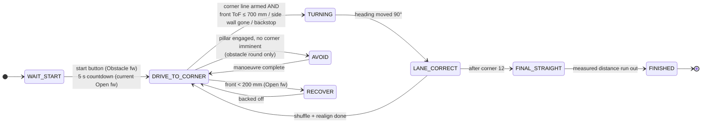
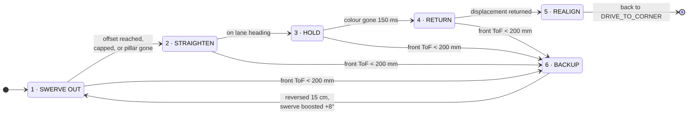

# Control Architecture & Intelligence — How the Car Thinks

> This document details the autonomous decision architecture, real-time state machine, odometry-based lane correction, and dual-tier perception stack of **Team Blueprint**.
> For a high-level system overview, return to the **[Master README](../README.md)**.

---

## 1. Core Navigation Philosophy

> **"The heading is the truth. Everything else is a hint."**

In autonomous miniature vehicle racing, raw sensor feedback is inherently prone to environmental noise:
* Wheels slip under acceleration and corner entry.
* Tyres scrub sideways through turns on low-friction mats.
* Time-of-Flight (ToF) distance sensors pick up specular reflections off high-reflectance white vinyl mats.
* Optical cameras can drop color tracks due to sudden ambient illumination changes or shadows.

To achieve robust 3-lap repeatability across 12 corners, **heading decides when a manoeuvre is finished, while other sensors only decide when one should start**:
* A $90^\circ$ turn terminates when the IMU registers $90^\circ$ of yaw displacement (within $0.3^\circ$). Encoder distance is only a safety cap (120 cm) in case the IMU never gets there.
* Straightaways are maintained via closed-loop gyroscope heading hold, rather than by continuously following wall distances.
* Drift is bounded by stepping the lane heading by exactly $90^\circ$ at every corner, so each straight is held against a fixed target.

---

## 2. Dual-Tier Heterogeneous Compute Hierarchy

```
            +-------------------------------------------+
            |  Raspberry Pi 5            ADVISORY tier   |
            |                                            |
            |  camera thread  ->  colour + bearing       |
            |  lidar thread   ->  360° ranges            |
            |  fusion loop    ->  obstacles with distance|
            +--------------------+-----------------------+
                                 |  UART 115200 baud (planned sender)
                                 |  "V,<colour>,<dx>,<area>"
                                 v
            +-------------------------------------------+
            |  STM32F411CEU6             REAL-TIME tier  |
            |                                            |
            |  IMU heading, encoder odometry,            |
            |  ToF ranges, floor colour,                 |
            |  the state machine, servo, motor           |
            +-------------------------------------------+
```

The system separates deterministic vehicle control from computationally heavy perception:

1. **STM32 Real-Time Master ([`src/open_round/OpenRound.cpp`](../src/open_round/OpenRound.cpp) / [`src/obstacle_round/ObstacleRound.cpp`](../src/obstacle_round/ObstacleRound.cpp))**:
   * Directly drives the motor (BTS7960 H-bridge, RPWM/LPWM) and steering servo (JX PS-1171MG).
   * Executes a zero-allocation, non-blocking cooperative state machine.
   * Reads the IMU (BNO085 over SPI, game rotation vector at ~100 Hz), the motor quadrature encoder (hardware timer), ToF distance sensors, and the TCS34725 floor colour sensor.
2. **Raspberry Pi 5 Advisory Tier ([`src/pi/`](../src/pi/))**:
   * Runs camera colour-blob detection and a LiDAR range thread, and fuses them into obstacles with bearing and distance.
   * Is meant to emit advisory serial packets (`V,<colour>,<dx>,<area>`). **Not implemented yet:** `main.py` currently prints the fused obstacles to the console and does not open the UART.
3. **Fail-Safe Decoupling**:
   * If the Pi freezes or stops sending, the STM32 treats vision as stale (`visionFresh() == false` after 250 ms) and simply never engages avoidance — it keeps driving on its own navigation.
   * The STM32 never waits on the Pi, so a perception fault cannot stall the drive loop.

---

## 3. The Autonomous State Machine



### Invariant Rules
1. **Corner Priority**: In `DRIVE_TO_CORNER` the turn triggers are evaluated before the pillar check, and avoidance is not entered once a corner line has armed the turn and the front wall is within `FRONT_TURN_MM`. (An avoidance that is already running completes before the next corner is looked for.) Missing a pillar forfeits points; missing a corner ends the run.
2. **Sensor-Driven State Exits**: Apart from the start countdown and short debounce windows, transitions are governed by measurements (encoder distance, IMU yaw, colour transitions, ToF range), each with an encoder-distance backstop so no state can hang.
3. **The Open-round program has no `INIT` state** — hardware bring-up happens in `setup()`; the obstacle program has an explicit `STATE_INIT`.

---

## 4. Startup, Calibration & Direction Decoding

1. **Sensor Initialization**: At power-on, the STM32 brings up the TCA9548A I2C multiplexer, the ToF sensor(s) (one VL53L0X in the Open program, three VL53L1X in the Obstacle program), the TCS34725 floor sensor, and the BNO085 IMU over SPI. Non-responding sensors are logged and the car degrades (e.g. with no front ToF the turn fires on colour alone).
2. **Gyro Zeroing**: The vehicle records the initial stationary yaw as `initialYawOffset`. All subsequent headings are relative to this startup vector, normalized to $[-180^\circ, +180^\circ]$. The car must remain stationary during boot.
3. **Wait for Start (`STATE_WAIT_START`)**: The motor stays off until the start pushbutton is pressed (WRO Rule 9.11). ⚠️ The current Open-round firmware does not read the button yet and instead starts after a fixed 5 s countdown — this must be changed before competition.
4. **Autonomous Direction Decoding**:
   The driving direction (clockwise vs. counter-clockwise) is drawn randomly per round (WRO Rule 9.3). The mat features an orange line and a blue line at each corner. The colour of the first line crossed at corner 1 determines the entire round:
   * **Orange first** $\to$ Clockwise $\to$ All subsequent corners are $90^\circ$ right turns.
   * **Blue first** $\to$ Counter-Clockwise $\to$ All subsequent corners are $90^\circ$ left turns.
   Once locked, the state machine only checks for its expected corner color, preventing stray reflections from corrupting the run.

---

## 5. Main Cruise Loop: `STATE_DRIVE_TO_CORNER`

Between corners, the vehicle holds the current lane heading with a heading controller (PID structure, run with only the P term):

```math
\text{error} = \text{target\_heading} - \text{current\_heading}
```
```math
\text{servo} = \text{SERVO\_TRUE\_STRAIGHT} + K_{p,\text{head}} \cdot \text{error}
```

* Slew-rate limited to `SERVO_SLEW` ($2.5^\circ/\text{cycle}$) to suppress yaw jerk and wheel scrub.
* $K_i = 0$ and $K_d = 0$ as tuned: the D term would act on filtered yaw rate (`YAW_FILT_ALPHA = 0.35`) and mechanical offset is calibrated out through `SERVO_TRUE_STRAIGHT`.
* The controller only acts on a fresh IMU sample.

### Concurrently Monitored Events
* **Corner Detection**: A floor line of the expected colour (debounced for `COLOR_CONFIRM_MS` = 6 ms) *arms* the corner. The turn then *fires* when the front ToF reads ≤ `FRONT_TURN_MM` ($700\text{ mm}$), or — in the Obstacle program — the inner side ToF goes invalid for 40 ms (the wall has ended). Backstops: if no range sensor is working the turn fires on colour alone, and the Open program fires anyway after `GATE_TO_TURN_MAX_CM` = 150 cm past the line.
* **Post-Corner Lockout**: For `POST_CORNER_LOCKOUT_CM` ($50\text{ cm}$) after each turn, colour detections are masked. This prevents sweeping back over the same corner lines on exit and triggering an accidental immediate second turn.
* **Obstacle Encounter (Obstacle Round)**: A fresh vision frame reports R or G with an area ≥ `AVOID_MIN_AREA_R/G` (1600).
* **Wall Recovery (Open Round)**: If the front ToF reads ≤ `WALL_PANIC_MM` (200 mm), the car enters `STATE_RECOVER`: it reverses with mirrored steering until the wall is ≥ 350 mm away (max 30 cm, max 3 consecutive failed attempts), ignoring floor lines it re-crosses on the way back, then resumes the interrupted state.

---

## 6. Lane-Gap Correction

<p align="center">
  
</p>

### The Problem with Wall-Following
Over 12 corners (3 full laps), slight turn variations compound. A wide corner exit leaves the car closer to the outer wall, degrading the entry angle of the next corner. Traditional robots follow the side wall with distance sensors; however, on matte black walls with white vinyl floors, ToF sensors are susceptible to beam clipping and false reflections.

### The Geometric Insight
The orange and blue corner marker lines **fan out radially**. The further the car is from the inner wall, the greater the physical distance between the two lines.

Thus, the distance between the two line crossings acts as a precise lateral ruler. The measurement is performed entirely by the motor encoder—the one sensor immune to optical surface noise.

### Implementation Logic
1. **Self-Referenced Baseline**: On Corner 1, the car measures the encoder distance between crossing line 1 and line 2 and stores it as the reference (`gapRefCm`). Until then the reference defaults to `GAP_THRESHOLD_CM` (20 cm). The vehicle does not assume an idealized track position; it holds the line it started on.
2. **Error Calculation**: On every subsequent corner:
   ```math
   \text{gap\_error} = \text{measured\_gap} - \text{reference\_gap}
   ```
3. **Proportional Steering Offset**:
   ```math
   \theta_{\text{offset}} = \min(K_{\text{lat}} \cdot |\text{gap\_error}|,\; 30^\circ) \quad (K_{\text{lat}} = 4^\circ/\text{cm})
   ```
   The servo is held $\theta_{\text{offset}}$ off `SERVO_TRUE_STRAIGHT` (side chosen from the sign of the error and the driving direction) for `CORRECTION_DISTANCE_CM` ($25\text{ cm}$) at reduced speed (`CORRECTION_PWM` = 55 Open / 70 Obstacle), then an eased arc brings the car back onto the lane heading.
4. **Deadband & Missing Lines**:
   * Errors under `GAP_DEADBAND_CM` ($2\text{ cm}$) are ignored to prevent hunting.
   * If the partner line is never seen during the turn, the correction for that corner is skipped.
   * While correcting, the car keeps watching for the next corner's line so a corner reached mid-correction is not missed (Open program).

---

## 7. Turn Dynamics: `STATE_TURNING`

Turns are executed with a non-blocking, eased proportional control law terminating strictly on IMU yaw:

```math
\text{steer} = \text{clamp}(K_{p,\text{turn}} \cdot |\text{error}|,\; \text{TURN\_MIN\_STEER},\; \text{TURN\_MAX\_STEER})
```
```math
\text{pwm} = \text{clamp}(K_{v,\text{turn}} \cdot |\text{error}|,\; \text{TURN\_MIN\_PWM},\; \text{TURN\_MAX\_PWM})
```

* As the vehicle approaches the target heading, speed and steering angle smoothly taper down to prevent exit overshoot.
* **No Settle Delay**: The turn hands off immediately when $|\text{error}| < 0.3^\circ$ (or after a 120 cm encoder cap). Residual error is absorbed while driving down the next straight.
* After corner 12 and its lane correction, the vehicle enters `STATE_FINAL_STRAIGHT`. The distance to drive is learned during the run as $L - A$ (full start-straight length measured at corners 5 and 9, minus the start-to-first-corner distance); `FINAL_STRAIGHT_CM` = 100 cm is only the fallback if $L$ was never measured.

---

## 8. Pillar Avoidance (Obstacle Round)

### Perception Link Protocol
The STM32 parses ASCII frames from the Pi over UART (115200 8N1). The Pi-side sender is **not written yet**; the format the firmware expects is:
```
V,<colour>,<dx>,<area>
```
* `colour`: `R` (Red), `G` (Green), or `N` (None).
* `dx`: Pixel displacement from frame centre; the firmware normalises it with `DX_SPAN` = 160 (a 320 px wide frame). Note that `camera.py` currently captures at 640 × 480, so either the sender must scale `dx` or `DX_SPAN` must become 320.
* `area`: Segmented contour area (used as proximity proxy).

### Offset-Based Maneuvering
Rather than applying a fixed swerve angle, the evasion target is calculated dynamically from the horizontal pixel offset $dx$:
* Centered obstacle ($|dx| \approx 0$) $\to$ Aggressive swerve aiming for `AVOID_SIDE_NEAR_MM` ($150\text{ mm}$ clearance from wall).
* Offset obstacle ($|dx| \gg 0$) $\to$ Mild swerve aiming for `AVOID_SIDE_FAR_MM` ($300\text{ mm}$ clearance).
* Hard safety limit: Vehicle will never steer closer than `SIDE_SAFE_MM` ($100\text{ mm}$) to any wall.
* **Rules Compliance**: Red pillars are passed on the right; green pillars on the left.

### 6-Phase Avoidance State Machine

The frame has no checksum; the parser simply rejects anything that does not match `V,<R|G|N>,<int>,<int>`.




| Phase | Action | Exit Condition |
|:---|:---|:---|
| **1. Swerve Out** | Steer out to computed offset; integrate lateral displacement via encoder. | Offset reached, boundary cap reached, or pillar exits frame. |
| **2. Straighten** | Align parallel to lane heading while holding lateral offset. | Yaw error $< 0.3^\circ$ (same eased arc as a turn). |
| **3. Hold** | Cruise along the obstacle side. | Color absent for debounced duration (`AVOID_RELEASE_MS = 150 ms`). |
| **4. Return** | Steer back by the exact integrated displacement. | Symmetric return distance completed. |
| **5. Realign** | Re-lock onto lane heading; restore base steering trims. | Aligned with lane; hands back to `DRIVE_TO_CORNER`. |
| **6. Backup** | **Near-miss recovery**: if the front ToF drops below $200\text{ mm}$ during phases 1–4 (and the car has moved ≥ 5 cm forward since the last backup), it is about to clip something. | Reverse $15\text{ cm}$ holding the last steering angle, boost the swerve angle by $+8^\circ$ (up to $44^\circ$), and re-attempt Phase 1. The base angle is restored after the pillar is passed. |

---

## 9. Raspberry Pi Perception Stack ([`src/pi/`](../src/pi/))

### Concurrency Architecture (`worldstate.py`)
A lock-guarded shared state (one slot per producer) connects the sensor threads to the fusion loop:
* Producers overwrite slots under a fast mutex lock.
* `snapshot()` extracts object references without blocking sensor capture loops.
* Enforces universal coordinate standards: distances in millimeters, angles in degrees ($0^\circ$ forward, positive left), and invalid returns as `float('inf')` (never `None`).

### Optical Vision Pipeline (`sensors/camera.py`)
* Camera acquisition via `Picamera2` at $640 \times 480$, HSV thresholding from `config.json`, published at up to ~30 Hz.
* Module-level detection functions share bit-for-bit identical code between the autonomous run loop and the tuning dashboard.
* Calculates angular bearing from optical principal point:
  ```math
  \text{bearing} = -\left(\frac{c_x - \frac{W}{2}}{\frac{W}{2}}\right) \cdot \frac{\text{HFOV}}{2}
  ```
* `hfov_deg` in `config.json` is 62°, a standard Pi-camera figure — it must be changed to the real field of view if the 160° fisheye is fitted (and a linear pixel-to-angle map is only approximate for a fisheye).

### Asynchronous LiDAR Pipeline (`sensors/lidar.py`)
* Wraps the asyncio-based `rplidarc1` library inside a dedicated OS thread.
* Reads `/dev/ttyUSB0` at 460800 baud and streams points into a 360-element range array indexed by integer degree ($0^\circ$ = forward, counter-clockwise positive, `MOUNT_OFFSET_DEG` = 0 not yet verified).
* Publishes to shared state at 50 Hz.

### Sensor Fusion (`main.py`)
At 30 Hz, the fusion loop gives each camera obstacle the minimum LiDAR range within $\pm 8^\circ$ of its bearing, producing (colour, bearing, distance) tuples. It currently prints them; the next step is to turn the nearest pillar into a `V,…` frame for the STM32.
